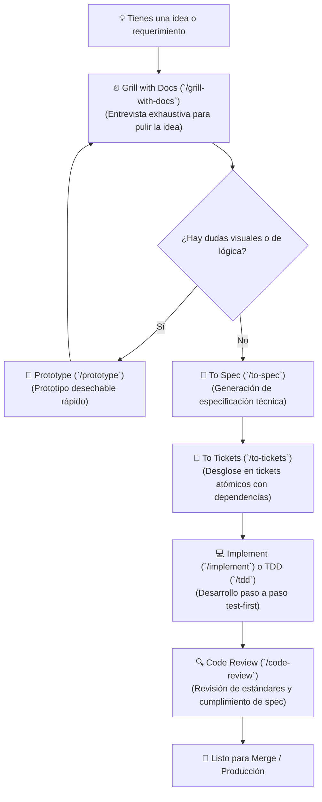

# 🧠 Guía Completa de Skills de Antigravity

Bienvenido a la documentación de **Skills de Antigravity** para el proyecto. Este repositorio cuenta con un conjunto de habilidades modulares diseñadas para acompañar todo el ciclo de vida del desarrollo de software asistido por IA: desde la concepción de una idea hasta la arquitectura, implementación guiada por pruebas (TDD) y revisión de código.

---

## 🗺️ Flujo de Trabajo: Del Concepto a Producción (*Idea → Ship*)

La mayoría de las tareas de desarrollo siguen este camino principal:

---

## 📚 Catálogo Detallado de Skills

---

### 1. 🚀 Planificación, Especificación e Implementación

| Nombre del Skill | Identificador / Comando | ¿Qué hace? | ¿Cuándo invocarlo? (Activador) | Modo de Invocación |
| :--- | :--- | :--- | :--- | :--- |
| **Grill with Docs** | [`grill-with-docs`](./grill-with-docs/SKILL.md) | Te entrevista de forma implacable para cuestionar y pulir tu idea antes de programar. Genera y actualiza el glosario (`CONTEXT.md`) y registros de decisión arquitectónica (ADRs). | **Al iniciar una nueva función o proyecto.** Escribe `/grill-with-docs` o *"Entrevístame para pulir esta idea y crear la documentación"*. | 👤 Manual |
| **Grill Me** | [`grill-me`](./grill-me/SKILL.md) | Versión sin estado de la entrevista (*stateless*). Realiza el mismo cuestionamiento profundo pero sin guardar archivos en el repositorio. | Para debatir y poner a prueba un razonamiento abstracto, un plan o un texto sin alterar el disco. | 👤 Manual |
| **Grilling (Primitiva)** | [`grilling`](./grilling/SKILL.md) | El motor base de preguntas y respuestas críticas que alimenta a los skills de entrevista. | Invocado internamente por otros skills (`triage`, `wayfinder`, etc.) o directamente si quieres la entrevista pura sin plantillas. | 🤖 Automático / 👤 Manual |
| **Prototype** | [`prototype`](./prototype/SKILL.md) | Construye un prototipo rápido y desechable para validar la experiencia de usuario o la lógica de estados antes de escribir el código definitivo. | Cuando una decisión técnica o de diseño requiere *verlo en pantalla* para responderse. | 🤖 Automático / 👤 Manual |
| **To Spec** | [`to-spec`](./to-spec/SKILL.md) | Sintetiza todo lo debatido en la conversación en una especificación técnica formal y estructurada. | Al finalizar una sesión de análisis: escribe `/to-spec` para consolidar el documento de diseño. | 👤 Manual |
| **To Tickets** | [`to-tickets`](./to-tickets/SKILL.md) | Divide la especificación técnica en tickets pequeños, atómicos y ordenados por dependencias (*tracer-bullet tickets*). | Después de tener el *spec*, para preparar las tareas de ejecución en orden de bloqueo. | 👤 Manual |
| **Implement** | [`implement`](./implement/SKILL.md) | Ejecuta la construcción de un ticket o spec, guiando el proceso mediante TDD estricto y realizando una revisión de código antes de finalizar. | Para iniciar la programación: *"Implementa el ticket #X"*. | 👤 Manual |
| **Implement Spec** | [`implement-spec`](./implement-spec/SKILL.md) | Implementa directamente una especificación completa en código. | Cuando tienes un documento de especificación listo para codificar de una sola vez. | 👤 Manual |
| **TDD (Test-Driven Development)** | [`tdd`](./tdd/SKILL.md) | Aplica el ciclo estricto de *Red-Green-Refactor*: escribe la prueba que falla, luego el código mínimo para pasarla, y finalmente refactoriza. | En cualquier momento que programes lógica crítica: *"Crea la función X usando TDD"* o *"Escribe los tests primero"*. | 🤖 Automático / 👤 Manual |
| **Code Review** | [`code-review`](./code-review/SKILL.md) | Lanza dos agentes en paralelo para auditar el código: uno verifica estándares del repo y el otro valida que cumpla con la especificación original. | Antes de crear un PR o al terminar una tarea: *"Haz un code review de mi rama"*. | 🤖 Automático / 👤 Manual |

---

### 2. 🐛 Diagnóstico, Depuración y Mantenimiento

| Nombre del Skill | Identificador / Comando | ¿Qué hace? | ¿Cuándo invocarlo? (Activador) | Modo de Invocación |
| :--- | :--- | :--- | :--- | :--- |
| **Diagnosing Bugs** | [`diagnosing-bugs`](./diagnosing-bugs/SKILL.md) | Metodología de depuración para errores complejos, intermitentes o caídas de rendimiento. Exige crear una prueba o comando reproducible que falle en rojo antes de teorizar soluciones. | Cuando algo falle o se rompa: *"Diagnostica este error"*, *"Hay un bug intermitente en X"*. | 🤖 Automático |
| **Resolving Merge Conflicts** | [`resolving-merge-conflicts`](./resolving-merge-conflicts/SKILL.md) | Resuelve conflictos de Git bloque por bloque, analizando la intención original de cada rama en lugar de mezclar líneas a ciegas. | En medio de un conflicto de Git: *"Ayúdame a resolver este conflicto de merge"*. | 🤖 Automático |
| **Triage** | [`triage`](./triage/SKILL.md) | Procesa incidencias y pull requests entrantes de terceros, los clasifica, verifica su reproducibilidad y redacta briefs técnicos listos para ser implementados. | Para clasificar y priorizar reportes externos o issues sin estructurar. | 👤 Manual |

---

### 3. 🏛️ Arquitectura y Modelado de Dominio

| Nombre del Skill | Identificador / Comando | ¿Qué hace? | ¿Cuándo invocarlo? (Activador) | Modo de Invocación |
| :--- | :--- | :--- | :--- | :--- |
| **Domain Modeling** | [`domain-modeling`](./domain-modeling/SKILL.md) | Refina el lenguaje ubicuo del proyecto, resuelve ambigüedades en términos del negocio y registra decisiones clave en ADRs (*Architecture Decision Records*). | Al definir entidades de negocio o redactar el glosario de términos. | 🤖 Automático |
| **Codebase Design** | [`codebase-design`](./codebase-design/SKILL.md) | Principios y vocabulario para diseñar *Deep Modules* (módulos con interfaces pequeñas y limpias que ocultan una gran complejidad interna). | Al diseñar la arquitectura de un módulo, puertos o adaptadores. | 🤖 Automático |
| **Improve Codebase Architecture** | [`improve-codebase-architecture`](./improve-codebase-architecture/SKILL.md) | Analiza la base de código buscando oportunidades de desacoplamiento y genera un reporte visual interactivo en HTML. | Cuando quieras realizar mantenimiento arquitectónico y reducir deuda técnica. | 👤 Manual |
| **Setup TS Deep Modules** | [`setup-ts-deep-modules`](./setup-ts-deep-modules/SKILL.md) | Configura `dependency-cruiser` en repositorios TypeScript para garantizar que los módulos internos solo se consuman a través de sus puntos de entrada públicos (`index.ts`). | Al inicializar o blindar la arquitectura de un proyecto en TypeScript. | 👤 Manual |

---

### 4. 🔍 Clarificación, Investigación y Aprendizaje

| Nombre del Skill | Identificador / Comando | ¿Qué hace? | ¿Cuándo invocarlo? (Activador) | Modo de Invocación |
| :--- | :--- | :--- | :--- | :--- |
| **Ask Matt (Router)** | [`ask-matt`](./ask-matt/SKILL.md) | Enrutador interactivo. Si no sabes qué skill utilizar para tu situación actual, te hace preguntas y te guía hacia el adecuado. | Escribe `/ask-matt` o pregunta *"¿Qué skill debo usar para esto?"*. | 👤 Manual |
| **Wayfinder** | [`wayfinder`](./wayfinder/SKILL.md) | Diseñado para proyectos masivos o iniciativas desde cero (*greenfield*). Crea un mapa de decisiones interconectadas y las resuelve ordenadamente hasta disipar la incertidumbre. | Cuando la tarea es demasiado grande para caber en una sola sesión de trabajo. | 👤 Manual |
| **Research** | [`research`](./research/SKILL.md) | Delega la lectura técnica e investigación a un agente secundario que consulta documentación oficial y fuentes primarias, entregando un reporte citado en Markdown. | *"Investiga la API de X y genera un reporte"* o *"Averigua qué versión soporta Y"*. | 🤖 Automático |
| **To Questionnaire** | [`to-questionnaire`](./to-questionnaire/SKILL.md) | Transforma una duda técnica o de negocio en un cuestionario estructurado listo para enviarle a un cliente, líder de producto o colega. | Cuando estás bloqueado por una decisión que depende de un tercero externo. | 👤 Manual |
| **Wait What** | [`wait-what`](./wait-what/SKILL.md) | Frena al asistente y le exige reexplicar su último mensaje en lenguaje claro, directo y sin tecnicismos innecesarios. | Cuando una respuesta del modelo resulte confusa: escribe `/wait-what` o *"Explícalo de nuevo con palabras simples"*. | 👤 Manual |
| **Teach** | [`teach`](./teach/SKILL.md) | Sesión de tutoría interactiva donde el asistente te enseña un concepto o tecnología utilizando ejemplos prácticos dentro del repositorio. | *"Enséñame cómo funciona el patrón X en este proyecto"*. | 👤 Manual |

---

### 5. 🛠️ Configuración, Git y Herramientas del Entorno

| Nombre del Skill | Identificador / Comando | ¿Qué hace? | ¿Cuándo invocarlo? (Activador) | Modo de Invocación |
| :--- | :--- | :--- | :--- | :--- |
| **Setup Skills Repo** | [`setup-matt-pocock-skills`](./setup-matt-pocock-skills/SKILL.md) | Configura el entorno inicial para estos skills: establece el gestor de issues local, etiquetas de triage y estructura de documentación. | Se ejecuta **una sola vez** al inicio del proyecto. | 👤 Manual |
| **Setup Pre-commit** | [`setup-pre-commit`](./setup-pre-commit/SKILL.md) | Configura hooks de Git con Husky, Prettier, chequeo de tipos TypeScript y pruebas automáticas antes de cada commit. | *"Configura pre-commit hooks en este repositorio"*. | 🤖 Automático |
| **Git Guardrails** | [`git-guardrails-claude-code`](./git-guardrails-claude-code/SKILL.md) | Instala protecciones para evitar que el asistente ejecute comandos destructivos de Git (`git push --force`, `reset --hard`, `branch -D`). | Para reforzar la seguridad en operaciones con Git. | 🤖 Automático |
| **Wizard** | [`wizard`](./wizard/SKILL.md) | Genera un script interactivo en consola para guiar a un humano en tareas que la IA no puede hacer por sí misma (crear credenciales, configurar consolas en la nube, etc.). | Cuando se requieren acciones manuales en servicios de terceros o configuración de secretos. | 🤖 Automático |
| **Migrate to Shoehorn** | [`migrate-to-shoehorn`](./migrate-to-shoehorn/SKILL.md) | Refactoriza aserciones de tipo inseguras (`as Type`) en archivos de prueba reemplazándolas por `@total-typescript/shoehorn`. | *"Migra las aserciones de tipos en los tests a shoehorn"*. | 🤖 Automático |

---

### 6. 📝 Redacción, Documentación y Gestión de Sesiones

| Nombre del Skill | Identificador / Comando | ¿Qué hace? | ¿Cuándo invocarlo? (Activador) | Modo de Invocación |
| :--- | :--- | :--- | :--- | :--- |
| **Handoff** | [`handoff`](./handoff/SKILL.md) / [`claude-handoff`](./claude-handoff/SKILL.md) | Resume y empaqueta el estado exacto de la sesión actual en un documento de traspaso para que otro agente o una nueva sesión continúe el trabajo sin pérdidas de contexto. | Cuando la ventana de contexto esté llena o vayas a delegar la tarea a otra sesión. | 👤 Manual |
| **Writing for Agents** | [`writing-for-agents`](./writing-for-agents/SKILL.md) | Guía de redacción de documentos orientados al consumo de modelos de lenguaje (`AGENTS.md`, `CLAUDE.md` y archivos `SKILL.md`). | Al crear nuevas instrucciones o documentación para el asistente. | 🤖 Automático |
| **Writing Fragments** | [`writing-fragments`](./writing-fragments/SKILL.md) | Fase 1 de redacción: recopila fragmentos, notas sueltas e ideas en bruto sin preocuparse por la estructura final. | Al comenzar a recopilar ideas para un artículo o documentación. | 👤 Manual |
| **Writing Beats** | [`writing-beats`](./writing-beats/SKILL.md) | Fase 2 de redacción: organiza las ideas en una secuencia lógica (*beats*), asegurando que cada concepto se fundamente antes de ser utilizado. | Para ordenar la estructura narrativa de un documento técnico. | 👤 Manual |
| **Writing Shape** | [`writing-shape`](./writing-shape/SKILL.md) | Fase 3 de redacción: transforma la estructura de *beats* en párrafos y secciones pulidas para el documento final. | Para redactar el artículo final a partir de los puntos estructurados. | 👤 Manual |
| **Scaffold Exercises** | [`scaffold-exercises`](./scaffold-exercises/SKILL.md) | Crea esqueletos de ejercicios educativos con enunciados, soluciones y explicaciones que superan validaciones de linter. | Al crear material didáctico o cursos interactivos. | 🤖 Automático |
| **Loop Me** | [`loop-me`](./loop-me/SKILL.md) | Realiza una entrevista guiada para definir y construir flujos de trabajo automatizados para agentes dentro del espacio de trabajo. | Para diseñar nuevos flujos de trabajo en el repositorio. | 👤 Manual |

---

## ⚡ Tabla de Decisión Rápida (Cheat Sheet de Comandos Manuales)

Esta tabla incluye **todos los skills de invocación manual** (`disable-model-invocation: true`), organizados según lo que quieras lograr en tu flujo de trabajo:

| Si tu objetivo es... | Comando / Skill a invocar | ¿Qué resultado obtienes? |
| :--- | :--- | :--- |
| **Configurar el repo para estos skills** *(1 sola vez)* | [`/setup-matt-pocock-skills`](./setup-matt-pocock-skills/SKILL.md) | Inicializa tracker de issues, etiquetas de triage y estructura de docs. |
| **Saber qué skill o flujo usar en este momento** | [`/ask-matt`](./ask-matt/SKILL.md) | Enrutador que te hace preguntas y te guía al skill adecuado. |
| **Pulir una idea dejando registro formal** | [`/grill-with-docs`](./grill-with-docs/SKILL.md) | Entrevista a fondo + actualiza glosario (`CONTEXT.md`) y ADRs. |
| **Pulir una idea sin tocar el disco** *(stateless)* | [`/grill-me`](./grill-me/SKILL.md) | Entrevista crítica profunda en memoria (sin crear archivos). |
| **Planificar un proyecto gigante / greenfield** | [`/wayfinder`](./wayfinder/SKILL.md) | Mapea un grafo de decisiones interconectadas antes de construir. |
| **Hacer preguntas a un cliente o tercero externo** | [`/to-questionnaire`](./to-questionnaire/SKILL.md) | Redacta un cuestionario formal con las preguntas exactas que necesitas. |
| **Convertir la charla en documento técnico** | [`/to-spec`](./to-spec/SKILL.md) | Sintetiza el debate actual en una especificación técnica formal. |
| **Dividir la especificación en tareas ordenadas** | [`/to-tickets`](./to-tickets/SKILL.md) | Genera tickets atómicos vinculados por sus dependencias de bloqueo. |
| **Construir un ticket paso a paso con tests** | [`/implement`](./implement/SKILL.md) | Ejecuta el ticket aplicando TDD estricto y code review final. |
| **Construir una especificación completa** | [`/implement-spec`](./implement-spec/SKILL.md) | Toma un documento de spec y lo implementa directamente en código. |
| **Procesar y clasificar issues o PRs externos** | [`/triage`](./triage/SKILL.md) | Categoriza y redacta briefs técnicos para incidencias entrantes. |
| **Escanear y mejorar la arquitectura del código** | [`/improve-codebase-architecture`](./improve-codebase-architecture/SKILL.md) | Genera un informe visual interactivo en HTML con áreas de mejora. |
| **Blindar la arquitectura de módulos en TypeScript** | [`/setup-ts-deep-modules`](./setup-ts-deep-modules/SKILL.md) | Configura `dependency-cruiser` para aislar subcarpetas de módulos. |
| **Aprender un concepto o patrón en el repo** | [`/teach`](./teach/SKILL.md) | Tutoría interactiva basada en el código real del proyecto. |
| **Pedir que te reexpliquen algo confuso** | [`/wait-what`](./wait-what/SKILL.md) | Fuerza al asistente a reexplicar su último mensaje con lenguaje simple. |
| **Diseñar flujos de trabajo para agentes** | [`/loop-me`](./loop-me/SKILL.md) | Entrevista guiada para definir automatizaciones en el workspace. |
| **Guardar y transferir la sesión a otro agente** | [`/handoff`](./handoff/SKILL.md) / [`/claude-handoff`](./claude-handoff/SKILL.md) | Exporta el estado estructurado para continuar en una nueva ventana. |
| **Redacción: Fase 1 (Capturar ideas sueltas)** | [`/writing-fragments`](./writing-fragments/SKILL.md) | Recopila notas, fragmentos e ideas en bruto sin juzgar estructura. |
| **Redacción: Fase 2 (Secuencia lógica / beats)** | [`/writing-beats`](./writing-beats/SKILL.md) | Ordena las ideas para que los conceptos se expliquen en orden lógico. |
| **Redacción: Fase 3 (Redactar texto final)** | [`/writing-shape`](./writing-shape/SKILL.md) | Da formato y redacta el artículo o documentación párrafo a párrafo. |

---

## 💡 Tipos de Invocación

* 👤 **Invocación Manual (User-invoked / Slash Commands):** Son skills diseñados para iniciar una fase de trabajo específica (como `/grill-with-docs`, `/to-spec`, `/to-tickets`, `/ask-matt`, `/wait-what`). Tienen `disable-model-invocation: true`, por lo que se activan cuando tú los solicitas explícitamente en el chat.
* 🤖 **Invocación Automática (Model-invoked):** Antigravity detecta cuándo son necesarios según el contexto de tu consulta (por ejemplo, si dices *"hay un bug en el login"*, activará `diagnosing-bugs`; si dices *"resuelve el conflicto de git"*, activará `resolving-merge-conflicts`).
