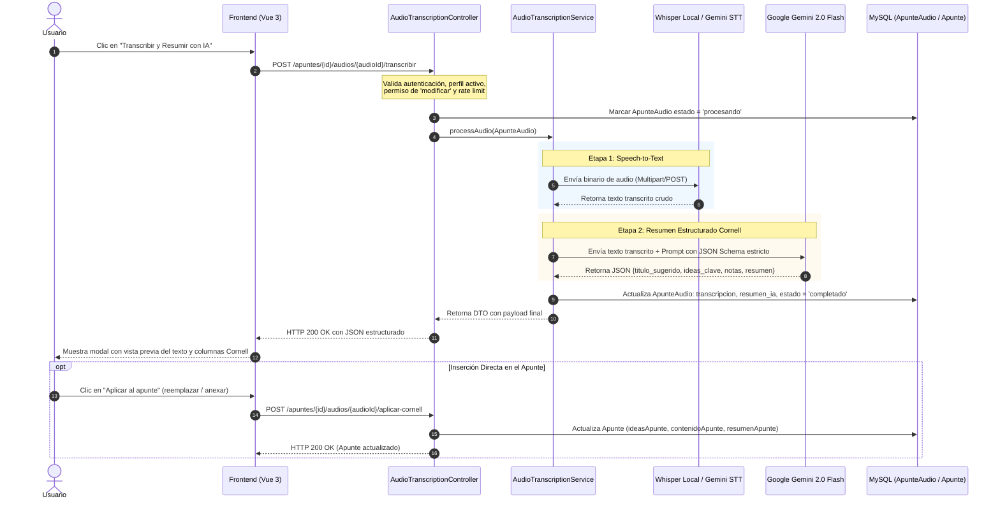

# Propuesta Técnica y Flujo de Implementación: Requerimiento [RF-M14]

**Proyecto:** Cronos Notes (Season 2)  
**Requerimiento:** [RF-M14] Transcripción Automática y Resumen Inteligente de Audios (Backend)  
**Cátedra:** Ingeniería de Software III — Universidad de la Cuenca del Plata  
**Docente:** Prof. Dr. Marcelo Alejandro Toledo  
**Autores:** Dellagnolo, Ricardo Agustín & Romea Acevedo, Clara Agustina  

---

## 1. Introducción y Objetivo

El requerimiento **RF-M14** tiene como finalidad eliminar la sobrecarga cognitiva que experimentan los estudiantes al tener que escuchar y desgrabar manualmente horas de clases grabadas.

La solución técnica integra dos capacidades de Inteligencia Artificial en el **Backend (Laravel 11)**:

1. **Speech-to-Text (STT)**: Conversión automatizada del audio a texto con puntuación y segmentación oracional.
2. **Síntesis Estructurada (Método Cornell)**: Procesamiento analítico del texto para estructurarlo automáticamente en las 3 secciones pedagógicas del método Cornell: *Ideas Clave*, *Notas de Clase* y *Resumen Integrador*.

---

## 2. Decisión Arquitectónica: Pipeline Desacoplado en Dos Etapas

Uno de los puntos clave de diseño de ingeniería es el **desacoplamiento de responsabilidades**:

```
[ Archivo de Audio ]
        │
        ▼
┌────────────────────────────────────────┐
│  ETAPA 1: Speech-to-Text (STT)         │ ──▶ Transcribe audio fonético a texto plano
│  (Whisper Local  ó  Gemini Multimodal) │
└────────────────────────────────────────┘
        │  (Texto Plano)
        ▼
┌────────────────────────────────────────┐
│  ETAPA 2: Síntesis y Razonamiento      │ ──▶ Clasifica y sintetiza en formato Cornell
│  (Google Gemini 2.0 Flash)             │
└────────────────────────────────────────┘
        │  (JSON Estructurado)
        ▼
[ Persistencia en DB & Respuesta al Editor ]
```

### ¿Por qué se diseñó en dos etapas?

1. **Especialización de Modelos**: Los modelos STT como *Whisper* son excepcionales transcribiendo fonemas a texto, pero **no tienen capacidad de síntesis ni de razonamiento**. Por el contrario, los Grandes Modelos de Lenguaje (LLM) como *Gemini Flash* son óptimos sintetizando y estructurando jerarquías conceptuales en JSON.
2. **Eficiencia en Costos y Privacidad (Whisper Local)**: Para el entorno de desarrollo y pruebas cotidianas, se implementa soporte para un microservicio local de Whisper (vía Docker o Python). Esto permite procesar audios de forma 100% gratuita, local e ilimitada sin consumir cuotas de APIs pagas.
3. **Portabilidad y Resiliencia (Fallback a Gemini)**: Si la aplicación se ejecuta en una máquina sin el servidor local de Whisper encendido (por ejemplo, durante la evaluación del docente o en despliegues en la nube), el backend detecta la indisponibilidad y conmuta automáticamente a **Gemini Multimodal**. El sistema nunca se bloquea ni requiere configuraciones complejas para ser probado.

---

## 3. Flujo Paso a Paso de la Implementación (Secuencia de Ejecución)

El ciclo de vida de una solicitud de transcripción ocurre a través de los siguientes pasos técnicos:



### Detalle de cada paso:

#### Paso 1: Solicitud, Seguridad y Control de Acceso

* El frontend envía la petición al endpoint `POST /apuntes/{id}/audios/{audioId}/transcribir`.
* El controlador valida:
  * Que el usuario esté autenticado.
  * Que tenga seleccionado un perfil activo con permisos de edición (`modificar`), evitando que usuarios con rol `Lector` generen costos de IA.
  * Límite de peticiones mediante middleware de Laravel (`throttle:10,60`) para prevenir llamadas accidentales en bucle.

#### Paso 2: Ejecución de Transcripción (STT)

* Se recupera el archivo de audio guardado en disco (`Storage::disk('public')`).
* El servicio `AudioTranscriptionService` envía el archivo vía HTTP `multipart/form-data` al servidor de Whisper Local (`http://localhost:9000/asr`).
* *Mecanismo de Resiliencia:* Si Whisper no responde en el puerto local y está configurado `WHISPER_FALLBACK_TO_GEMINI=true`, el servicio conmuta transparentemente a la API de Google Gemini enviando los datos del audio en base64/inlineData.
* Se obtiene la transcripción completa en español.

#### Paso 3: Síntesis bajo el Método Cornell

* El texto plano obtenido se envía a **Google Gemini 2.0 Flash**.
* Se utiliza un **System Instruction** y un esquema JSON forzado (`responseMimeType: application/json` con `responseSchema` de Gemini) que exige la siguiente estructura estricta:
  * `titulo_sugerido`: Título descriptivo para la nota.
  * `ideas_clave`: Array de cadenas con palabras clave y preguntas de repaso.
  * `notas`: Texto enriquecido con el desarrollo ordenado de los temas.
  * `resumen`: Síntesis conceptual de cierre (3 a 5 oraciones).

#### Paso 4: Persistencia No Destructiva

* Se actualiza la tabla `ApunteAudio` en MySQL guardando la transcripción cruda y el JSON del resumen, marcando el estado como `completado`.
* **Decisión de diseño clave:** El apunte original (`Apunte`) **no se sobrescribe automáticamente**. Esto protege el trabajo previo del estudiante en caso de que ya tuviera notas escritas a mano en el editor.

#### Paso 5: Endpoint de Aplicación Atómica (`aplicar-cornell`)

* Se proporciona el endpoint dedicado `POST /apuntes/{id}/audios/{audioId}/aplicar-cornell`.
* Permite dos modalidades configurables:
  * `"modo": "reemplazar"`: Reemplaza las columnas del apunte por las generadas por la IA.
  * `"modo": "anexar"`: Concatena de manera ordenada las nuevas ideas y notas al final de lo que el alumno ya había redactado.

---

## 4. Componentes y Clases Backend a Construir

| Componente                                              | Tipo              | Responsabilidad                                                                                                                        |
|:------------------------------------------------------- |:----------------- |:-------------------------------------------------------------------------------------------------------------------------------------- |
| `database/migrations/...`                               | Migración MySQL   | Agrega a `ApunteAudio`: `transcripcion` (LONGTEXT), `resumen_ia` (JSON), `estado` (VARCHAR) y `error_mensaje` (TEXT).                  |
| `app/Models/ApunteAudio.php`                            | Modelo Eloquent   | Configura `$fillable` y casteo automático de `resumen_ia` a array/JSON nativo de PHP.                                                  |
| `app/Services/AudioTranscriptionService.php`            | Clase de Servicio | Encapsula la comunicación HTTP con Whisper y Gemini, el manejo de fallbacks y la orquestación del procesamiento.                       |
| `app/Http/Controllers/AudioTranscriptionController.php` | Controlador REST  | Gestiona autorización de perfiles, rate limits y respuestas JSON para la transcripción y aplicación Cornell.                           |
| `routes/web.php`                                        | Enrutador Web     | Registra los dos endpoints protegidos bajo el middleware `auth.custom`.                                                                |
| `tests/Feature/AudioTranscriptionTest.php`              | Suite de Pruebas  | Pruebas de integración con `Http::fake()` simulando respuestas de Whisper y Gemini para verificar el flujo de punta a punta sin costo. |

---

## 5. Buenas Prácticas y Estándares de Ingeniería Aplicados

1. **Principio de Responsabilidad Única (SRP)**: El controlador solo coordina solicitudes HTTP; toda la lógica algorítmica de integración con IA y parseo de respuestas reside en el servicio `AudioTranscriptionService`.
2. **Patrón Driver / Open-Closed Principle (OCP)**: El sistema está diseñado para que agregar un nuevo proveedor de STT (como AWS Transcribe o Azure Speech) requiera solo un nuevo método en el servicio sin modificar el controlador ni las vistas.
3. **Persistencia No Destructiva**: Salvaguarda la integridad de la información del usuario al no pisar apuntes previos sin consentimiento explícito.
4. **Tolerancia a Fallos y Degradación Elegante**: El sistema cuenta con fallback automático y registra mensajes de error comprensibles ante caídas de red o puertos locales no disponibles.
