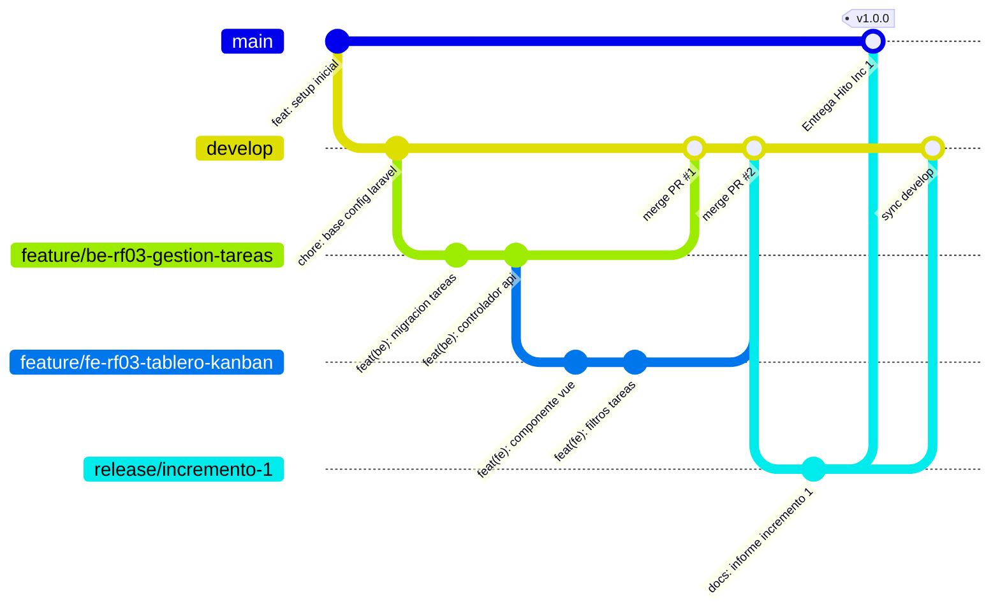
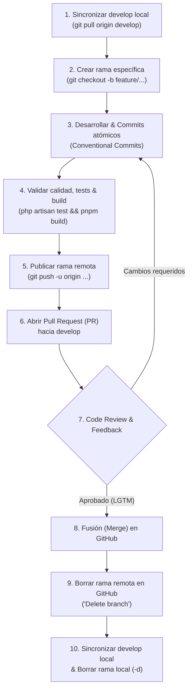

# Guía de Estrategia de Ramas (Git Flow) — Cronos Notes
## Proyecto: Sistema Inteligente de Gestión de Tareas, Apuntes y Productividad Pomodoro
**Cátedra:** Ingeniería de Software II (ISW II) & Programación en Ambientes Web (PAW) – UCP Sede Formosa  

Esta guía establece el estándar obligatorio de manejo de ramas en Git para que los 4 desarrolladores (**Ayala, Dellagnolo, Fornari y Romea**), organizados en parejas de desarrollo bajo metodología ágil (XP / Programación en Parejas), trabajen en paralelo sin pisarse código ni generar conflictos.

---

## 🌳 1. Topología de Ramas del Proyecto



---

## 🏷️ 2. Tipos de Ramas y Convenciones de Nombres

| Tipo de Rama | Rama Origen | Rama Destino | Nomenclatura Obligatoria | Ejemplo |
| :--- | :---: | :---: | :--- | :--- |
| **Producción** | — | — | `main` | `main` *(Código 100% estable / Entregas a cátedra)* |
| **Desarrollo (Base)** | `main` | — | `develop` | `develop` *(Rama activa de integración de todo el equipo)* |
| **Feature Backend** | `develop` | `develop` | `feature/be-<rf>-<descripcion>` | `feature/be-rf03-crud-tareas` |
| **Feature Frontend** | `develop` | `develop` | `feature/fe-<rf>-<descripcion>` | `feature/fe-rf04-reloj-pomodoro` |
| **Feature General** | `develop` | `develop` | `feature/<rf>-<descripcion>` | `feature/rf05-sistema-rachas` |
| **Corrección / Bug** | `develop` | `develop` | `fix/<descripcion>` | `fix/temporizador-pomodoro-pausa` |
| **Documentación** | `develop` | `develop` | `docs/<descripcion>` | `docs/actualizar-especificacion-rf14` |
| **Mantenimiento / Config** | `develop` | `develop` | `chore/<descripcion>` | `chore/actualizar-dependencias-composer` |
| **Release de Incremento** | `develop` | `main` & `develop` | `release/incremento-<numero>` | `release/incremento-1` *(Cierre de hito y entrega formal)* |
| **Hotfix Urgente** | `main` | `main` & `develop` | `hotfix/<descripcion>` | `hotfix/error-critico-auth-google` |

---

## 🚀 3. Ciclo de Vida Completo de una Rama (Flujo End-to-End)

El ciclo de vida de cualquier funcionalidad, corrección o tarea comprende **6 fases esenciales** desde que se toma el requerimiento hasta que la rama se elimina tras integrarse a `develop`:



---

### 🔹 Fase 1: Creación y Preparación de la Rama

#### Paso 1: Actualizar tu rama `develop` local
Antes de crear cualquier rama nueva, asegúrate de tener la versión más reciente del código integrado por tus compañeros:
```bash
git checkout develop
git pull origin develop
```

#### Paso 2: Crear tu rama de funcionalidad (Feature Branch)
Crea una rama con el prefijo correspondiente a tu área (`fe-`, `be-`, `fix/`, etc.) y el código de requerimiento funcional (RF):
```bash
# Si trabajas en Frontend (Vue / Inertia / Tailwind):
git checkout -b feature/fe-rf04-reloj-pomodoro

# Si trabajas en Backend (Laravel / Controladores / Modelos / Migraciones):
git checkout -b feature/be-rf03-api-tareas

# Si es una corrección o bug:
git checkout -b fix/temporizador-pomodoro-pausa
```

---

### 🔹 Fase 2: Desarrollo y Validación Local

#### Paso 3: Desarrollar y realizar commits atómicos
Trabaja de manera incremental realizando commits pequeños y coherentes, respetando el estándar *Conventional Commits*:
```bash
git status
git add .
git commit -m "feat(pomodoro): agregar componente de reloj con estados de pausa y reinicio"
```

#### Paso 4: Mantener tu rama sincronizada con `develop`
Si la otra pareja fusionó cambios en `develop` mientras trabajabas en tu funcionalidad, trae esos cambios a tu rama para resolver divergencias temprano:
```bash
git checkout feature/fe-rf04-reloj-pomodoro
git fetch origin
git merge origin/develop
```

#### Paso 5: Validar que el código compila, pasan los tests y cumple linters
Antes de subir cualquier código al repositorio remoto, valida que la build de frontend funcione y los tests pasen:
```bash
# Frontend (Vite / Vue):
pnpm build
# o bien: npm run build

# Backend (Tests de Laravel y Linter Pint):
php artisan test
./vendor/bin/pint --test
```
> [!IMPORTANT]
> Nunca abras un Pull Request si `pnpm build`, `npm run build` o `php artisan test` fallan en tu máquina local.

---

### 🔹 Fase 3: Publicación y Creación del Pull Request (PR)

#### Paso 6: Subir tu rama a GitHub
Publica tu rama en el repositorio remoto configurando el upstream tracking:
```bash
git push -u origin feature/fe-rf04-reloj-pomodoro
```

#### Paso 7: Abrir el Pull Request (PR) en GitHub
1. Ingresa al repositorio de GitHub: `dellagnoloRA/cronos-notes`.
2. Verás el banner con el botón **"Compare & pull request"** (o ve a la pestaña *Pull requests* -> *New pull request*).
3. **Rama base obligatoria:** Asegúrate de que la rama destino sea **`develop`** (nunca `main` directamente):
   * `base: develop`  ←  `compare: feature/fe-rf04-reloj-pomodoro`
4. **Título estandarizado del PR:**
   * Formato: `[<ID-RF>][<ÁREA>] <Descripción concisa>`
   * Ejemplo: `[RF-04][FE] Reloj Pomodoro Interactivo y Selector de Modos`
5. **Descripción del PR:** Detalla los cambios implementados, migraciones creadas (si aplica), componentes Vue afectados y capturas de pantalla de la interfaz.
6. **Asignaciones:**
   * **Reviewers:** Asigna a los integrantes de la otra pareja para la revisión cruzada.
   * **Assignee:** Asignate a ti mismo y a tu compañero de pareja como responsables.
   * **Issue Tracker / Tareas:** Si utilizas `.scratch/` o el tablero de tareas, referencia el ID o archivo correspondiente.

---

### 🔹 Fase 4: Revisión de Código (Code Review) e Iteraciones

#### Paso 8: Atender feedback o cambios solicitados
El revisor examinará el código, evaluará buenas prácticas y dejará comentarios o solicitará cambios:
* **Si te solicitan correcciones:** No crees una nueva rama ni cierres el PR. Realiza las correcciones en tu rama local, commitea y vuelve a pushear:
  ```bash
  # En tu misma rama local:
  git add .
  git commit -m "fix(pomodoro): ajustar intervalo de repeticion de alarma"
  git push origin feature/fe-rf04-reloj-pomodoro
  ```
  *GitHub actualizará automáticamente el Pull Request con los nuevos commits.*
* **Revisión asistida con IA:** Puedes utilizar el comando `/code-review` en Antigravity CLI / Cursor / Claude Code para validar estándares y verificar que el código cumpla exactamente con la especificación del requerimiento.
* **Si el PR es aprobado (*Approved / LGTM*):** La rama queda habilitada para la fusión.

---

### 🔹 Fase 5: Fusión (Merge) del Pull Request

#### Paso 9: Fusión en GitHub hacia `develop`
1. Una vez aprobado el PR y verificados los checks automáticos:
2. Haz clic en el botón verde **"Merge pull request"** (o *"Squash and merge"* según la política del incremento) y confirma con **"Confirm merge"**.

---

### 🔹 Fase 6: Finalización y Limpieza de Ramas (Borrado Local y Remoto)

Para mantener el repositorio limpio y prevenir acumulación de ramas huérfanas, cada rama debe ser eliminada tras su fusión exitosa:

#### Paso 10: Borrar la rama remota en GitHub
* Inmediatamente después de hacer merge, GitHub muestra el botón **"Delete branch"**. Haz clic para eliminar la rama del servidor remoto.
* *(Alternativa por consola):*
  ```bash
  git push origin --delete feature/fe-rf04-reloj-pomodoro
  ```

#### Paso 11: Limpieza y sincronización en el entorno local
Una vez cerrada la tarea en GitHub, vuelve a tu rama principal local y elimina la rama de trabajo que ya está integrada:
```bash
# 1. Regresar a develop:
git checkout develop

# 2. Traer los cambios recién fusionados en remoto:
git pull origin develop

# 3. Eliminar la rama local ya integrada (flag -d seguro):
git branch -d feature/fe-rf04-reloj-pomodoro

# 4. Limpiar referencias remotas eliminadas en tu copia local:
git fetch --prune
```

> [!TIP]
> El flag `-d` (minúscula) es seguro: Git no te permitirá borrar la rama si contiene commits que no fueron fusionados en `develop`. Si te da un aviso de no fusión, verifica haber hecho `git pull origin develop` primero. No uses `-D` a menos que quieras descartar deliberadamente el trabajo de esa rama.

---

## ✍️ 4. Estándar de Mensajes de Commit (*Conventional Commits*)

Cada commit debe tener un tipo, un alcance opcional entre paréntesis y una descripción clara en infinitivo/presente:

```text
<tipo>(<alcance>): <descripción corta>
```

### Tipos admitidos:
* `feat`: Nueva funcionalidad para el usuario o sistema.  
  * *Ejemplo:* `feat(pomodoro): integrar reproduccion de sonido ambiental con Howler.js`
  * *Ejemplo:* `feat(auth): implementar inicio de sesion con Google OAuth Socialite`
  * *Ejemplo:* `feat(tareas): agregar filtro por prioridad y etiquetas de categorias`
* `fix`: Corrección de un error o bug.  
  * *Ejemplo:* `fix(pomodoro): corregir calculo de racha al completar sesion fuera de hora`
  * *Ejemplo:* `fix(api): validar token de sesion expirado en peticiones inertia`
* `docs`: Cambios en la documentación, especificaciones o diagramas.  
  * *Ejemplo:* `docs: actualizar diagrama de secuencia en especificacion rf14`
* `style`: Cambios de formato visual, espaciado o CSS (sin tocar lógica).  
  * *Ejemplo:* `style(dashboard): ajustar paleta dark mode en tarjeta de estadisticas`
* `refactor`: Modificación de código que no agrega función ni arregla bug.  
  * *Ejemplo:* `refactor(services): modularizar logica de calculo de nivel de usuario`
* `test`: Agregado o corrección de pruebas unitarias o de integración.  
  * *Ejemplo:* `test(tareas): agregar casos de prueba para eliminacion en cascada`
* `chore`: Tareas de mantenimiento, dependencias o configuración.  
  * *Ejemplo:* `chore(deps): actualizar inertia-vue3 a version mas reciente`

---

## 🤖 5. Integración con Agentes de IA y `.scratch/` (Issue Tracker Local)

El proyecto utiliza un **Issue Tracker Local** basado en Markdown dentro de la carpeta `.scratch/` para articular el trabajo entre parejas y asistentes de IA (Antigravity CLI, Cursor, Claude Code):

### ¿Cómo lo usa cada pareja?
- Cada pareja trabaja en su propia subcarpeta aislada por requerimiento:
  - Pareja A: `.scratch/rf-03-gestion-tareas/`
  - Pareja B: `.scratch/rf-04-sesion-pomodoro/`
- En esa carpeta viven:
  - `spec.md` (especificación formal del requerimiento o funcionalidad).
  - `issues/01-nombre-tarea.md`, `issues/02-nombre-tarea.md` (tickets individuales ejecutables por agentes o humanos).

> [!NOTE]
> Al estar aisladas en carpetas distintas por requerimiento dentro de sus respectivas ramas, **Git nunca producirá conflictos** al trabajar las parejas en paralelo con sus agentes.

---

## 🛡️ 6. Reglas de Oro del Repositorio (Guardrails)

1. 🚫 **PROHIBIDO hacer push directo a `main` o `develop`:** Todo cambio debe ingresar exclusivamente mediante un **Pull Request (PR)** revisado y aprobado.
2. 🚫 **PROHIBIDO hacer `git push --force`:** Puede sobreescribir y destruir el trabajo que tus compañeros subieron.
3. 🚫 **NUNCA commitear archivos `.env` con credenciales reales:** Solo se sube `.env.example` con variables de plantilla. Las claves de Google OAuth, secretos de base de datos o tokens de APIs deben permanecer únicamente en tu `.env` local.
4. ✅ **Traer cambios de develop antes de abrir PR:** Si tu rama quedó desactualizada respecto a `develop`, actualízala con:
   ```bash
   git checkout feature/mi-tarea
   git fetch origin
   git merge origin/develop
   ```
5. ✅ **Un PR por Requerimiento:** No mezcles código de Tareas (RF-03) en un PR de Sesión Pomodoro (RF-04). Mantén los PRs atómicos y focalizados.
6. 🧹 **Borrado obligatorio post-merge:** Una vez fusionada la rama en `develop`, debe borrarse tanto en GitHub (remota) como en tu entorno local (`git branch -d` y `git fetch --prune`). No se conservan ramas ya integradas.

---

## 🆘 7. Cómo Resolver Conflictos de Fusión (Merge Conflicts)

Si al intentar unir tu rama GitHub o Git indican que existen conflictos con `develop`:

1. En tu máquina, posicionado en tu rama de trabajo:
   ```bash
   git checkout feature/tu-rama
   git fetch origin
   git merge origin/develop
   ```
2. Git marcará los archivos con conflicto. Ábrelos en **VS Code**.
3. VS Code mostrará los botones interactivos en cada bloque de conflicto:
   * *Accept Current Change* (Conservar lo que hiciste en tu rama).
   * *Accept Incoming Change* (Conservar lo que vino desde develop).
   * *Accept Both Changes* (Conservar ambos bloques).
4. Elige la combinación correcta, verifica que el código compile y pase los tests (`pnpm build` y `php artisan test`), guarda los archivos y ejecuta:
   ```bash
   git add .
   git commit -m "fix(merge): resolver conflictos con develop"
   git push origin feature/tu-rama
   ```
