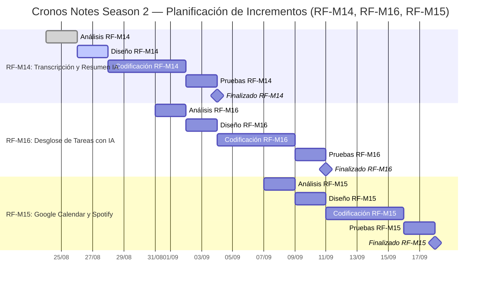

# Planificación y Diagrama de Gantt — Incrementos Season 2 (RF-M14, RF-M15, RF-M16)

Este documento detalla la planificación incremental del desarrollo para los requerimientos **RF-M14**, **RF-M15** y **RF-M16**, asignados al **Grupo The Dinamit** (Dellagnolo, Ricardo & Romea Acevedo, Agustina). 

Siguiendo el ciclo de vida de desarrollo de software incremental, cada requerimiento transita de manera estructurada por las cinco fases formales: **Análisis**, **Diseño**, **Codificación**, **Prueba** y **Finalizado**.

- **Fecha de Inicio del Análisis:** Lunes 24 de Agosto de 2026.
- **Metodología:** Extreme Programming (XP) con entregas incrementales y programación en parejas.

---

## 1. Desglose de Tareas y Subtareas por Requerimiento

### 🔹 Incremento 1: [RF-M14] Transcripción Automática y Resumen Inteligente de Audios

* **Módulo Afectado:** **Módulo de Toma de Apuntes y Grabaciones Multimedia** (`resources/js/Pages/apunte/` y `app/Http/Controllers/ApunteController.php`).
* **Herramientas y Tecnologías Utilizadas:**
  * **IA & Speech-to-Text:** OpenAI Whisper API / Gemini 2.0 Multimodal Audio (conversión de audio a texto) y Google Gemini API (`gemini-2.0-flash`) para generación de resúmenes estructurados.
  * **Frontend:** Vue 3 (Composition API), Inertia.js, `MediaRecorder API` (captura de audio nativa), `TranscriptionModal.vue`, `AudioPanel.vue`, `Editor.vue`.
  * **Backend:** PHP 8.2+, Laravel 11, `AudioTranscriptionService.php`, `AudioTranscriptionController.php`, `Laravel Storage` (gestión de archivos locales en `storage/app/public/audios/`).
  * **Base de Datos:** MySQL, Eloquent ORM, modelo `ApunteAudio.php` (columnas `transcripcion` y `resumen_ia`).

#### Fase 1: Análisis (24/08/2026 – 26/08/2026)
* **T1.1 Elicitación y especificación de requerimientos de audio:**
  * *ST1.1.1:* Análisis de formatos soportados (`.webm`, `.mp3`, `.wav`) y límites de tamaño/duración de grabación en el cliente.
  * *ST1.1.2:* Especificación de endpoints y contratos de datos para la API de Whisper / Gemini Multimodal (Speech-to-Text).
  * *ST1.1.3:* Definición del esquema JSON estricto para el prompt de resumen estructurado bajo el Método Cornell (*Ideas*, *Notas*, *Resumen*).

#### Fase 2: Diseño (26/08/2026 – 28/08/2026)
* **T1.2 Diseño de arquitectura, datos e interfaces:**
  * *ST1.2.1:* Diseño UI/UX del modal interactivo `TranscriptionModal.vue` y estados de procesamiento (loaders, preescucha, visor de texto).
  * *ST1.2.2:* Diseño del modelo de datos: ampliación de la tabla `apunte_audios` con columnas `transcripcion` y `resumen_ia`.
  * *ST1.2.3:* Diagrama de secuencia del flujo asíncrono Frontend -> Controlador Laravel -> Whisper/Gemini API -> Base de Datos.

#### Fase 3: Codificación (28/08/2026 – 02/09/2026)
* **T1.3 Desarrollo Backend:**
  * *ST1.3.1:* Implementación de `AudioTranscriptionService.php` (conexión con Whisper API y Gemini API).
  * *ST1.3.2:* Creación de `AudioTranscriptionController.php` y rutas seguras en `routes/web.php`.
* **T1.4 Desarrollo Frontend:**
  * *ST1.4.1:* Creación del componente `TranscriptionModal.vue` e integración del disparador en `AudioPanel.vue`.
  * *ST1.4.2:* Lógica de inserción automática y formateo de texto en las 3 secciones Cornell de `Editor.vue`.

#### Fase 4: Prueba (02/09/2026 – 04/09/2026)
* **T1.5 Validación y aseguramiento de calidad (QA):**
  * *ST1.5.1:* Pruebas unitarias de `AudioTranscriptionServiceTest.php` con mocks de respuestas de transcripción e IA.
  * *ST1.5.2:* Pruebas de integración subiendo grabaciones cortas (15s) y largas (5 min).
  * *ST1.5.3:* Validación del caso de prueba: grabación -> transcripción -> resumen -> inserción en editor.

#### Fase 5: Finalizado & Cierre (04/09/2026)
* **T1.6 Cierre del incremento:**
  * *ST1.6.1:* Code review cruzado, manejo de excepciones (timeouts de API, audios inaudibles) y refactorización.
  * *ST1.6.2:* Actualización de documentación técnica y manual de usuario.
  * *ST1.6.3:* Merge a la rama principal (`develop`) y etiquetado de versión.

---

### 🔹 Incremento 2: [RF-M16] Desglose Automático de Tareas con IA (Subtareas Inteligentes)

* **Módulo Afectado:** **Módulo de Gestión de Tareas y Productividad** (`resources/js/Pages/GestionTareas.vue` y `app/Http/Controllers/TareaController.php`).
* **Herramientas y Tecnologías Utilizadas:**
  * **Inteligencia Artificial:** Google Gemini API (`gemini-2.0-flash`) con System Instructions y *Structured Outputs* (esquema JSON estricto con validación de tipos).
  * **Frontend:** Vue 3, Inertia.js, `SubtaskBreakdownModal.vue`, `GestionTareas.vue`, `VerTareaModal.vue`, Tailwind CSS (checklists interactivos, animaciones y barras de progreso reactivas).
  * **Backend:** PHP 8.2+, Laravel 11, `TaskBreakdownService.php`, `TareaController.php`, `Laravel HTTP Client` con políticas de reintento (*Retry with Exponential Backoff*).
  * **Base de Datos:** MySQL, Eloquent ORM, modelo `Subtarea.php` (columnas `id`, `tarea_id`, `titulo`, `completada`, `estimacionEsfuerzo`, `orden`), modelo `Tarea.php`.

#### Fase 1: Análisis (31/08/2026 – 02/09/2026)
* **T2.1 Elicitación y modelado de subtareas:**
  * *ST2.1.1:* Análisis de patrones de desglose de tareas complejas en actividades atómicas secuenciales.
  * *ST2.1.2:* Diseño de la estructura del prompt para Gemini API (título accionable, orden secuencial y estimación de 1 a 4 Pomodoros).
  * *ST2.1.3:* Definición de reglas de negocio para el cálculo de avance porcentual de la tarea padre.

#### Fase 2: Diseño (02/09/2026 – 04/09/2026)
* **T2.2 Diseño técnico y prototipado UI:**
  * *ST2.2.1:* Diseño UI/UX del modal `SubtaskBreakdownModal.vue` con checkboxes, edición inline y reordenamiento.
  * *ST2.2.2:* Diseño visual de la tarjeta de tarea en `GestionTareas.vue` con checklist interactivo y barra de progreso.
  * *ST2.2.3:* Diseño del modelo relacional: tabla `subtareas` con claves foráneas, índices y regla de cascada.

#### Fase 3: Codificación (04/09/2026 – 09/09/2026)
* **T2.3 Desarrollo Backend:**
  * *ST2.3.1:* Migración y modelo Eloquent `Subtarea.php` con relación `belongsTo(Tarea::class)`.
  * *ST2.3.2:* Implementación de `TaskBreakdownService.php` con prompt engineering estricto en formato JSON.
  * *ST2.3.3:* Creación del endpoint `TareaController@desglosarTareaConIA` y métodos de persistencia en lote.
* **T2.4 Desarrollo Frontend:**
  * *ST2.4.1:* Implementación del componente `SubtaskBreakdownModal.vue` con validaciones de edición.
  * *ST2.4.2:* Actualización de `GestionTareas.vue` y `VerTareaModal.vue` para marcar subtareas completadas en tiempo real.

#### Fase 4: Prueba (09/09/2026 – 11/09/2026)
* **T2.5 Verificación de software:**
  * *ST2.5.1:* Pruebas unitarias de parsing y recuperación ante fallos de formato en la respuesta de Gemini.
  * *ST2.5.2:* Pruebas de integración: persistencia de subtareas y recálculo automático de completitud de la tarea padre.
  * *ST2.5.3:* Pruebas de usabilidad con 5 tipos distintos de tareas (académicas, laborales y personales).

#### Fase 5: Finalizado & Cierre (11/09/2026)
* **T2.6 Cierre del incremento:**
  * *ST2.6.1:* Revisión de código en pareja, optimización de tiempos de respuesta y caché de prompts.
  * *ST2.6.2:* Actualización de documentación de requerimientos ([RF-M16](docs/rf_m16_desglose_automatico_tareas.md)).
  * *ST2.6.3:* Merge a la rama principal y validación de regresión.

---

### 🔹 Incremento 3: [RF-M15] Sincronización Completa con Google Calendar y Spotify

* **Módulo Afectado:** **Módulo de Integraciones Externas, Calendario y Entorno Pomodoro Zen** (`resources/js/Pages/pomodoro/`, `resources/js/Pages/Calendario.vue`, `app/Http/Controllers/GoogleCalendarController.php`, `SpotifyController.php`).
* **Herramientas y Tecnologías Utilizadas:**
  * **APIs de Terceros & SDKs:** Google Calendar REST API v3 (`.../auth/calendar.events`), Spotify Web API y Spotify Web Playback SDK (reproductor de streaming embebido en JavaScript).
  * **Autenticación & Seguridad:** Laravel Socialite (OAuth 2.0 PKCE / Authorization Code Flow con soporte para Refresh Tokens).
  * **Frontend:** Vue 3, Inertia.js, `SpotifyPlayer.vue`, `Calendario.vue`, `SesionZen.vue`, `PerfilUsuario.vue`, Lucide Icons.
  * **Backend:** PHP 8.2+, Laravel 11, `GoogleCalendarService.php`, `SpotifyService.php`, `GoogleCalendarController.php`, `SpotifyController.php`.
  * **Base de Datos:** MySQL, tabla `IntegracionExterna` (almacenamiento encriptado de tokens OAuth y expiraciones), tabla `Tarea` (columna `google_event_id`).

#### Fase 1: Análisis (07/09/2026 – 09/09/2026)
* **T3.1 Análisis de protocolos de integración externa:**
  * *ST3.1.1:* Análisis de alcances OAuth 2.0 requeridos para Google Calendar (`calendar.events`) y Spotify (`streaming`, `user-read-playback-state`).
  * *ST3.1.2:* Especificación de reglas de sincronización bidireccional y resolución de conflictos de horarios.
  * *ST3.1.3:* Especificación técnica del ciclo de vida del Spotify Web Playback SDK en el navegador.

#### Fase 2: Diseño (09/09/2026 – 11/09/2026)
* **T3.2 Diseño de componentes multimedia y arquitectura:**
  * *ST3.2.1:* Diseño UI/UX del widget `SpotifyPlayer.vue` en el Modo Zen (carátula, controles de reproducción y selector de listas).
  * *ST3.2.2:* Diseño de interfaz en `Calendario.vue` con botón de sincronización e insignias de eventos de Google Calendar.
  * *ST3.2.3:* Diseño del esquema de almacenamiento seguro de tokens y refresh tokens en `IntegracionExterna`.

#### Fase 3: Codificación (11/09/2026 – 16/09/2026)
* **T3.3 Desarrollo Backend:**
  * *ST3.3.1:* Implementación de `GoogleCalendarService.php` (creación, actualización y consulta de eventos).
  * *ST3.3.2:* Implementación de `SpotifyService.php` (gestión OAuth, renovación de tokens y llamadas a Spotify Web API).
  * *ST3.3.3:* Controladores `GoogleCalendarController.php` y `SpotifyController.php` con manejo de callbacks.
* **T3.4 Desarrollo Frontend:**
  * *ST3.4.1:* Integración del script del Spotify Web Playback SDK y componente `SpotifyPlayer.vue` en `SesionZen.vue`.
  * *ST3.4.2:* Lógica de sincronización en `Calendario.vue` y enlace de tareas con eventos en `GestionTareas.vue`.

#### Fase 4: Prueba (16/09/2026 – 18/09/2026)
* **T3.5 Aseguramiento de calidad e interoperabilidad:**
  * *ST3.5.1:* Pruebas de handshake OAuth 2.0 y renovación automática de tokens expirados (*Token Refresh*).
  * *ST3.5.2:* Pruebas de sincronización real de eventos en Google Calendar.
  * *ST3.5.3:* Pruebas de reproducción de audio, cambio de pistas y volumen en Spotify con cuentas vinculadas.

#### Fase 5: Finalizado & Cierre (18/09/2026)
* **T3.6 Cierre del incremento:**
  * *ST3.6.1:* Code review, validación de mecanismos de fallback cuando no hay conexión externa o cuenta gratuita.
  * *ST3.6.2:* Documentación de variables `.env` y configuración de APIs en Google Cloud y Spotify Developer.
  * *ST3.6.3:* Merge a la rama principal y demostración del incremento finalizado.

---

## 2. Cronograma de Actividades (Gantt Tabular)

| Requerimiento | Fase del Ciclo de Vida | Fecha Inicio | Fecha Fin | Duración | Responsables | Estado / Entregable |
| :--- | :--- | :---: | :---: | :---: | :--- | :--- |
| **RF-M14** | 1. Análisis | 24/08/2026 | 26/08/2026 | 3 días | R. Dellagnolo & A. Romea | Especificación y contratos de API |
| **RF-M14** | 2. Diseño | 26/08/2026 | 28/08/2026 | 3 días | R. Dellagnolo & A. Romea | Prototipo UI y diagrama de datos |
| **RF-M14** | 3. Codificación | 28/08/2026 | 02/09/2026 | 4 días | R. Dellagnolo & A. Romea | Backend Services + Modal Cornell |
| **RF-M14** | 4. Prueba | 02/09/2026 | 04/09/2026 | 3 días | R. Dellagnolo & A. Romea | Suite de tests y validación QA |
| **RF-M14** | 5. Finalizado | 04/09/2026 | 04/09/2026 | 1 día | R. Dellagnolo & A. Romea | **Hito 1: RF-M14 Integrado** |
| | | | | | | |
| **RF-M16** | 1. Análisis | 31/08/2026 | 02/09/2026 | 3 días | R. Dellagnolo & A. Romea | Formato JSON y reglas de subtareas |
| **RF-M16** | 2. Diseño | 02/09/2026 | 04/09/2026 | 3 días | R. Dellagnolo & A. Romea | Modal UI y esquema relacional |
| **RF-M16** | 3. Codificación | 04/09/2026 | 09/09/2026 | 4 días | R. Dellagnolo & A. Romea | TaskBreakdownService + Checklist |
| **RF-M16** | 4. Prueba | 09/09/2026 | 11/09/2026 | 3 días | R. Dellagnolo & A. Romea | Tests unitarios y pruebas de usuario |
| **RF-M16** | 5. Finalizado | 11/09/2026 | 11/09/2026 | 1 día | R. Dellagnolo & A. Romea | **Hito 2: RF-M16 Integrado** |
| | | | | | | |
| **RF-M15** | 1. Análisis | 07/09/2026 | 09/09/2026 | 3 días | R. Dellagnolo & A. Romea | Análisis OAuth y Web Playback SDK |
| **RF-M15** | 2. Diseño | 09/09/2026 | 11/09/2026 | 3 días | R. Dellagnolo & A. Romea | Widget Spotify y vista Calendario |
| **RF-M15** | 3. Codificación | 11/09/2026 | 16/09/2026 | 4 días | R. Dellagnolo & A. Romea | Servicios Google/Spotify + Vue Player |
| **RF-M15** | 4. Prueba | 16/09/2026 | 18/09/2026 | 3 días | R. Dellagnolo & A. Romea | Tests de tokens y streaming |
| **RF-M15** | 5. Finalizado | 18/09/2026 | 18/09/2026 | 1 día | R. Dellagnolo & A. Romea | **Hito 3: RF-M15 Integrado** |

---

## 3. Diagrama de Gantt Visual

