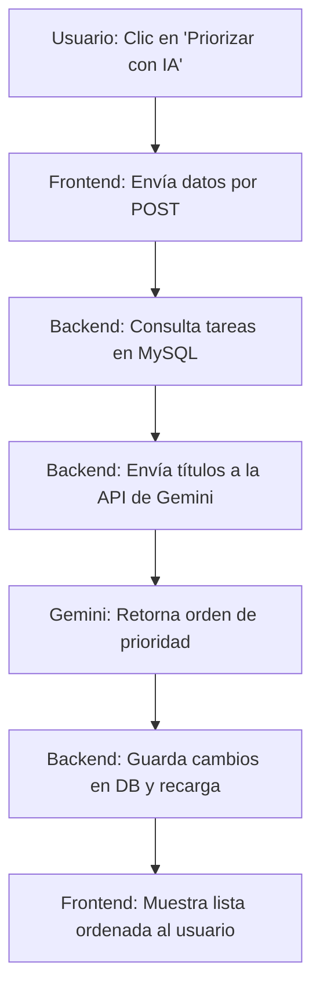

# [RF-MXX] Nombre del Requerimiento

## 1. Descripción y Objetivo
*Describir acá brevemente qué hace este requerimiento, cuál es su propósito en el sistema y qué valor le aporta al usuario final. Relacionarlo con las necesidades detectadas en la elicitación (ej. el cuestionario).*

**Ejemplo:**
> Permite al usuario ocultar todas las distracciones de la pantalla (paneles, menús de navegación, widgets secundarios) durante una sesión de concentración activa. El objetivo es reducir la carga cognitiva y ayudar a evitar la procrastinación en momentos críticos de estudio o trabajo.

---

## 2. Tecnologías, Herramientas y Librerías
*Especificar qué herramientas se usaron para esta implementación específica y justificar su elección de ser necesario.*

- **Librería/API:** `Nombre de la librería o API` (Propósito: qué hace y por qué se eligió).
- **Base de Datos / Persistencia:** Cambios realizados en la base de datos (nuevas tablas, columnas o migraciones).

**Ejemplo:**
- **Web Audio API (Nativo de JS):** Para la reproducción concurrente de sonidos en el mezclador ambiental, evitando dependencias externas innecesarias.
- **Tabla `estadisticas`:** Se agregaron las columnas `sesiones_canceladas` y `ultimo_mensaje_motivacional` para registrar los eventos del temporizador.

---

## 3. Archivos Involucrados en el Requerimiento 
*Enumerar los archivos que forman parte del requerimiento. Esto ayuda a cualquiera a navegar dentro código fuente.*

### Frontend (Vue 3)
- [GestionTareas.vue](file:///C:/Users/della/Cronos-Notes/resources/js/Pages/GestionTareas.vue) - Contiene el componente del panel de tareas y el botón de priorización.
- [Welcome.vue](file:///C:/Users/della/Cronos-Notes/resources/js/Pages/Welcome.vue) - Landing page que contiene el acceso directo al modo invitado.

### Backend & Controladores (Laravel)
- [TareaController.php](file:///C:/Users/della/Cronos-Notes/app/Http/Controllers/TareaController.php) - Maneja los endpoints para crear, listar y priorizar tareas a través del servicio de IA.
- [PomodoroController.php](file:///C:/Users/della/Cronos-Notes/app/Http/Controllers/PomodoroController.php) - Controla la lógica de inicio, pausa y finalización de ciclos de concentración.

### Modelos y Datos (Eloquent ORM)
- `app/Models/Tarea.php` - Modelo de datos con los atributos de prioridad, título y fecha límite.

---

## 4. Flujo de Datos y Control
*Describir de forma sencilla el flujo lógico. Se puede usar un diagrama de flujo simple (bloques) o una lista de pasos en pseudocódigo.*

### Diagrama de Flujo del Requerimiento

### Detalle del Flujo de Control (Pseudocódigo / Pasos)
1. **Frontend:** El usuario dispara la acción desde la interfaz Vue.
2. **Controlador:** Recibe el request y valida la autenticación.
3. **Servicio/Lógica:**
   - Consulta las tareas asociadas al perfil activo.
   - Si no hay tareas, retorna un error descriptivo.
   - Llama al motor de IA enviando el prompt con los títulos y fechas límite.
4. **Base de Datos:** Se actualiza el campo `prioridad` de las tareas con el orden devuelto por la IA.
5. **Respuesta:** Se retorna el estado actualizado al frontend.

---

## 5. Pruebas y Validación (QA)
*Explicar los pasos específicos que debe realizar un tester (o los que se realizaron) para validar que el requerimiento funciona tal como se especificó.*

1. **Precondición:** Iniciar sesión con un usuario de prueba y asegurarse de tener al menos 3 tareas creadas con fechas límites distintas.
2. **Paso 1:** Dirigirse a la sección de Tareas y hacer clic en el botón de ordenación inteligente.
3. **Paso 2:** Verificar la aparición del loader mientras la Inteligencia Artificial procesa la información.
4. **Resultado Esperado:** Las tareas deben quedar reorganizadas automáticamente por fecha de vencimiento y criticidad. No debe haber recarga completa de la página gracias a Inertia.js.
