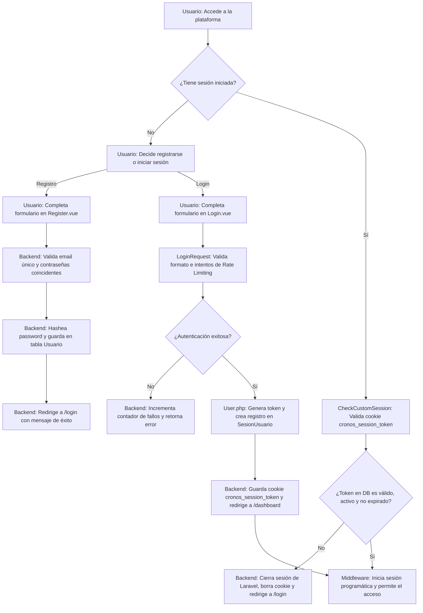

# [RF-1] Autenticación de Usuario

## 1. Descripción y Objetivo
Este requerimiento define la capacidad del sistema para gestionar el acceso seguro de los usuarios a la plataforma. Consiste en la autenticación, el registro de nuevos perfiles, la validación de sus datos y la persistencia de las sesiones. 

Se desglosa en los siguientes sub-requerimientos:
- **RF 1.1: Datos de usuario**: Permite almacenar de forma estructurada la información básica del usuario: nombre, apellido, correo electrónico y contraseña segura en la base de datos.
- **RF 1.2: Validaciones de datos**: El sistema debe comprobar que el formato de los datos provistos sea correcto (ej. correo electrónico válido, contraseñas coincidentes y longitud adecuada) antes de procesarlos. Además, protege contra fuerza bruta limitando intentos fallidos de login.
- **RF 1.3: Sesiones de usuario**: Gestiona la persistencia del estado de autenticación a través de una cookie segura vinculada a una sesión física registrada en la base de datos, manteniéndolo conectado hasta que el token expire (24 horas) o cierre sesión voluntariamente.

---

## 2. Tecnologías, Herramientas y Librerías
Este requerimiento se implementa utilizando las siguientes capas tecnológicas del framework Laravel y Vue 3:

- **Laravel Core & Eloquent ORM**: Persistencia de datos en la tabla `Usuario` y `SesionUsuario` mediante relaciones de tipo *One-to-Many*.
- **Laravel Rate Limiter**: Protege el enpoint de inicio de sesión de ataques de fuerza bruta. Permite un máximo de 5 intentos por minuto (utilizando IP y email como clave) antes de bloquear temporalmente al usuario.
- **Bcrypt (Laravel Hash Facade)**: Cifrado unidireccional de contraseñas para el almacenamiento seguro.
- **Inertia.js & Vue 3**: Interfaces reactivas para las vistas de login y registro, enviando peticiones asíncronas sin recargar toda la aplicación.
- **CheckCustomSession (Middleware Personalizado)**: Interceptor de peticiones HTTP que valida la cookie `cronos_session_token` contra los registros de la base de datos para autenticar al usuario de manera programática en cada petición web.

---

## 3. Archivos Involucrados en el Requerimiento

### Frontend (Vue 3)
- [Register.vue](file:///C:/Users/della/Cronos-Notes/resources/js/Pages/auth/Register.vue) - Componente que renderiza el formulario de registro y realiza el envío de datos POST a `/register`.
- [Login.vue](file:///C:/Users/della/Cronos-Notes/resources/js/Pages/auth/Login.vue) - Componente del formulario de acceso web con soporte para recordar credenciales y enlace al login de Google.

### Backend & Controladores (Laravel)
- [RegisteredUserController.php](file:///C:/Users/della/Cronos-Notes/app/Http/Controllers/Auth/RegisteredUserController.php) - Controlador que valida los campos de registro de usuario y guarda la información en la base de datos.
- [AuthenticatedSessionController.php](file:///C:/Users/della/Cronos-Notes/app/Http/Controllers/Auth/AuthenticatedSessionController.php) - Maneja el inicio de sesión personalizado, la creación de la cookie y la desactivación física del registro de sesión al cerrar la cuenta.
- [LoginRequest.php](file:///C:/Users/della/Cronos-Notes/app/Http/Requests/Auth/LoginRequest.php) - Gestiona la validación de credenciales del login y el control de tasa de peticiones (Rate Limiting).
- [CheckCustomSession.php](file:///C:/Users/della/Cronos-Notes/app/Http/Middleware/CheckCustomSession.php) - Middleware que intercepta la cookie `cronos_session_token` y autologuea al usuario si el token es válido y no ha caducado.

### Modelos y Datos (Eloquent ORM)
- [User.php](file:///C:/Users/della/Cronos-Notes/app/Models/User.php) - Modelo de usuario (`Usuario`) que provee las funciones helper de inicio (`iniciarSesionPersonalizada`) y cierre (`cerrarSesionPersonalizada`) de sesiones en DB.
- [SesionUsuario.php](file:///C:/Users/della/Cronos-Notes/app/Models/SesionUsuario.php) - Modelo para representar y verificar la validez y expiración física de los tokens persistidos.

### Enrutamiento y Base de Datos
- [auth.php](file:///C:/Users/della/Cronos-Notes/routes/auth.php) - Rutas de endpoints `/login`, `/register`, `/logout` y redireccionamiento OAuth.
- [2026_01_01_000000_create_users_table.php](file:///C:/Users/della/Cronos-Notes/database/migrations/2026_01_01_000000_create_users_table.php) - Migración de estructura para la tabla `Usuario`.
- [2026_01_01_000009_create_sesion_usuario_recuperacion_password_table.php](file:///C:/Users/della/Cronos-Notes/database/migrations/2026_01_01_000009_create_sesion_usuario_recuperacion_password_table.php) - Migración para la tabla `SesionUsuario`.

---

## 4. Flujo de Datos y Control

### Diagrama de Flujo del Requerimiento

### Detalle del Flujo de Control (Pasos)
1. **Acceso Inicial y Validación de Sesión (Middleware):**
   - Cuando un usuario solicita cualquier ruta protegida, el middleware [CheckCustomSession.php](file:///C:/Users/della/Cronos-Notes/app/Http/Middleware/CheckCustomSession.php) intercepta la petición.
   - Lee el valor de la cookie `cronos_session_token`. Si existe, busca el token correspondiente en la tabla `SesionUsuario`.
   - Si la sesión es válida (está activa y no ha caducado), se autentica al usuario programáticamente en el framework y se le permite el acceso.
   - De lo contrario, se limpia cualquier rastro de la sesión, se elimina la cookie y se lo redirige al formulario de inicio de sesión.
2. **Flujo de Registro (Register.vue):**
   - El usuario completa los datos en el componente [Register.vue](file:///C:/Users/della/Cronos-Notes/resources/js/Pages/auth/Register.vue) y se envían por POST a `/register`.
   - El controlador [RegisteredUserController.php](file:///C:/Users/della/Cronos-Notes/app/Http/Controllers/Auth/RegisteredUserController.php) valida los campos.
   - Si las validaciones fallan (ej. contraseñas distintas, correo inválido o ya registrado), se retornan los errores al frontend.
   - Si las validaciones son exitosas, se aplica hashing seguro a la contraseña y se crea un registro en la tabla `Usuario`. Luego se redirige a `/login` con un mensaje flash de éxito.
3. **Flujo de Inicio de Sesión (Login.vue):**
   - El usuario ingresa sus credenciales en [Login.vue](file:///C:/Users/della/Cronos-Notes/resources/js/Pages/auth/Login.vue).
   - [LoginRequest.php](file:///C:/Users/della/Cronos-Notes/app/Http/Requests/Auth/LoginRequest.php) verifica el control de tasa de intentos (Rate Limiting). Si se superan los 5 intentos en un minuto, bloquea las peticiones.
   - Si las credenciales son incorrectas, se incrementa el contador de fallos y se retorna un mensaje de error.
   - Si la autenticación es correcta, se invoca a `iniciarSesionPersonalizada()` en el modelo [User.php](file:///C:/Users/della/Cronos-Notes/app/Models/User.php) para generar un nuevo token criptográfico, registrar la sesión activa en la base de datos y guardar la cookie `cronos_session_token` en el navegador con duración de 24 horas.

---

## 5. Pruebas y Validación (QA)

### Pruebas de Registro (Sign Up)
1. **Precondición**: El correo `tester_qa@cronos.com` no debe estar registrado en el sistema.
2. **Paso 1**: Dirigirse a la URL `/register`, llenar el campo correo con un formato inválido (ej: `test_invalido`).
   - **Resultado Esperado**: El navegador o el framework debe reportar que el formato no corresponde a un correo electrónico válido.
3. **Paso 2**: Rellenar con datos correctos pero ingresar contraseñas distintas en "Contraseña" y "Confirmar contraseña". Hacer clic en "Registrarse".
   - **Resultado Esperado**: Debe retornar un error de validación indicando que la confirmación de la contraseña no coincide.
4. **Paso 3**: Introducir los datos correctos (`tester_qa@cronos.com`, contraseñas idénticas) y pulsar "Registrarse".
   - **Resultado Esperado**: Debe redirigir automáticamente a la pantalla `/login` con un mensaje indicando que el registro fue completado exitosamente.

### Pruebas de Login y Persistencia (Session & Security)
1. **Precondición**: Tener la cuenta `tester_qa@cronos.com` registrada con la contraseña `password123`.
2. **Paso 1**: Dirigirse a `/login`, escribir el correo válido y una contraseña errónea. Presionar "Ingresar". Repetir esto consecutivamente 6 veces en menos de un minuto.
   - **Resultado Esperado**: Del intento 1 al 5 debe mostrar "Estas credenciales no coinciden...". En el intento 6 debe bloquear temporalmente las peticiones indicando que ha realizado demasiados intentos de inicio de sesión y debe esperar un número determinado de segundos.
3. **Paso 2**: Tras superar el bloqueo temporal, ingresar las credenciales correctas (`tester_qa@cronos.com` y `password123`).
   - **Resultado Esperado**: Redirección fluida al Dashboard de la aplicación.
4. **Paso 3**: Abrir las herramientas de desarrollador en el navegador (F12), ir a la pestaña Aplicación/Almacenamiento -> Cookies.
   - **Resultado Esperado**: Debe existir una cookie llamada `cronos_session_token` marcada como `HttpOnly` (para protección XSS) y con vigencia de 24 horas.
5. **Paso 4**: Hacer clic en el botón de cerrar sesión en la aplicación.
   - **Resultado Esperado**: Redirección inmediata a la landing page pública (`/`). En el navegador la cookie `cronos_session_token` debe ser eliminada y en la tabla `SesionUsuario` de la base de datos el token correspondiente debe cambiar su estado a `activa = 0`.
