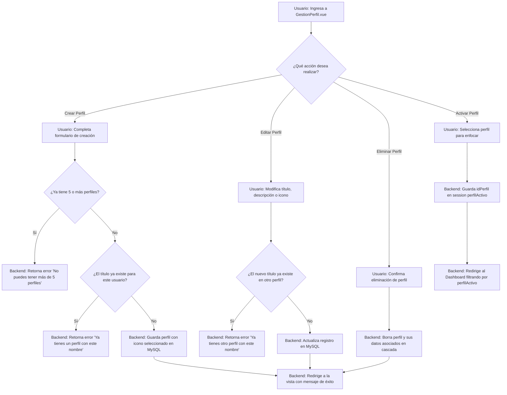

# [RF-2] Gestión y Personalización de Perfiles

## 1. Descripción y Objetivo
Este requerimiento define la capacidad del sistema para organizar y personalizar la información del usuario en diferentes ámbitos o espacios de trabajo (perfiles). Los perfiles actúan como contenedores aislados de tareas y apuntes para ayudar a separar contextos (ej. "Estudio", "Trabajo", "Proyectos Personales").

Se compone de los siguientes sub-requerimientos:
- **RF 2: Gestión de Perfiles**: Permite al usuario crear, editar, eliminar y cambiar el perfil activo del sistema.
- **RF 2.1: Personalización de perfiles**: Ofrece configuraciones visuales y de identificación para cada perfil, tales como modificar el título, agregar una descripción y elegir un icono representativo (ej. carpeta, libro, código).

### Reglas de Negocio y Restricciones:
- **Límite de perfiles**: Cada usuario puede crear un máximo de **5 perfiles**.
- **Nombres únicos**: No se permite que un mismo usuario tenga dos perfiles con el mismo nombre (título).
- **Asociación en cascada**: Al eliminar un perfil, se eliminan todas sus tareas y apuntes relacionados en la base de datos.

---

## 2. Tecnologías, Herramientas y Librerías
Este requerimiento utiliza la arquitectura estándar de Laravel, Vue 3 e Inertia.js:

- **Laravel Core & Eloquent ORM**: Persistencia en la tabla `Perfil` y control de relaciones con `Usuario` y `Tarea`.
- **Laravel Policy (`PerfilPolicy`)**: Gobierna los permisos del perfil según los roles jerárquicos (Lector, Editor, Administrador), asegurando que solo el propietario o usuarios autorizados puedan ver, editar o eliminar el perfil.
- **Inertia.js & Vue 3**: La página [GestionPerfil.vue](/resources/js/Pages/GestionPerfil.vue) maneja el listado dinámico, la apertura de diálogos modales para la creación y edición de perfiles (incluyendo selección de iconos visuales) sin recargas.
- **Sesión de PHP/Laravel**: Se almacena la clave `perfilActivo` en la sesión del servidor para persistir qué perfil está utilizando el usuario en el dashboard.

---

## 3. Archivos Involucrados en el Requerimiento

### Frontend (Vue 3)
- [GestionPerfil.vue](/resources/js/Pages/GestionPerfil.vue) - Componente principal de la interfaz que permite administrar perfiles, cambiar de perfil activo, editar nombres, descripciones y seleccionar iconos.

### Backend & Controladores (Laravel)
- [PerfilController.php](/app/Http/Controllers/PerfilController.php) - Controlador que gestiona los endpoints CRUD de perfiles y la asignación del perfil activo en la sesión.

### Políticas de Acceso (Laravel Policy)
- [PerfilPolicy.php](/app/Policies/PerfilPolicy.php) - Define las autorizaciones para asegurar que los usuarios no propietarios tengan permisos específicos (Lector, Editor o Administrador) y bloquea operaciones indebidas.

### Modelos y Datos (Eloquent ORM)
- [Perfil.php](/app/Models/Perfil.php) - Modelo Eloquent que representa la tabla `Perfil`, definiendo las relaciones con `User`, `Tarea` y `Apunte`.
- [User.php](/app/Models/User.php) - Modelo de usuario con la relación `perfiles()`.

### Enrutamiento y Base de Datos
- [web.php](/routes/web.php) - Define las rutas `/perfiles`, `/perfiles/activar` y `/gestion-perfil`.
- [2026_01_01_000003_create_perfils_table.php](/database/migrations/2026_01_01_000003_create_perfils_table.php) - Migración de estructura para la tabla `Perfil`.
- [2026_06_10_165143_add_icono_perfil_to_perfil_table.php](/database/migrations/2026_06_10_165143_add_icono_perfil_to_perfil_table.php) - Migración que añade la columna `iconoPerfil` para almacenar el icono personalizado.

---

## 4. Flujo de Datos y Control

### Diagrama de Flujo del Requerimiento

### Detalle del Flujo de Control (Pasos)
1. **Listar Perfiles:**
   - Al entrar a `/gestion-perfil`, [PerfilController.php](/app/Http/Controllers/PerfilController.php) consulta todos los perfiles creados por el usuario y los compartidos con él, y los envía como `props` a [GestionPerfil.vue](/resources/js/Pages/GestionPerfil.vue).
2. **Crear Perfil (RF 2.1):**
   - El usuario abre el modal "Crear Perfil" e ingresa título (máx. 30 caracteres), descripción (máx. 100 caracteres) y selecciona un icono visual (ej: `bi-folder-fill`, `bi-book`, etc.).
   - Envía la petición POST a `/perfiles`. El backend valida que el usuario tenga menos de 5 perfiles y que el nombre sea único para su cuenta. Si pasa, crea el registro y redirige refrescando la vista.
3. **Editar Perfil:**
   - El usuario selecciona un perfil existente y presiona "Editar". Modifica los campos en el modal y hace clic en "Guardar".
   - Se envía un PUT a `/perfiles/{id}`. El controlador comprueba que el nuevo título no esté en uso por otro perfil del mismo usuario y actualiza los datos.
4. **Eliminar Perfil:**
   - El usuario presiona el botón de eliminar y confirma en el modal. Se envía un DELETE a `/perfiles/{id}`.
   - El backend elimina el registro, lo cual dispara la eliminación en cascada en la base de datos (tareas y apuntes vinculados).
5. **Activar Perfil:**
   - El usuario hace clic en el botón de activar sobre una tarjeta de perfil. Se envía una petición POST a `/perfiles/activar`.
   - El backend almacena el `idPerfil` en la variable de sesión `perfilActivo` y redirige al dashboard. Toda vista subsiguiente usará esta variable para filtrar las tareas y apuntes mostrados.

---

## 5. Pruebas y Validación (QA)

### Pruebas de Creación e Iconos
1. **Precondición**: Tener menos de 5 perfiles creados.
2. **Paso 1**: Ir a "Mis Perfiles", hacer clic en "Añadir Perfil" sin rellenar el título.
   - **Resultado Esperado**: El formulario debe impedir el envío indicando que el título es requerido.
3. **Paso 2**: Completar el título con un nombre que ya exista (ej: "Estudio"), elegir cualquier icono y guardar.
   - **Resultado Esperado**: Debe mostrar un mensaje de error indicando "Ya tienes un perfil con este nombre".
4. **Paso 3**: Modificar el título por uno único (ej: "Gimnasio"), elegir el icono de la pesa (`bi-activity`) y guardar.
   - **Resultado Esperado**: El perfil debe guardarse correctamente y aparecer listado en la interfaz mostrando el icono de la pesa.

### Pruebas de Límites
1. **Precondición**: Tener 5 perfiles ya creados en el listado.
2. **Paso 1**: Hacer clic en "Añadir Perfil", rellenar campos con un nombre único y presionar "Guardar".
   - **Resultado Esperado**: La acción debe ser rechazada y retornar el mensaje "No puedes tener más de 5 perfiles".

### Pruebas de Selección Activa
1. **Paso 1**: Hacer clic en "Activar" en la tarjeta del perfil "Gimnasio".
   - **Resultado Esperado**: Debe redirigir al Dashboard principal. La barra lateral superior o el estado global de la app deben indicar que el perfil activo actual es "Gimnasio". Todas las tareas y apuntes listados deben corresponder únicamente a este perfil.
