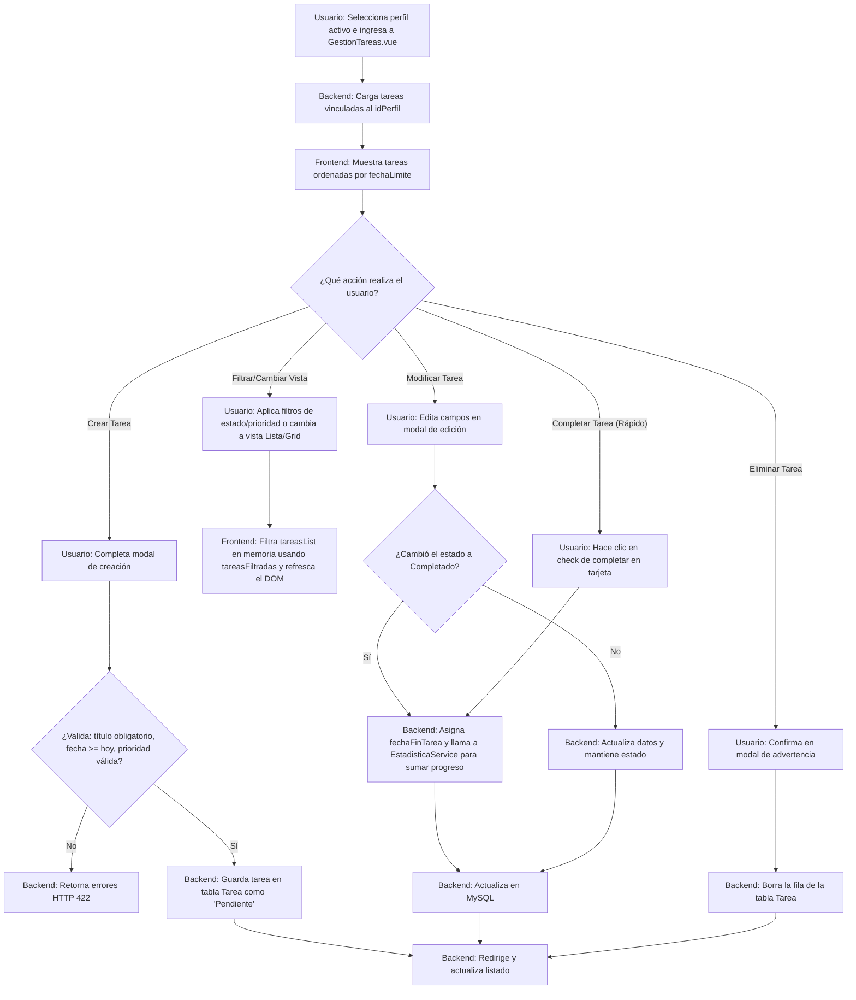

# [RF-3] Gestión y Visualización de Tareas

## 1. Descripción y Objetivo
Este requerimiento define la capacidad del sistema para gestionar las tareas de concentración del usuario dentro del perfil activo. Las tareas organizan el trabajo pendiente y sirven como unidad básica sobre la cual se ejecutan los ciclos de temporización Pomodoro.

Se desglosa en los siguientes sub-requerimientos:
- **RF 3: Gestión de Tareas**: Permite al usuario realizar el ABM (Alta, Baja, Modificación) de tareas y marcarlas como completadas.
- **RF 3.1: Datos de Tareas**: Estructura la información de la tarea en la base de datos (título, descripción, fecha de vencimiento, prioridad inicial, estimación de esfuerzo en pomodoros y vinculación con un perfil específico).
- **RF 3.2: Visualización de Tareas**: Provee una interfaz flexible para listar las tareas del perfil activo, ordenadas cronológicamente por su fecha límite, permitiendo alternar entre vista de Rejilla (Grid) y Lista, así como filtrar dinámicamente según su estado y prioridad.
- **RF 3.3: Etiquetas Visuales**: Identifica visualmente el nivel de prioridad y el estado actual de cada tarea mediante un sistema cromático intuitivo y badges descriptivos.

---

## 2. Tecnologías, Herramientas y Librerías
Este requerimiento se apoya en el stack reactivo del proyecto:

- **Laravel Core & Eloquent ORM**: Almacenamiento en la tabla `Tarea` con integridad referencial hacia la tabla `Perfil` (eliminación en cascada).
- **Inertia.js & Vue 3**: La página [GestionTareas.vue](/resources/js/Pages/GestionTareas.vue) recibe las tareas cargadas en las `props` y expone computadas reactivas (`tareasFiltradas`) para filtrar la lista al instante en el navegador del cliente sin realizar nuevas consultas al servidor.
- **EstadisticaService (Backend Service)**: Servicio PHP que se activa cuando una tarea cambia a estado `'Completado'`, sumando de manera automática el conteo de la tarea resuelta en las estadísticas globales del usuario.
- **Bootstrap Icons**: Librería de iconos vectoriales para identificar los estados de las tareas.

---

## 3. Archivos Involucrados en el Requerimiento

### Frontend (Vue 3)
- [GestionTareas.vue](/resources/js/Pages/GestionTareas.vue) - Vista principal del panel de tareas. Maneja el listado, los filtros de estado/prioridad en memoria (`filtroEstado`, `filtroPrioridad`), los modales de creación/edición, la conmutación de rejilla/lista (`esVistaGrid`) y la priorización inteligente con IA.

### Backend & Controladores (Laravel)
- [TareaController.php](/app/Http/Controllers/TareaController.php) - Controlador que gestiona los métodos CRUD de tareas y valida que las peticiones tengan permisos correctos según el perfil activo del usuario.

### Modelos y Datos (Eloquent ORM)
- [Tarea.php](/app/Models/Tarea.php) - Modelo Eloquent para la tabla `Tarea` con casts para formateo de fechas e integridad de datos.
- [Perfil.php](/app/Models/Perfil.php) - Define la relación inversa de pertenencia `tareas()`.

### Enrutamiento y Base de Datos
- [web.php](/routes/web.php) - Contiene las rutas para las tareas (`/tareas`, `/tareas/{id}`, `/tareas/{id}/completar`, etc.) bajo el middleware de autenticación.
- [2026_01_01_000007_create_tareas_table.php](/database/migrations/2026_01_01_000007_create_tareas_table.php) - Estructura de migración de la base de datos para la tabla `Tarea`.

---

## 4. Flujo de Datos y Control

### Diagrama de Flujo del Requerimiento

### Detalle del Flujo de Control (Pasos)
1. **Carga y Ordenamiento Inicial:**
   - Al entrar a `/tareas`, el controlador obtiene el `perfilActivo` de la sesión.
   - Consulta a la base de datos ordenando por `fechaLimite` ascendente (`orderBy('fechaLimite', 'asc')`) para asegurar que el usuario vea primero lo que vence antes.
2. **Estructura y Validación de Datos (RF 3.1 & RF 3.2):**
   - Para **Crear** una tarea se validan las siguientes reglas:
     - `tituloTarea`: Requerido, string, máximo 45 caracteres.
     - `descripcionTarea`: Opcional, string, máximo 200 caracteres.
     - `fechaLimite`: Requerido, debe ser igual o posterior a hoy (`after_or_equal:today`).
     - `prioridadTarea`: Requerido, valores permitidos: `'Baja'`, `'Media'`, `'Alta'`.
     - `estimacionEsfuerzo`: Opcional, entero mínimo 1 (indica cantidad de pomodoros).
   - Para **Modificar** se permite cambiar el estado (`estadoTarea` en `['Pendiente', 'En Progreso', 'Completado']`). Si el estado pasa a `'Completado'`, se guarda automáticamente la fecha de hoy en `fechaFinTarea`.
3. **Filtros en el Cliente (RF 3.2):**
   - El frontend cuenta con dos variables reactivas: `filtroEstado` y `filtroPrioridad`.
   - La propiedad computada `tareasFiltradas` evalúa las combinaciones seleccionadas y renderiza solo los elementos que coincidan, logrando una respuesta de filtrado instantánea sin tocar el servidor.
4. **Diseño de Código Cromático (RF 3.3):**
   - Las prioridades se mapean a estilos específicos mediante la función `clasePrioridad`:
     - **Alta**: Fondo granate (`#612c2d`), texto blanco.
     - **Media**: Fondo salmón (`#e38e76`), texto blanco.
     - **Baja**: Fondo durazno (`#f4be95`), texto granate.
   - Los estados se identifican con colores y Bootstrap Icons a través de `claseEstado`:
     - **Pendiente**: Dot gris (`#adb5bd`) e icono `bi-dash-circle`.
     - **En Progreso**: Dot naranja (`#ff922b`) e icono `bi-clock-history`.
     - **Completado**: Dot verde (`#51cf66`) e icono `bi-check-circle-fill`.

---

## 5. Pruebas y Validación (QA)

### Pruebas de CRUD y Estructura
1. **Precondición**: Tener un perfil activo asignado en la sesión.
2. **Paso 1**: Hacer clic en el botón de agregar tarea (botón flotante `+`), rellenar el formulario omitiendo el título y con una fecha límite del día de ayer. Guardar.
   - **Resultado Esperado**: El formulario debe dar error indicando que el título es requerido y la fecha límite debe ser hoy o posterior.
3. **Paso 2**: Rellenar correctamente con Título: "Estudiar Álgebra", Prioridad: "Alta", Estimación: "3 Pomodoros", Fecha Límite: Hoy. Guardar.
   - **Resultado Esperado**: La tarea debe aparecer de inmediato. El fondo de la etiqueta de prioridad debe ser rojo oscuro/granate.
4. **Paso 3**: Abrir la base de datos en la tabla `Tarea`.
   - **Resultado Esperado**: Debe existir la fila correspondiente con `fechaInicioTarea` establecida en el día actual y `estadoTarea = 'Pendiente'`.

### Pruebas de Modificación y Completado
1. **Paso 1**: En la tarjeta de la tarea "Estudiar Álgebra", hacer clic en el botón de modificar (icono de lápiz), cambiar el estado a "En Progreso" y guardar.
   - **Resultado Esperado**: El indicador de estado debe cambiar a naranja con el texto "En proceso".
2. **Paso 2**: Marcar la tarea como completada (clic en el botón de verificación).
   - **Resultado Esperado**: La tarea cambia a color verde con un ticket. En base de datos, el campo `fechaFinTarea` debe haberse completado con la fecha de hoy. El contador de tareas finalizadas en el perfil de usuario debe haberse incrementado en 1.

### Pruebas de Filtros y Conmutador de Vistas
1. **Paso 1**: Teniendo al menos una tarea en estado "Pendiente" y otra "Completado", cambiar el filtro de Estado a "Pendiente".
   - **Resultado Esperado**: Solo deben renderizarse en pantalla las tareas con estado "Pendiente".
2. **Paso 2**: Presionar el conmutador de vista a "Lista".
   - **Resultado Esperado**: Las tareas deben reorganizarse horizontalmente de manera compacta, alineadas una debajo de otra en lugar de en bloques de cuadrícula.
