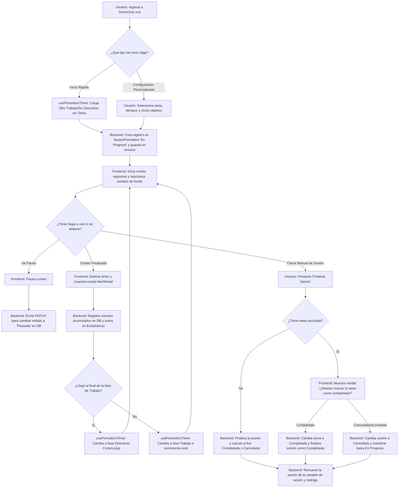

# [RF-4] Sesión Pomodoro y Temporizador

## 1. Descripción y Objetivo
Este requerimiento define el núcleo funcional del temporizador de productividad basado en la Técnica Pomodoro. Su objetivo es ayudar al usuario a concentrarse en sus actividades dividiendo el tiempo de trabajo en bloques enfocados, alternados con descansos cortos y largos para mitigar el agotamiento cognitivo.

Se compone de los siguientes sub-requerimientos:
- **RF 4: Sesión Pomodoro**: Vincula una sesión física de trabajo a una tarea específica del perfil activo, controlando el inicio, pausa y finalización del ciclo de concentración.
- **RF 4.1: Temporizador Pomodoro**: Implementa el cronómetro regresivo que por defecto corre ciclos estándar de 25 minutos de trabajo y 5 minutos de descanso. Si la sesión se detiene antes de finalizar, el sistema registra proporcionalmente el tiempo transcurrido en minutos completos en la base de datos para no perder el esfuerzo acumulado.
- **RF 4.2: Alertas de Sesión**: Emite una ventana modal emergente de aviso no invasivo al finalizar cada intervalo de tiempo, indicando al usuario que ha completado la fase (estudio/trabajo o descanso) y guiándolo hacia la siguiente etapa.

---

## 2. Tecnologías, Herramientas y Librerías
Este requerimiento interactúa con componentes avanzados de reactividad, control de audio y persistencia en el backend:

- **Vue 3 Composables (`usePomodoroTimer`)**: Composable reactivo que encapsula la lógica pura del temporizador, los intervalos de segundo a segundo, la persistencia en `localStorage` ante recargas accidentales de página y el registro automático de minutos trabajados en background.
- **Inertia.js & Laravel Controller**: [PomodoroController.php](file:///C:/Users/della/Cronos-Notes/app/Http/Controllers/PomodoroController.php) recibe peticiones síncronas y asíncronas (Axios) para iniciar, registrar minutos minuto a minuto, pausar y finalizar la sesión.
- **HTML5 Web Audio API & Howler.js**: Carga y reproduce dinámicamente bucles de música y ruido ambiental durante la fase activa, pausándose y deteniéndose automáticamente cuando el temporizador se detiene.
- **AlertModal (Componente Vue)**: Componente modal personalizado [AlertModal.vue](file:///C:/Users/della/Cronos-Notes/resources/js/Components/AlertModal.vue) utilizado para desplegar las alertas de fin de ciclo en pantalla completa.

---

## 3. Archivos Involucrados en el Requerimiento

### Frontend (Vue 3)
- [SesionZen.vue](file:///C:/Users/della/Cronos-Notes/resources/js/Pages/pomodoro/SesionZen.vue) - Interfaz principal del espacio de concentración. Renderiza el cronómetro, controles de reproducción (Iniciar, Pausar, Finalizar), mezclador de sonidos y las ventanas modales de alerta de fin de fase y de confirmación de cierre.
- [usePomodoroTimer.js](file:///C:/Users/della/Cronos-Notes/resources/js/Composables/usePomodoroTimer.js) - Composable reactivo que coordina el estado de cuenta regresiva, fases (`work`, `shortBreak`, `longBreak`), conteo de ciclos y sincronización del estado actual con el almacenamiento local (`localStorage`).

### Backend & Controladores (Laravel)
- [PomodoroController.php](file:///C:/Users/della/Cronos-Notes/app/Http/Controllers/PomodoroController.php) - Controlador que gestiona la inicialización de sesiones en base de datos, actualización de estados (pausar/reanudar) y la persistencia del tiempo real trabajado tras la finalización o cancelación.

### Modelos y Datos (Eloquent ORM)
- [SesionPomodoro.php](file:///C:/Users/della/Cronos-Notes/app/Models/SesionPomodoro.php) - Modelo Eloquent que mapea a la tabla `SesionPomodoro` para registrar el estado, ciclos completados y minutos de trabajo acumulados.
- [ConfiguracionPomodoro.php](file:///C:/Users/della/Cronos-Notes/app/Models/ConfiguracionPomodoro.php) - Modelo que guarda las preferencias de duración por usuario.

### Enrutamiento y Base de Datos
- [web.php](file:///C:/Users/della/Cronos-Notes/routes/web.php) - Define las rutas de API y enrutamiento del temporizador bajo el prefijo `/pomodoro`.
- [2026_01_01_000011_create_sesion_pomodoro_table.php](file:///C:/Users/della/Cronos-Notes/database/migrations/2026_01_01_000011_create_sesion_pomodoro_table.php) - Migración para la tabla `SesionPomodoro`.

---

## 4. Flujo de Datos y Control

### Diagrama de Flujo del Requerimiento

### Detalle del Flujo de Control (Pasos)
1. **Configuración e Inicialización:**
   - Al invocar `iniciarSesion()`, se valida e inserta un registro en la tabla `SesionPomodoro` en estado `'En Progreso'`. Si hay una tarea seleccionada, esta pasa a estado `'En Progreso'`.
   - Se guarda el objeto descriptivo de la sesión en la sesión de Laravel (`sesionPomodoroActiva`) para retornarlo al cliente y evitar que acceda a configurar de nuevo.
2. **Ciclo Regresivo en Background (RF 4.1):**
   - El front-end inicia el conteo. Cada segundo que transcurre se resta de `timeLeft`.
   - Si la fase es de trabajo, cada 60 segundos transcurridos el composable realiza una petición HTTP POST asíncrona en segundo plano a `/pomodoro/registrar` informando `minutosTrabajados = 1` y actualizando el acumulado en la base de datos de manera atómica.
3. **Pausa y Almacenamiento Local:**
   - Al presionar "Pausa", se interrumpe el interval, se detienen los sonidos ambientales y se realiza una petición PATCH a `/pomodoro/estado` asignando el estado `'Pausada'` en DB.
   - El estado actual (tiempo transcurrido, ciclo actual, fase) se guarda en `localStorage` bajo una clave única de la sesión (`pomodoro_session_{idSesion}`) para que si el usuario recarga la pestaña, la sesión continúe exactamente donde estaba.
4. **Alertas de Fin de Fase (RF 4.2):**
   - Cuando el contador llega a `00:00`, se invoca el callback del front-end.
   - Se muestra un modal `<AlertModal>` en pantalla indicando la finalización ("¡Sesión de trabajo finalizada!" o "¡Descanso terminado!").
   - Tras aceptar, se calcula el siguiente intervalo: si completó la cantidad de ciclos estipulados para el descanso largo (ej. 4 ciclos), el cronómetro se configura con la duración de descanso largo; de lo contrario, inicia un descanso corto y vuelve a comenzar.
5. **Cierre de Sesión y Completado de Tarea:**
   - Si el usuario presiona "Finalizar Sesión" manualmente antes de cumplir el objetivo, el front-end calcula los minutos transcurridos en el ciclo de trabajo actual que aún no se registraron en la DB y los envía para su guardado final.
   - Si la sesión tenía una tarea asociada, se muestra un modal preguntando si desea dar la tarea por finalizada. De ser afirmativo, la sesión se guarda como `'Completada'` y la tarea como `'Completada'`. Caso contrario, la sesión se guarda como `'Cancelada'` y la tarea se mantiene `'En Progreso'`.

---

## 5. Pruebas y Validación (QA)

### Pruebas del Temporizador e Intervalos
1. **Precondición**: Estar autenticado y en la pantalla `/pomodoro` en estado de Setup.
2. **Paso 1**: Seleccionar una tarea de la lista, configurar 25 minutos de trabajo, 5 de descanso y presionar "Iniciar Sesión".
   - **Resultado Esperado**: El temporizador debe cargar el valor `25:00` y comenzar el descuento segundo a segundo. La tarea elegida debe cambiar su estado en el menú lateral a "En proceso".
3. **Paso 2**: Dejar correr el temporizador durante 1 minuto completo (60 segundos).
   - **Resultado Esperado**: Se debe observar en la consola del navegador (pestaña Red/Network) el envío de una petición HTTP POST a `/pomodoro/registrar` con el parámetro `minutosTrabajados = 1`.
4. **Paso 3**: Presionar el botón de "Pausa".
   - **Resultado Esperado**: El conteo se detiene. Debe dispararse una petición PATCH a `/pomodoro/estado` con `estado = 'Pausada'`.
5. **Paso 4**: Recargar la pestaña del navegador (F5).
   - **Resultado Esperado**: Gracias a la persistencia en `localStorage`, la interfaz debe reconstruirse mostrando el temporizador detenido en el mismo segundo exacto en el que se pausó.

### Pruebas de Alertas (Fase Completada)
1. **Paso 1**: Dejar que el temporizador llegue a `00:00` durante una fase activa de Trabajo.
   - **Resultado Esperado**: El temporizador se detiene. Debe aparecer una ventana modal emergente con el título "¡Sesión de trabajo finalizada!" y el botón "Aceptar".
2. **Paso 2**: Presionar el botón "Aceptar".
   - **Resultado Esperado**: El modal debe desaparecer. El temporizador debe configurarse automáticamente con el tiempo de descanso (ej. `05:00`) y quedar listo para iniciar la fase de relajación.

### Pruebas de Finalización Manual y Tarea
1. **Precondición**: Tener una sesión iniciada con una tarea asociada.
2. **Paso 1**: Dejar correr la sesión de trabajo por unos minutos y presionar el botón rojo "Finalizar Sesión".
   - **Resultado Esperado**: El temporizador se detiene y se despliega un cuadro de diálogo preguntando si se desea marcar la tarea como completada.
3. **Paso 2**: Seleccionar "Sí, completar tarea".
   - **Resultado Esperado**: Se redirige a la pantalla de Pomodoro en estado limpio. En el dashboard la tarea debe figurar como "Finalizada".
