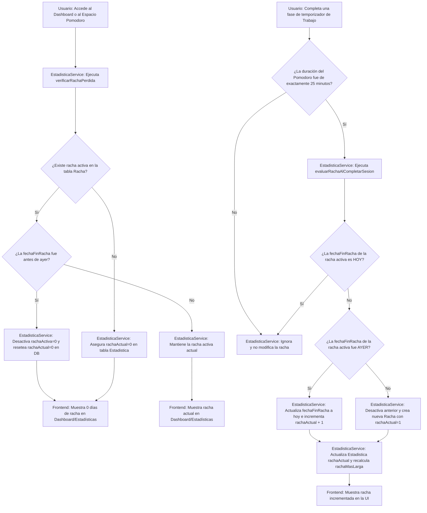

# [RF-5] Sistema de Rachas

## 1. Descripción y Objetivo
Este requerimiento define el mecanismo de gamificación y motivación en Cronos Notes. Su objetivo es incentivar la constancia de uso diario y el mantenimiento de hábitos de concentración saludables mediante un contador de "días consecutivos de racha".

Se compone de las siguientes características y reglas de negocio:
- **Racha Activa**: La racha se incrementa en 1 por cada día consecutivo que el usuario complete al menos una sesión pomodoro activa.
- **Regla del Día Consecutivo**: Para mantener la racha, el usuario debe realizar una sesión el día de hoy o haber realizado una el día de ayer. Si transcurre un día completo sin actividad calificada, la racha se rompe y el contador vuelve a cero.
- **Restricción de Duración (RF-M12)**: Para evitar fraudes (ej. iniciar y completar sesiones simuladas de 1 minuto), la racha solo aumenta cuando el usuario completa una sesión de trabajo con una duración configurada de **exactamente 25 minutos**.
- **Límite Diario**: La racha solo puede incrementarse una vez al día. Sesiones completadas el mismo día después del incremento diario son registradas en el historial de trabajo pero no alteran el contador de la racha actual.

---

## 2. Tecnologías, Herramientas y Librerías
El sistema de rachas se implementa mediante servicios y persistencia relacional en el backend:

- **Laravel Core & Carbon**: Para realizar las operaciones de fechas y tiempo, comparando si la última racha finalizó ayer (`Carbon::yesterday()`) o antes para declarar su pérdida.
- **EstadisticaService (Backend Service)**: Clase centralizada [EstadisticaService.php](file:///C:/Users/della/Cronos-Notes/app/Services/EstadisticaService.php) que evalúa las fechas, crea los registros de racha y sincroniza la tabla `Estadistica` global con el desglose histórico de la tabla `Racha`.
- **Inertia.js Props**: El estado actual de la racha (`rachaActual` y `rachaMasLarga`) se inyecta como propiedad del usuario autenticado en las vistas de [Dashboard.vue](file:///C:/Users/della/Cronos-Notes/resources/js/Pages/Dashboard.vue), [PerfilUsuario.vue](file:///C:/Users/della/Cronos-Notes/resources/js/Pages/PerfilUsuario.vue) y [Estadisticas.vue](file:///C:/Users/della/Cronos-Notes/resources/js/Pages/Estadisticas.vue).

---

## 3. Archivos Involucrados en el Requerimiento

### Frontend (Vue 3)
- [Dashboard.vue](file:///C:/Users/della/Cronos-Notes/resources/js/Pages/Dashboard.vue) - Muestra el indicador principal de la racha actual ("X días de racha") en la sección de estadísticas rápidas del usuario.
- [PerfilUsuario.vue](file:///C:/Users/della/Cronos-Notes/resources/js/Pages/PerfilUsuario.vue) y [Estadisticas.vue](file:///C:/Users/della/Cronos-Notes/resources/js/Pages/Estadisticas.vue) - Exponen la racha más larga histórica y la racha actual del perfil del estudiante.

### Backend & Servicios (Laravel)
- [EstadisticaService.php](file:///C:/Users/della/Cronos-Notes/app/Services/EstadisticaService.php) - Contiene la lógica para comprobar pérdidas de racha (`verificarRachaPerdida`) e incrementar el contador de días consecutivos al completar sesiones de 25 minutos (`evaluarRachaAlCompletarSesion`).

### Modelos y Datos (Eloquent ORM)
- [Racha.php](file:///C:/Users/della/Cronos-Notes/app/Models/Racha.php) - Modelo Eloquent que mapea a la tabla `Racha` para almacenar el histórico de rachas del usuario.
- [Estadistica.php](file:///C:/Users/della/Cronos-Notes/app/Models/Estadistica.php) - Modelo que unifica y acumula los contadores del usuario para búsquedas rápidas.

### Enrutamiento y Base de Datos
- [web.php](file:///C:/Users/della/Cronos-Notes/routes/web.php) - Pasa por el servicio de racha para resetearla si caducó al cargar el dashboard o la página de perfil.
- [2026_01_01_000005_create_estadistica_racha_table.php](file:///C:/Users/della/Cronos-Notes/database/migrations/2026_01_01_000005_create_estadistica_racha_table.php) - Define las tablas `Racha` y `Estadistica`.

---

## 4. Flujo de Datos y Control

### Diagrama de Flujo del Requerimiento

### Detalle del Flujo de Control (Pasos)
1. **Comprobación Pasiva de Expiración:**
   - Cada vez que el usuario carga el Dashboard o su Perfil de Usuario, se ejecuta `verificarRachaPerdida()`.
   - Se comprueba la fecha del último pomodoro completado (`fechaFinRacha` de la racha activa). Si esta fecha es anterior al día de ayer (es decir, pasaron 48 horas o más desde la última sesión), se actualiza el estado de la racha a inactiva (`rachaActiva = 0`) y se setea `rachaActual = 0` en la tabla `Estadistica`.
2. **Evaluación de Actividad Calificada:**
   - Cuando el temporizador finaliza y registra una sesión pomodoro completada en el servidor, se dispara `evaluarRachaAlCompletarSesion()`.
   - **Filtro de Duración (Regla RF-M12)**: Si la sesión duró un tiempo distinto de 25 minutos (ej. 15, 30 o 45 minutos), el flujo termina sin acumular racha.
3. **Cálculo de Consecutividad:**
   - **Caso 1 (Mismo Día)**: Si el usuario ya había completado una sesión de 25 minutos hoy (`fechaFinRacha == hoy`), se sale del flujo inmediatamente para no duplicar el conteo.
   - **Caso 2 (Día Consecutivo)**: Si la última sesión fue ayer (`fechaFinRacha == ayer`), se actualiza la fecha de fin al día de hoy y se incrementa el contador local de la racha en 1.
   - **Caso 3 (Racha Nueva/Rota)**: Si no hay racha activa o la última actividad ocurrió antes de ayer, se cierra cualquier racha anterior, y se inserta un nuevo registro en la tabla `Racha` con `fechaInicioRacha = hoy`, `fechaFinRacha = hoy` y `rachaActual = 1`.
4. **Sincronización y Réplica:**
   - El nuevo valor de racha activa calculado se actualiza en el campo `rachaActual` de la tabla `Estadistica`.
   - Si la nueva racha supera el récord histórico del usuario (`rachaMasLarga`), se actualiza el campo `rachaMasLarga` con este nuevo valor.

---

## 5. Pruebas y Validación (QA)

### Pruebas de Incremento de Racha
1. **Precondición**: El usuario debe tener su racha actual en `0` en el Dashboard.
2. **Paso 1**: Iniciar una sesión pomodoro de 25 minutos (vía inicio rápido o personalizado). Esperar o simular que se complete la fase hasta el final (hasta ver el AlertModal).
   - **Resultado Esperado**: Al aceptar el modal y recargar el dashboard, la sección de estadísticas debe mostrar "1 días de racha".
3. **Paso 2**: Iniciar otra sesión pomodoro de 25 minutos el mismo día y completarla.
   - **Resultado Esperado**: El contador de racha debe mantenerse en "1 días de racha" (no debe incrementarse dos veces el mismo día).
4. **Paso 3**: Iniciar una sesión pomodoro personalizada modificada a 30 minutos de duración. Completar la sesión.
   - **Resultado Esperado**: El contador de racha no debe alterarse (debe mantenerse en 1), ya que solo aplican sesiones de exactamente 25 minutos.

### Pruebas de Expiración y Reseteo
1. **Precondición**: Tener una racha de 1 o más días con la última fecha de actividad (`fechaFinRacha`) en el día de hoy.
2. **Paso 1**: Modificar en la base de datos la fecha de fin de la racha activa (`fechaFinRacha`) al día de ayer. Ingresar a la aplicación.
   - **Resultado Esperado**: La racha debe mantenerse activa y mostrar su contador normal, ya que la última actividad fue "ayer" y el usuario tiene tiempo de mantenerla completando una sesión hoy.
3. **Paso 2**: Modificar en la base de datos la fecha de fin de la racha activa (`fechaFinRacha`) a una fecha de hace dos días. Cargar el Dashboard.
   - **Resultado Esperado**: El sistema debe detectar la inactividad, desactivar el registro de la racha en la base de datos (`rachaActiva = 0`) y mostrar "0 días de racha" en la interfaz. El valor de "Racha más larga" en el perfil debe conservar su récord histórico anterior.
