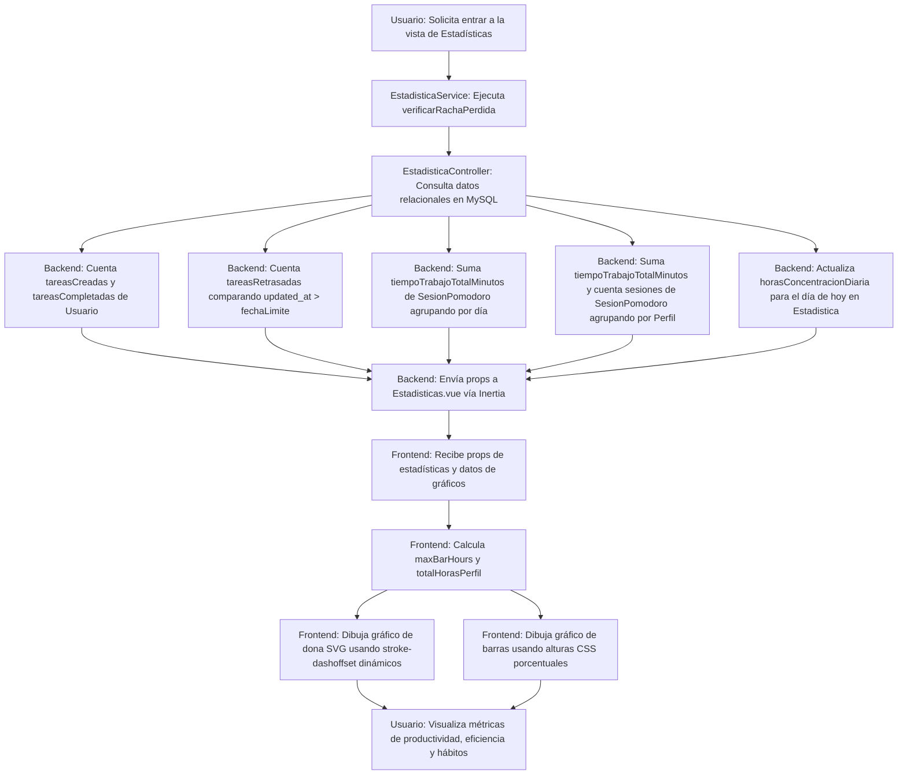

# [RF-6] Sistema de Estadísticas de Usuario

## 1. Descripción y Objetivo
Este requerimiento define el módulo analítico y de autoevaluación de Cronos Notes. Su objetivo es brindar al usuario una visualización clara, interactiva e integrada sobre su rendimiento y hábitos de trabajo diario, permitiéndole identificar patrones de productividad y hacer seguimiento de sus logros.

Se compone de los siguientes sub-requerimientos:
- **RF 6: Sistema de Estadísticas**: Muestra una vista unificada que recopila y calcula métricas clave del comportamiento y dedicación temporal del usuario.
- **RF 6.1: Estadísticas de Usuario**: Expone indicadores de rendimiento numéricos (tareas completadas, tareas completadas con retraso, porcentaje de eficiencia y tiempo acumulado en minutos de concentración) y gráficos interactivos (horas de estudio por día de la última semana y horas de pomodoro dedicadas a cada perfil).

---

## 2. Tecnologías, Herramientas y Librerías
El sistema de estadísticas está diseñado con una arquitectura eficiente que reduce el consumo de librerías externas de renderizado pesado, utilizando SVG nativo y CSS reactivo:

- **Laravel Core & Eloquent ORM**: Consultas relacionales agregadas (conteo, sumatoria y agrupaciones) sobre las tablas `Tarea`, `SesionPomodoro` y `Perfil` para procesar la información del usuario autenticado.
- **Carbon (Date Library)**: Utilizado para calcular la ventana temporal de los últimos 7 días en el backend de manera dinámica.
- **Inertia.js & Vue 3 Props**: Traspaso eficiente de arrays de datos precalculados en formato JSON a la vista del cliente.
- **SVG Reactivo y Flexbox (Frontend Render)**: El gráfico de dona se genera dinámicamente mediante etiquetas `<circle>` de SVG calculando las proporciones angulares (`stroke-dasharray` y `stroke-dashoffset`) en tiempo real. El gráfico de barras se dibuja usando columnas de HTML y alturas porcentuales (`height: X%`) basadas en el máximo valor semanal registrado.

---

## 3. Archivos Involucrados en el Requerimiento

### Frontend (Vue 3)
- [Estadisticas.vue](/resources/js/Pages/Estadisticas.vue) - Componente principal de la vista analítica. Contiene las tarjetas de métricas, los cálculos reactivos de ejes, las leyendas cromáticas y las estructuras SVG/CSS para pintar los gráficos de dona y barras.

### Backend & Controladores (Laravel)
- [EstadisticaController.php](/app/Http/Controllers/EstadisticaController.php) - Controlador que calcula las tareas creadas, completadas y retrasadas, agrupa los minutos trabajados por perfil y por día para la última semana, y actualiza la concentración diaria.
- [EstadisticaService.php](/app/Services/EstadisticaService.php) - Servicio que incrementa el total de minutos trabajados globales y suma tareas resueltas a nivel de base de datos.

### Modelos y Datos (Eloquent ORM)
- [Estadistica.php](/app/Models/Estadistica.php) - Mapea la tabla `Estadistica` donde se acumulan las rachas, el total de minutos trabajados e información consolidada.

### Enrutamiento y Base de Datos
- [web.php](/routes/web.php) - Define la ruta GET `/estadisticas` protegida por el middleware de autenticación.
- [2026_01_01_000005_create_estadistica_racha_table.php](/database/migrations/2026_01_01_000005_create_estadistica_racha_table.php) - Migración de estructura para la tabla `Estadistica`.

---

## 4. Flujo de Datos y Control

### Diagrama de Flujo del Requerimiento

### Detalle del Flujo de Control (Pasos)
1. **Petición e Interceptación de Racha:**
   - La petición ingresa por `/estadisticas`. Antes de recopilar métricas, el backend ejecuta `verificarRachaPerdida()` para garantizar que la racha del usuario esté actualizada.
2. **Cómputo en Servidor (EstadisticaController):**
   - **Métricas Numéricas**:
     - `tareasCreadas`: Cuenta todas las tareas del usuario.
     - `tareasCompletadas`: Cuenta tareas en estado `'Completado'`.
     - `tareasRetrasadas`: Cuenta tareas en estado `'Completado'` cuya fecha de última actualización (`updated_at`) sea posterior a su `fechaLimite`.
     - `eficiencia`: Porcentaje de completadas sobre creadas.
   - **Historial Semanal (Gráfico de Barras)**:
     - Itera del día actual hacia atrás 7 veces. Para cada fecha, calcula la sumatoria de minutos trabajados en sesiones activas y divide por 60 para enviarlo en horas.
   - **Distribución por Perfil (Gráfico de Dona)**:
     - Itera por cada perfil del usuario. Suma los minutos totales trabajados en sesiones asociadas a tareas de ese perfil y cuenta las sesiones totales.
3. **Cálculo Reactivo en Cliente (Estadisticas.vue):**
   - **Columna de Barras**: Obtiene el valor máximo de horas del array de la semana para definir el límite del eje Y (`maxBarHours`). Cada barra calcula su altura relativa con la fórmula `(horas_dia / max_horas) * 100`.
   - **Gráfico de Dona**: Calcula la suma total de horas de todos los perfiles (`totalHorasPerfil`). Cada segmento de círculo calcula su proporción (`getDashArray`) y su posición angular inicial (`getDashOffset`) en base a los segmentos acumulados anteriormente.

---

## 5. Pruebas y Validación (QA)

### Pruebas de Métricas y Cálculos
1. **Precondición**: El usuario debe tener al menos una tarea creada y completada, y otra tarea completada después de la fecha límite establecida (tarea retrasada).
2. **Paso 1**: Navegar al apartado "Estadísticas".
   - **Resultado Esperado**: Se debe cargar el listado. Comprobar que "Tareas Completadas" sume el valor correcto, "Finalizadas con Retraso" registre las tareas que excedieron la fecha de vencimiento y el indicador de "Eficiencia" muestre la relación porcentual correcta.

### Pruebas de Visualización de Gráficos (Gráfico de Barras y Dona)
1. **Paso 1**: Completar un pomodoro de 25 minutos hoy. Ir a "Estadísticas".
   - **Resultado Esperado**: 
     - En el gráfico "Horas de estudio por día", la barra correspondiente a la fecha de hoy debe mostrar un incremento proporcional a 0.42 horas (25 minutos). El eje Y debe recalcular sus etiquetas de escala de acuerdo con el nuevo valor máximo.
     - Al pasar el cursor (hover) por encima de la barra, debe aparecer un tooltip con la fecha y las horas exactas.
2. **Paso 2**: Ir a "Estadísticas" habiendo completado pomodoros únicamente en el perfil "Estudio".
   - **Resultado Esperado**: El gráfico "Horas de pomodoro por perfil" (dona) debe estar compuesto al 100% por el color representativo del perfil "Estudio" y la leyenda debe indicar la sumatoria de horas y sesiones registradas para ese perfil.
