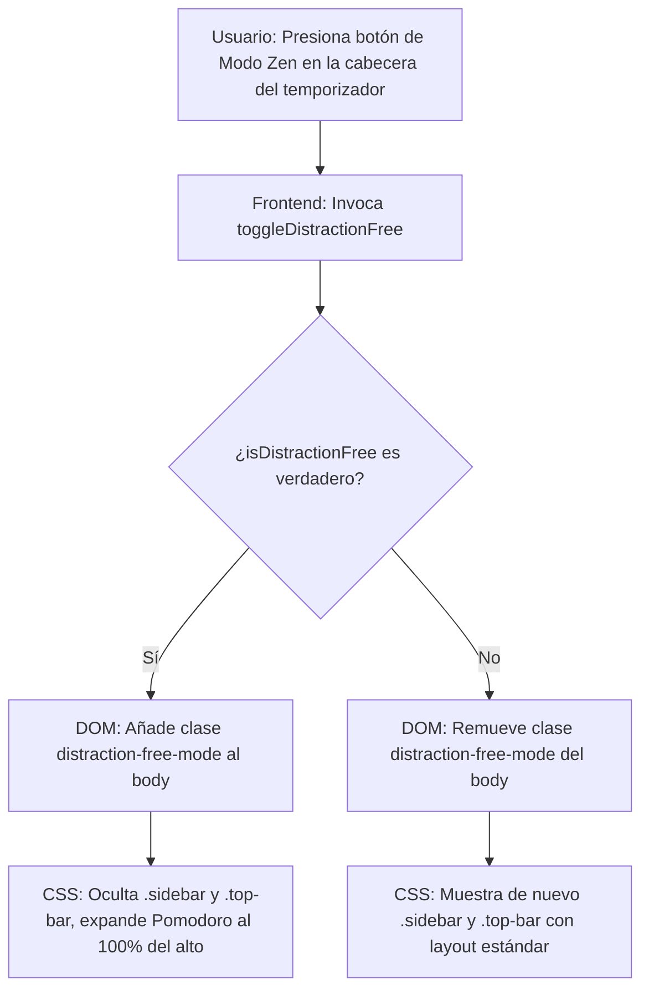

# [RF-M01] Alternancia a Modo Zen

## 1. Descripción y Objetivo
Este requerimiento define la capacidad del usuario para alternar a un entorno visual libre de distracciones visuales (Modo Zen) mediante un botón manual en la interfaz del widget de temporizador.
- **Alternancia Manual**: Permite ocultar los paneles laterales (sidebar) y barra superior (topbar) de navegación, expandiendo el área del espacio de concentración para ocupar el 100% de la pantalla.
- **Objetivo**: Ayudar al usuario a evitar interrupciones visuales y carga cognitiva innecesaria durante periodos de estudio o trabajo activo, manteniendo visible únicamente el temporizador y la tarea seleccionada.

---

## 2. Tecnologías, Herramientas y Librerías
Este requerimiento se implementa a nivel de interfaz de usuario mediante control reactivo y clases CSS globales:

- **Vue 3 (Composition API)**: Reactividad mediante `isDistractionFree` ref para controlar el estado y actualizar dinámicamente las clases del contenedor.
- **Manipulación de Clases de Body (DOM)**: Uso de `document.body.classList.add('distraction-free-mode')` y `document.body.classList.remove('distraction-free-mode')` para ocultar elementos estructurales fuera de la vista Vue principal.
- **Directivas Personalizadas (vDraggable)**: Para controlar la interacción física y el movimiento del widget de temporizador, permitiendo moverlo libremente tanto en pantalla completa como en modo minimizado.

---

## 3. Archivos Involucrados en el Requerimiento

### Frontend (Vue 3)
- [SesionZen.vue](/resources/js/Pages/pomodoro/SesionZen.vue) - Gestiona la cabecera del widget del temporizador donde se incluye el botón de ojo (`bi-eye-fill` / `bi-eye-slash-fill`), el estado de pantalla completa, y los estilos que modifican el layout a modo zen.
- [AppLayout.vue](/resources/js/Layouts/AppLayout.vue) - Contiene la estructura general con el menú de navegación lateral (`.sidebar`) y superior (`.top-bar`) que se ocultan ante la presencia de la clase `distraction-free-mode` en el `body`.

### Directivas de Interacción
- [vDraggable.js](/resources/js/Directives/vDraggable.js) - Controla el comportamiento de arrastre libre del widget principal del temporizador.

---

## 4. Flujo de Datos y Control

### Diagrama de Flujo del Requerimiento

### Detalle del Flujo de Control (Pasos)
1. **Frontend:** El usuario hace clic en el botón con forma de ojo en la cabecera del temporizador Pomodoro.
2. **Método Controlador:** Se ejecuta `toggleDistractionFree()`, el cual invierte el valor de `isDistractionFree`.
3. **Manipulación del DOM:**
   - Si `isDistractionFree` es `true`, se inserta la clase `.distraction-free-mode` en la etiqueta `<body>` del documento.
   - Si es `false`, se remueve la clase.
4. **Hojas de Estilo (CSS):** El navegador interpreta la regla global `body.distraction-free-mode .sidebar { display: none !important; }` y `.top-bar { display: none !important; }` ocultando de inmediato las secciones y expandiendo el contenedor principal al 100% de la ventana.

---

## 5. Pruebas y Validación (QA)

1. **Precondición:** Iniciar sesión e ingresar a la sección de Pomodoro (/pomodoro).
2. **Paso 1:** Con el temporizador maximizado, presionar el botón de ojo (Modo Zen) al lado de minimizar.
3. **Resultado Esperado 1:** La barra de navegación lateral y la barra superior deben desaparecer instantáneamente. La pantalla del espacio Pomodoro debe abarcar todo el espacio del navegador.
4. **Paso 2:** Hacer clic en la pantalla vacía de fondo (fuera de los widgets) o pulsar nuevamente el botón del ojo.
5. **Resultado Esperado 2:** El layout normal de la aplicación debe restablecerse al instante de forma suave y sin desajustes de los widgets.
