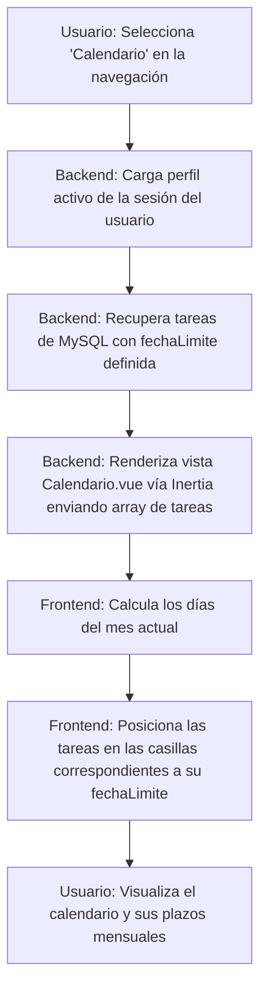

# [RF-M03] Renderizado de Calendario Visual

## 1. Descripción y Objetivo
Este requerimiento introduce una vista de planificación visual mensual e intuitiva en el sistema.
- **Mapeo de Tareas**: Obtiene todas las tareas creadas por el usuario activo y las ubica en el día correspondiente del calendario según su fecha de límite establecida (`fechaLimite`).
- **Objetivo**: Proveer una herramienta visual de organización semanal y mensual que ayude al usuario a anticipar picos de trabajo y plazos de entrega directamente integrados con sus perfiles de tareas, mejorando la gestión de tiempo de manera global.

---

## 2. Tecnologías, Herramientas y Librerías
El calendario visual combina la recuperación selectiva de registros del servidor con lógica reactiva en el cliente:

- **Laravel (Eloquent ORM)**: Recuperación de tareas filtradas por perfil activo utilizando consultas relacionales en la base de datos MySQL.
- **Inertia.js**: Transfiere los datos de la colección de tareas recuperada desde el backend directamente hacia las propiedades (`props`) de la vista Vue en el frontend.
- **Vue 3**: Construcción y renderizado de la grilla de días del mes, posicionamiento reactivo de tareas y filtros dinámicos.

---

## 3. Archivos Involucrados en el Requerimiento

### Frontend (Vue 3)
- [Calendario.vue](/resources/js/Pages/Calendario.vue) - Página que define el diseño del calendario mensual, lógica de navegación de meses (anterior/siguiente) y renderiza las tarjetas de tareas dentro de los días correspondientes.

### Backend & Controladores (Laravel)
- [DashboardController.php](/app/Http/Controllers/DashboardController.php) - Coordina la recuperación de las tareas y perfiles vinculados para alimentar la visualización inicial de la página.

### Modelos y Datos (Eloquent ORM)
- [Tarea.php](/app/Models/Tarea.php) - Contiene los campos `tituloTarea` y `fechaLimite` utilizados para estructurar el calendario.

---

## 4. Flujo de Datos y Control

### Diagrama de Flujo del Requerimiento

### Detalle del Flujo de Control (Pasos)
1. **Frontend:** El usuario solicita ingresar a la pestaña de Calendario.
2. **Backend (Enrutamiento y Carga):** El controlador correspondiente obtiene el ID del perfil activo de la sesión y realiza una consulta Eloquent para buscar tareas no archivadas.
3. **Paso de Datos:** Inertia inyecta el JSON de tareas en las `props` del componente `Calendario.vue`.
4. **Cálculo de Grilla (Frontend):**
   - El componente Vue calcula cuántos días tiene el mes actual, el día de la semana en que comienza el mes, y genera las filas de la cuadrícula.
   - Itera por cada día del mes, comparando el formato de fecha del día con la propiedad `fechaLimite` de las tareas recibidas.
5. **Renderizado:** Si hay coincidencia de fecha, se inserta una pequeña tarjeta con el título y color según la prioridad de la tarea en la celda del día correspondiente.

---

## 5. Pruebas y Validación (QA)

1. **Precondición:** Iniciar sesión y crear una tarea (ej: "Entregar Taller 2") asignándole una fecha límite específica en el mes actual (ej: el día 20).
2. **Paso 1:** Ir a "Calendario" en el menú de navegación izquierdo.
3. **Resultado Esperado 1:** Debe renderizarse la cuadrícula del mes actual de forma responsive.
4. **Paso 2:** Navegar hasta la casilla del día asignado (ej: día 20).
5. **Resultado Esperado 2:** La tarea "Entregar Taller 2" debe mostrarse visible dentro del día correspondiente con el color identificativo de su prioridad.
