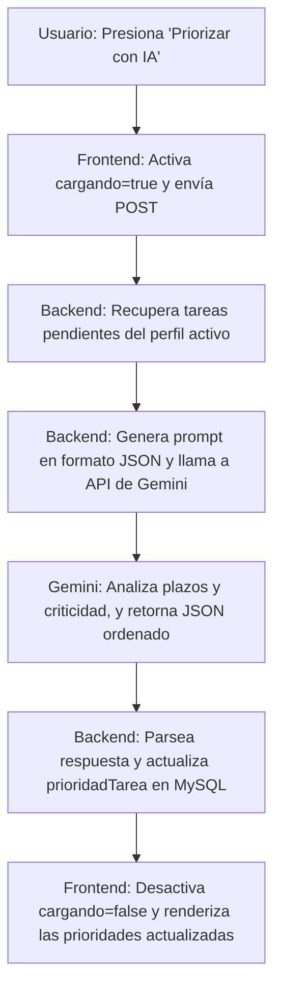

# [RF-M04] Procesamiento de IA para Prioridad

## 1. Descripción y Objetivo
Este requerimiento define la integración de Inteligencia Artificial para automatizar y mejorar la priorización de tareas pendientes.
- **Priorización Inteligente**: Envía los títulos, descripciones y fechas límite de las tareas del perfil seleccionado a la API de Inteligencia Artificial de Google Gemini.
- **Objetivo**: Proveer al usuario una categorización de prioridades (Alta, Media, Baja) optimizada y justificada por un modelo de lenguaje avanzado, resolviendo problemas de indecisión o sobrecarga y ayudando a estructurar el flujo diario de trabajo.

---

## 2. Tecnologías, Herramientas y Librerías
Este requerimiento requiere una integración segura mediante APIs externas y control de flujo de datos estructurados:

- **Google Gemini API**: Modelo fundacional (`gemini-2.0-flash` o similar) utilizado para realizar el análisis y devolver el orden jerárquico.
- **Laravel Services / HTTP Client**: Llamadas HTTP seguras autenticadas mediante `GEMINI_API_KEY` definido en el archivo de entorno `.env` del servidor.
- **Inertia.js & Vue 3**: Botón disparador interactivo en la pantalla de gestión de tareas con estados de carga (spinners) para evitar envíos dobles.
- **Eloquent ORM / MySQL**: Actualización de la columna `prioridadTarea` (`Alta`, `Media`, `Baja`) en la tabla `Tarea`.

---

## 3. Archivos Involucrados en el Requerimiento

### Frontend (Vue 3)
- [GestionTareas.vue](/Cronos-Note/resources/js/Pages/GestionTareas.vue) - Interfaz principal del gestor de tareas que incluye el botón para activar la ordenación por Inteligencia Artificial y el spinner de carga.

### Backend & Controladores (Laravel)
- [TareaController.php](/Cronos-Note/app/Http/Controllers/TareaController.php) - Contiene la lógica del endpoint `priorizarConIA()`. Construye el prompt estructurado, configura los modelos y llama al endpoint de Gemini, parseando la respuesta JSON devuelta.

### Modelos y Datos (Eloquent ORM)
- [Tarea.php](/Cronos-Note/app/Models/Tarea.php) - Representa la entidad Tarea con los atributos actualizables por la IA.

---

## 4. Flujo de Datos y Control

### Diagrama de Flujo del Requerimiento

### Detalle del Flujo de Control (Pasos)
1. **Frontend:** El usuario inicia la priorización haciendo clic en el botón correspondiente.
2. **Backend (Preparación del Prompt):** El controlador lee las tareas asociadas al perfil y genera una cadena descriptiva con el formato:
   *`[ID: 1, Titulo: "Examen de Software", Limite: "2026-06-15", Descripción: "Preparar unidad 3"]`*
3. **Petición HTTP a la API de Gemini:**
   - Envía un request POST al endpoint de Gemini incluyendo la clave de desarrollo y el prompt.
   - Solicita que la respuesta sea devuelta estrictamente en formato JSON válido con los IDs clasificados en categorías de prioridad.
4. **Persistencia en Base de Datos:** El backend itera sobre el resultado de la IA y actualiza la columna `prioridadTarea` de cada registro respectivo en la tabla `Tarea`.
5. **UI Update:** Inertia devuelve la redirección de éxito y el frontend muestra la lista ordenada visualmente por criticidad mediante etiquetas de colores.

---

## 5. Pruebas y Validación (QA)

1. **Precondición:** Tener al menos 3 tareas creadas en el perfil activo con diferentes fechas de vencimiento (por ejemplo: una mañana, otra en 2 semanas, otra sin fecha).
2. **Paso 1:** Ir a la vista de "Tareas" y hacer clic en el botón "Priorizar con IA".
3. **Resultado Esperado 1:** Debe visualizarse un indicador de carga ("Pensando...") y las interacciones del panel de tareas deben bloquearse temporalmente.
4. **Resultado Esperado 2:** Tras unos segundos, el indicador desaparece y las tareas cambian su etiqueta de prioridad. La tarea con vencimiento más cercano debe estar categorizada como prioridad "Alta".
5. **Validación en Base de Datos:** Al revisar el registro de la base de datos MySQL, el campo `prioridadTarea` de las filas correspondientes debe coincidir con el estado de la interfaz.
