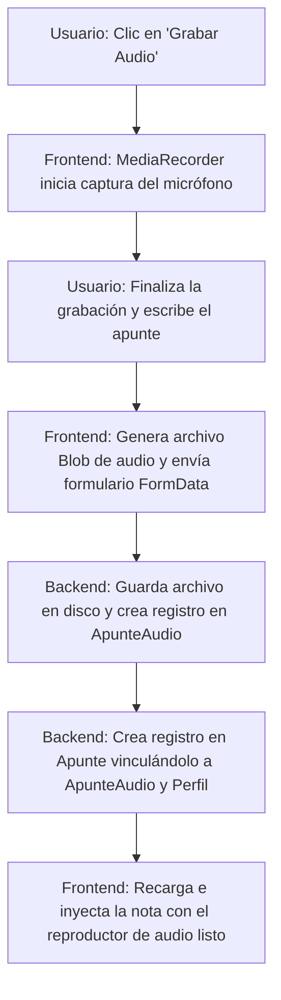

# [RF-M05] Editor de Apuntes en Tiempo Real

## 1. Descripción y Objetivo
Este requerimiento provee un entorno avanzado para la toma de apuntes o notas de estudio asociadas a perfiles.
- **Editor Enriquecido y Método Cornell**: Ofrece herramientas para formatear texto (negritas, cursivas, listas) y la opción de cambiar al Método Cornell, que divide la nota en secciones de "Ideas", "Notas principales" y "Resumen".
- **Grabadora de Audio**: Permite al usuario capturar audio del micrófono en tiempo real directamente en la interfaz del editor, vinculando grabaciones (audios de clase) al apunte activo.
- **Objetivo**: Integrar la toma de notas escritas con la captura de sonido ambiental en una sola pantalla, eliminando la necesidad de cambiar de dispositivo o aplicación durante el estudio.

---

## 2. Tecnologías, Herramientas y Librerías
El editor enriquecido y la grabadora de voz combinan APIs nativas del navegador con persistencia relacional en Laravel:

- **Web Audio / MediaRecorder API**: API nativa de JavaScript utilizada para acceder de forma segura al hardware del micrófono, capturar el flujo de audio e iniciar/detener la codificación en archivos comprimidos (`.wav` o `.mp3`).
- **Inertia useForm & FormData**: Serializa los apuntes de texto y adjunta el archivo binario del audio grabado en una petición multipart/form-data.
- **Laravel Storage**: Para almacenar físicamente las grabaciones de audio en el disco del servidor (`storage/app/public/audios/`).
- **MySQL / Eloquent ORM**: Tablas `Apunte` y `ApunteAudio` para relacionar los apuntes textuales con sus grabaciones multimedia asociadas.

---

## 3. Archivos Involucrados en el Requerimiento

### Frontend (Vue 3)
- [Editor.vue](/Cronos-Note/resources/js/Pages/Apuntes/Editor.vue) - Vista del formulario de toma de apuntes, enlazado de texto y estructura Cornell.
- [AudioPanel.vue](/Cronos-Note/resources/js/Pages/Apuntes/Components/AudioPanel.vue) - Componente encargado de manejar la interacción con el micrófono mediante `MediaRecorder`, gestionar estados de grabación y reproducir el audio guardado.
- [EditorToolbar.vue](/Cronos-Note/resources/js/Pages/Apuntes/Components/EditorToolbar.vue) - Barra de herramientas de formateo de texto del editor.
- [NoteEditor.vue](/Cronos-Note/resources/js/Pages/Apuntes/Components/NoteEditor.vue) - Área editable del apunte con soporte Cornell o estándar.

### Backend & Controladores (Laravel)
- [ApunteController.php](/Cronos-Note/app/Http/Controllers/ApunteController.php) - Recibe las peticiones HTTP, almacena el audio físico en disco y persiste las referencias en base de datos.

### Modelos y Datos (Eloquent ORM)
- [Apunte.php](/Cronos-Note/app/Models/Apunte.php) - Modelo de Eloquent para las notas.
- [ApunteAudio.php](/Cronos-Note/app/Models/ApunteAudio.php) - Asocia los archivos de audio físicos con el apunte correspondiente.

---

## 4. Flujo de Datos y Control

### Diagrama de Flujo del Requerimiento

### Detalle del Flujo de Control (Pasos)
1. **Frontend (Grabación):** El usuario pulsa en "Grabar Audio". La aplicación solicita permiso de micrófono y, tras concederse, inicializa la clase `MediaRecorder` recolectando porciones de audio en un array de datos.
2. **Finalización:** Al detener la grabación, se compilan los datos en un objeto `Blob` y se crea una URL temporal local para permitir la preescucha antes de guardar.
3. **Envío de Datos (POST):** El usuario pulsa "Guardar Apunte". Inertia envía un `FormData` conteniendo los campos de texto, formato seleccionado (Cornell/estándar), y el archivo binario del audio.
4. **Backend (Persistencia):**
   - El controlador `ApunteController` valida que el archivo de audio sea válido.
   - Guarda el audio en `public/storage/audios/` asignándole un hash único.
   - Crea un registro en la tabla `apunte_audios` (Modelo `ApunteAudio`).
   - Crea un registro en la tabla `apunte` (Modelo `Apunte`), asociando la nota al perfil activo y al ID del audio guardado.
5. **UI Update:** Inertia redirige de vuelta al listado, renderizando el reproductor `<audio>` nativo si el apunte tiene una grabación asociada.

---

## 5. Pruebas y Validación (QA)

1. **Precondición:** Tener un perfil activo e ingresar a la pestaña de "Apuntes".
2. **Paso 1:** Pulsar en "Nuevo Apunte". Escribir un título e ideas en los campos correspondientes.
3. **Paso 2:** Presionar el botón del micrófono "Grabar", hablar por 5 segundos y presionar "Detener". Escuchar la grabación previa.
4. **Paso 3:** Pulsar en "Guardar Apunte" y esperar el redireccionamiento.
5. **Resultado Esperado:** El apunte se crea y aparece en la lista. Al reabrirlo, debe mostrarse el texto formateado tal como se escribió, y debe aparecer un reproductor de audio integrado que permita escuchar la grabación de 5 segundos realizada.
