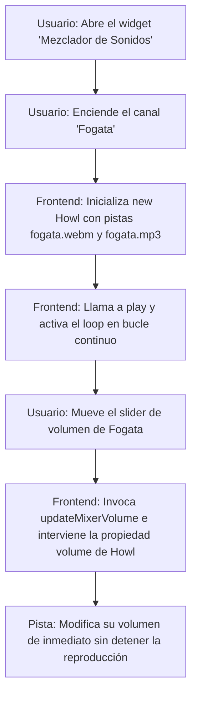

# [RF-M06] Mezclador de Sonidos

## 1. Descripción y Objetivo
Este requerimiento provee un ambiente auditivo personalizable para potenciar la concentración y el aislamiento acústico durante las sesiones de estudio.
- **Reproducción Simultánea y Mezcla**: El usuario puede activar una o más pistas de sonido ambiental (lluvia, tormenta, fogata, viento, ruido blanco, cafetería, etc.) al mismo tiempo y ajustar el volumen de cada pista de forma independiente a través de un panel de controles deslizantes (sliders).
- **Objetivo**: Ayudar al usuario a generar un espacio inmersivo y libre de ruidos externos distractores que ayude a mitigar el estrés académico o laboral.

---

## 2. Tecnologías, Herramientas y Librerías
El mezclador de sonidos aprovecha una combinación de recursos de audio locales y una librería de audio robusta:

- **Howler.js**: Librería JavaScript de control de audio en 3D y multicanal, utilizada para cargar las pistas, reproducirlas concurrentemente en bucle (`loop: true`), y cambiar el volumen dinámicamente sin interrumpir la reproducción.
- **Pistas Locales (Directorio public)**: Archivos de sonido comprimidos en formatos de alta calidad `.mp3` y `.webm` alojados directamente en el servidor.
- **Vue 3 (Composition API)**: Estructuración reactiva del mezclador mediante `mixerState` y mapeo de emojis dinámicos según el tipo de sonido.
- **Resolución de Rutas Relativas (XAMPP)**: Método `getAssetUrl` para garantizar que las pistas de sonido se ubiquen correctamente tanto en servidores locales de subdirectorio (ej. `http://localhost/public/`) como en entornos virtuales de dominio raíz.

---

## 3. Archivos Involucrados en el Requerimiento

### Frontend (Vue 3)
- [SesionZen.vue](/resources/js/Pages/pomodoro/SesionZen.vue) - Administra la lógica del mezclador, controla la instanciación de objetos `Howl`, maneja los sliders de volumen individuales y los estados activos.

### Recursos Estáticos (Audios)
- `public/audios/` - Directorio que aloja las pistas de audio locales comprimidas (ej. `storm.mp3`, `campfire.webm`, `cafe.mp3`, etc.).

---

## 4. Flujo de Datos y Control

### Diagrama de Flujo del Requerimiento

### Detalle del Flujo de Control (Pasos)
1. **Frontend:** El usuario abre el Mezclador de Sonidos y activa un canal de audio (ej: Fogata).
2. **Carga y Reproducción:**
   - Si no existe una instancia de `Howl` para ese sonido en el array de instancias (`howlerInstances`), se instancia una nueva.
   - La propiedad `src` de la instancia carga las fuentes `.webm` y `.mp3` resolviendo las rutas a través del helper `getAssetUrl` para evitar errores 404 de servidor.
   - Se configuran los parámetros `loop: true` y `html5: true`.
   - Se inicia la reproducción ejecutando el método `.play()`.
3. **Control de Volumen:** Al desplazar el slider de volumen, el evento de input dispara `updateMixerVolume(soundKey)`. Este método ajusta el volumen directamente en la instancia de Howler ejecutando `howlerInstances[soundKey].volume(state.volume)`.
4. **Desactivación:** Si el usuario apaga el canal de audio, se invoca `.pause()` en la instancia respectiva, deteniendo la salida de sonido pero conservando la posición de reproducción.
5. **Cierre:** Al abandonar la pantalla de pomodoro, la directiva `onUnmounted` limpia todas las instancias llamando a `.stop()` y `.unload()` para evitar fugas de sonido en segundo plano.

---

## 5. Pruebas y Validación (QA)

1. **Precondición:** Estar en la pantalla de pomodoro (/pomodoro).
2. **Paso 1:** Desplegar el widget "Mezclador de Sonidos" (ubicado en el extremo superior izquierdo).
3. **Paso 2:** Encender la pista "Tormenta" pulsando sobre su botón o icono.
4. **Resultado Esperado 1:** Debe reproducirse el sonido de lluvia y truenos en bucle.
5. **Paso 3:** Encender la pista "Fogata" y mover su slider a la mitad de volumen.
6. **Resultado Esperado 2:** Ambos sonidos deben escucharse de forma simultánea, y el crujido de la fogata debe ser más tenue que el sonido de la tormenta.
7. **Paso 4:** Salir del módulo de pomodoro y navegar hacia otra sección (ej. Tareas).
8. **Resultado Esperado 3:** Todo sonido del mezclador debe silenciarse por completo de forma inmediata.
