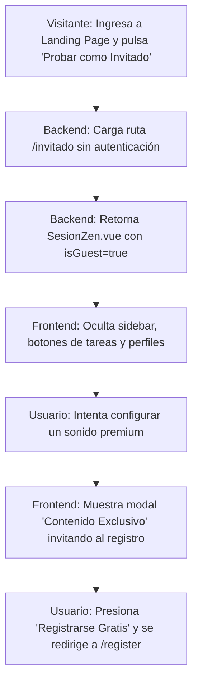

# [RF-M07] Sesión de Invitado

## 1. Descripción y Objetivo
Este requerimiento define la capacidad del sistema para ser probado por usuarios anónimos (visitantes) sin forzarlos a registrarse.
- **Acceso Directo (Modo Invitado)**: Permite ingresar al espacio de Pomodoro con el temporizador y el mezclador de sonidos ambientales habilitados de forma inmediata.
- **Fidelización y Barrera de Entrada**: Bloquea las funcionalidades persistentes (guardar plantillas de tiempo, asociar tareas, registrar estadísticas, etc.) y muestra un modal promocional invitando a registrarse de forma gratuita cuando el visitante intenta utilizarlas.
- **Objetivo**: Atraer usuarios nuevos permitiéndoles probar el valor estético y la utilidad del espacio de trabajo de manera inmediata antes de solicitar sus datos personales.

---

## 2. Tecnologías, Herramientas y Librerías
La sesión de invitado utiliza rutas públicas y condicionales lógicos en el frontend:

- **Laravel Routing**: Ruta pública `/invitado` excluida del middleware `auth`.
- **Inertia.js**: Paso del flag booleano `isGuest => true` en las propiedades de la vista al renderizar el componente.
- **Vue 3**:
  - Evaluación lógica condicional (`v-if="isGuest"`) en plantillas para ocultar la barra lateral de navegación (AppLayout) y el selector de tareas del Pomodoro.
  - Teleport del modal de promoción de registro para incentivar la conversión a usuario formal.

---

## 3. Archivos Involucrados en el Requerimiento

### Frontend (Vue 3)
- [SesionZen.vue](/Cronos-Note/resources/js/Pages/Pomodoro/SesionZen.vue) - Oculta la selección de tareas en el configurador, bloquea los paisajes y sonidos premium para visitantes, y abre el modal promocional de registro.
- [Welcome.vue](/Cronos-Note/resources/js/Pages/Welcome.vue) - Landing page que provee el botón de acceso directo "Probar como Invitado".

### Backend & Controladores (Laravel)
- [web.php](/Cronos-Note/routes/web.php) - Ruta de acceso pública a `/invitado` asociada al controlador.
- [PomodoroController.php](/Cronos-Note/app/Http/Controllers/PomodoroController.php) - Método `invitado()` que carga el componente `SesionZen` pasando `isGuest` como `true`.

---

## 4. Flujo de Datos y Control

### Diagrama de Flujo del Requerimiento

### Detalle del Flujo de Control (Pasos)
1. **Frontend:** Un usuario no autenticado ingresa a la aplicación y pulsa en "Probar como Invitado".
2. **Backend (Enrutamiento):** La ruta web mapea `/invitado` y llama al controlador `PomodoroController@invitado`. Este omite el filtro de autenticación y renderiza la vista `Pomodoro/SesionZen` adjuntando la propiedad `isGuest => true`.
3. **Restricción de Layout (Frontend):**
   - El componente Vue principal evalúa `<component :is="isGuest ? 'div' : AppLayout">`.
   - Si `isGuest` es `true`, el componente principal se renderiza dentro de un contenedor `div` estándar en lugar de `AppLayout`, eliminando el menú de navegación lateral.
   - En el configurador de Pomodoro, se oculta el menú desplegable de tareas.
4. **Validación de Bloqueos:** Si el invitado intenta interactuar con un fondo de pantalla o sonido restringido (ej: paisaje premium), la función `isLandscapeLocked(key)` o `isSoundLocked(soundKey)` retorna `true`.
5. **Modal de Conversión:** Se abre el modal `modalRegistroOpen = true` mostrando el mensaje correspondiente para redirigir al visitante al formulario de registro formal en `/register`.

---

## 5. Pruebas y Validación (QA)

1. **Precondición:** Cerrar sesión en la aplicación.
2. **Paso 1:** Navegar a la URL del espacio invitado `/invitado`.
3. **Resultado Esperado 1:** La página debe cargar el entorno Pomodoro. La barra lateral de navegación no debe estar visible.
4. **Paso 2:** Abrir el panel de configuración de la sesión del temporizador.
5. **Resultado Esperado 2:** El selector de tareas no debe mostrarse (los invitados no tienen tareas registradas).
6. **Paso 3:** Ir a la Configuración Avanzada, seleccionar un paisaje premium (ej. Paisaje 5) e intentar aplicarlo.
7. **Resultado Esperado 3:** Debe mostrarse un modal con el título "Contenido Exclusivo" que explique que la opción solo está disponible para registrados y provea un botón para ir al registro.
