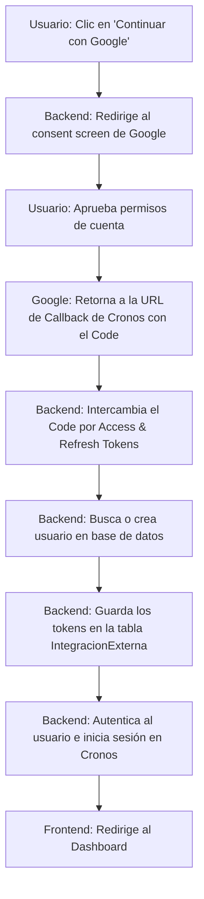

# [RF-M08] Conexión con APIs Externas & [RF-M8.1] Herramientas a Integrar

## 1. Descripción y Objetivo
Este requerimiento define la integración del sistema **Cronos-Note** con plataformas externas mediante protocolos de autorización seguros (OAuth 2.0). El objetivo principal es permitir la interoperabilidad con servicios externos para enriquecer la experiencia de usuario:
- **Autenticación con Google**: Permitir el registro e inicio de sesión rápido en Cronos-Note mediante una cuenta de Google existente.

---

## 2. Tecnologías, Herramientas y Librerías
Para esta integración se emplean protocolos estándar de seguridad y librerías del ecosistema de Laravel:

- **Laravel Socialite:** Paquete oficial de Laravel que simplifica la integración y el flujo OAuth 2.0 con diversos proveedores (Google, Spotify, etc.).
- **Google API Client (OAuth 2.0):** Proveedor utilizado para autenticar al usuario y solicitar los scopes necesarios para Google Calendar (`.../auth/calendar.readonly`).

- **Tabla `IntegracionExterna`:** Tabla del sistema encargada de persistir de forma segura las credenciales de conexión del usuario (identificador de la plataforma, token de acceso y token de actualización/refresh token).

---

## 3. Archivos Involucrados en el Requerimiento

### Frontend (Vue 3)
- [Login.vue](/Cronos-Note/resources/js/Pages/auth/Login.vue) - Contiene el botón de "Continuar con Google".
- [Register.vue](/Cronos-Note/resources/js/Pages/auth/Register.vue) - Contiene el botón de "Registrarse con Google".
- [SesionZen.vue](/Cronos-Note/resources/js/Pages/pomodoro/SesionZen.vue) - Panel de control e interfaz de reproducción para Spotify (reproductor integrado).

### Backend & Controladores (Laravel)
- [GoogleAuthController.php](/Cronos-Note/app/Http/Controllers/Auth/GoogleAuthController.php) - Administra la redirección y el retorno (callback) del flujo de autenticación de Google.
- [routes/auth.php](/Cronos-Note/routes/auth.php) - Define las rutas de redirección (`auth/google`) y de callback (`auth/google/callback`).

### Modelos y Datos (Eloquent ORM)
- [IntegracionExterna.php](/Cronos-Note/app/Models/IntegracionExterna.php) - Modelo de Eloquent que representa la tabla `IntegracionExterna` para el guardado de tokens.
- [User.php](/Cronos-Note/app/Models/User.php) - Define la relación `hasMany` con `IntegracionExterna`.

---

## 4. Flujo de Datos y Control

### Diagrama de Flujo del Requerimiento (OAuth 2.0 y Callback)

### Detalle del Flujo de Control (Pasos de Integración)
1. **Petición de Autorización:** El usuario selecciona la acción de vincular su cuenta o iniciar sesión. El frontend redirige a la ruta del backend (`auth/google` o similar).
2. **Redirección de Proveedor:** El backend utiliza `Laravel Socialite` para generar la URL de autorización del proveedor externo (con los scopes requeridos) y redirige al usuario.
3. **Aprobación del Usuario:** El usuario autoriza a Cronos-Note en la plataforma externa.
4. **Manejo del Callback:** El proveedor redirige al endpoint de callback de Cronos-Note enviando un parámetro `code`.
5. **Obtención y Guardado de Tokens:**
   - El controlador de Laravel captura el callback, intercambia el código por los tokens de acceso y refresco de forma segura.
   - Se busca al usuario autenticado o se registra en caso de inicio de sesión por primera vez.
   - Se realiza un `updateOrCreate()` en la tabla `IntegracionExterna` guardando el `tokenAcceso` e `identificadorExterno`.
6. **Consumo de la API:** Posteriormente, el sistema realiza peticiones HTTP autorizadas (con cabecera `Authorization: Bearer [tokenAcceso]`) para leer eventos de Google Calendar o enviar comandos de reproducción a Spotify.

---

## 5. Pruebas y Validación (QA)

### Caso de Prueba 1: Registro/Login con Google
1. **Precondición:** No haber iniciado sesión. Tener una cuenta de Google activa.
2. **Paso 1:** Ir a la página de Login (`/login`) y hacer clic en "Continuar con Google".
3. **Paso 2:** Seleccionar una cuenta de Google en la pantalla de consentimiento.
4. **Resultado Esperado:** El sistema debe redirigir al Dashboard de Cronos-Note, iniciar sesión exitosamente y registrar un registro en la tabla `IntegracionExterna` con `plataforma = 'GoogleAuth'`.

