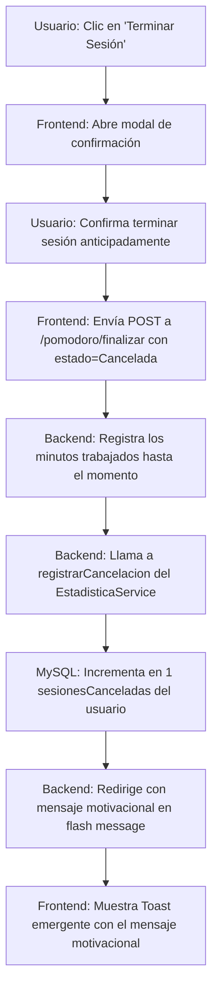

# [RF-M09] Registro de Cancelación de Sesión

## 1. Descripción y Objetivo
Este requerimiento define el comportamiento del sistema cuando un usuario detiene activamente un temporizador de concentración (Pomodoro) antes de alcanzar el objetivo de tiempo establecido (cuando el contador no ha llegado a cero). El objetivo es:
- **Persistencia en Estadísticas**: Registrar el evento incrementando la métrica de sesiones canceladas del usuario en la base de datos para mantener un historial fidedigno de rendimiento.
- **Feedback Motivacional**: Mostrar un mensaje de aliento y motivación en la interfaz de usuario en lugar de un aviso genérico de cancelación, promoviendo la resiliencia y el bienestar del usuario frente a la interrupción del flujo de trabajo.

---

## 2. Tecnologías, Herramientas y Librerías
Este requerimiento utiliza la infraestructura estándar de sesiones e interfaz de Cronos-Note:

- **Eloquent ORM / MySQL**: Actualización de la tabla `Estadistica` para incrementar la columna `sesionesCanceladas`.
- **Sesión de Laravel (Flash Messages)**: Mecanismo de persistencia temporal en sesión para transferir el mensaje motivacional desde el controlador del backend hasta la vista del frontend durante el redireccionamiento.
- **Inertia.js & Vue 3**: Recepción automática del flash message success en la propiedad `$page.props.flash.success` para renderizar el componente visual de notificación de manera interactiva.

---

## 3. Archivos Involucrados en el Requerimiento

### Frontend (Vue 3)
- [SesionZen.vue](/Cronos-Note/resources/js/Pages/pomodoro/SesionZen.vue) - Administra el inicio del flujo de cancelación de sesión y renderiza los modales de confirmación (`showConfirmEndModal`).
- [AppLayout.vue](/Cronos-Note/resources/js/Layouts/AppLayout.vue) - Captura el mensaje flash de éxito e introduce un toast emergente flotante en el lateral derecho superior de la pantalla.

### Backend & Controladores (Laravel)
- [PomodoroController.php](/Cronos-Note/app/Http/Controllers/PomodoroController.php) - Modifica la acción `finalizarSesion()`. Gestiona el flujo redirigiendo al usuario y adjuntando el mensaje motivacional.
- [EstadisticaService.php](/Cronos-Note/app/Services/EstadisticaService.php) - Proporciona el método `registrarCancelacion()` encargado de persistir el conteo en la base de datos.

### Modelos y Datos (Eloquent ORM)
- [Estadistica.php](/Cronos-Note/app/Models/Estadistica.php) - Modelo Eloquent con la columna `sesionesCanceladas`.

---

## 4. Flujo de Datos y Control

### Diagrama de Flujo del Requerimiento

### Detalle del Flujo de Control (Pasos)
1. **Frontend:** El usuario decide terminar su sesión antes de tiempo. Se detiene el temporizador en el cliente y se solicita confirmación.
2. **Controlador:** Recibe los datos de finalización en `finalizarSesion()`.
3. **Persistencia:**
   - Si se han acumulado minutos de concentración en el ciclo activo, se incrementa el tiempo de trabajo acumulado y se actualizan los gráficos de estadísticas semanales.
   - Al detectarse un estado `'Cancelada'`, se invoca `$estadisticaService->registrarCancelacion(Auth::id())`.
   - La base de datos incrementa el contador `sesionesCanceladas` en la fila correspondiente al usuario en la tabla `Estadistica`.
4. **Respuesta y Redirección:** El controlador olvida la sesión activa en el servidor y redirige a la ruta principal de pomodoro agregando un mensaje de aliento motivacional al flash payload:
   *`"Sesión cancelada. ¡No te preocupes! Cada pequeño paso cuenta, vuelve a intentarlo cuando estés listo. 💪"`*
5. **UI Notification:** `AppLayout.vue` detecta el flash message y renderiza un toast con el mensaje motivacional.

---

## 5. Pruebas y Validación (QA)

1. **Precondición:** Iniciar sesión con un usuario y abrir el panel de concentración Pomodoro (`/pomodoro`).
2. **Paso 1:** Iniciar una nueva sesión de Pomodoro rápida o personalizada.
3. **Paso 2:** Esperar a que el temporizador comience a correr (ej. transcurridos algunos segundos o minutos) y hacer clic en el botón rojo "Terminar Sesión".
4. **Paso 3:** Confirmar la acción en el cuadro de diálogo de advertencia.
5. **Resultado Esperado:**
   - El sistema debe redirigir a la pantalla de configuración del Pomodoro.
   - Debe aparecer un toast verde con el mensaje motivacional de aliento.
   - En la base de datos (o la página de estadísticas), el número de sesiones canceladas del usuario debe haberse incrementado en exactamente 1.
