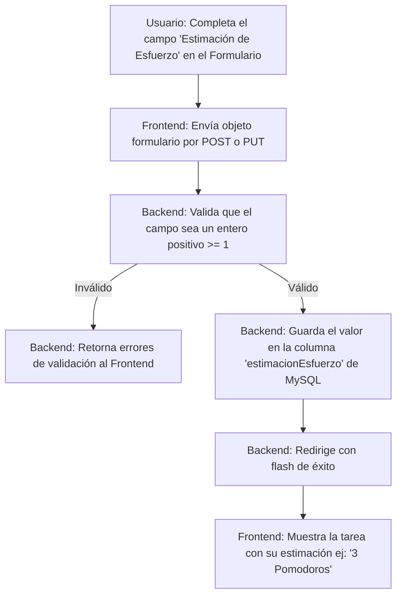

# [RF-M10] Estimación de Esfuerzo

## 1. Descripción y Objetivo
Este requerimiento define la capacidad del usuario para planificar y predecir la cantidad de esfuerzo/tiempo requerida para completar una tarea de manera estructurada:
- **Campo de Estimación**: Se provee un campo numérico positivo en los formularios de creación y edición de tareas para ingresar la cantidad estimada de ciclos Pomodoro (bloques de 25 minutos) requeridos.
- **Objetivo**: Ayudar al usuario a planificar sus actividades diarias cuantificando las tareas en unidades Pomodoro. Esto se vincula directamente con la visualización del progreso en tiempo real durante la sesión activa de Pomodoro.

---

## 2. Tecnologías, Herramientas y Librerías
Este requerimiento aprovecha el modelo relacional estándar y la validación en Laravel:

- **MySQL / Eloquent ORM**: Columna `estimacionEsfuerzo` de tipo entero (`INTEGER`) en la tabla `Tarea`.
- **Formularios de Inertia (`useForm`)**: Para el enlazado bidireccional de datos (`v-model`) en Vue y el envío asíncrono con manejo automático de errores de validación.
- **Validación de Laravel**: Regla de validación `'estimacionEsfuerzo' => 'nullable|integer|min:1'` para asegurar que los datos ingresados correspondan a un entero positivo.

---

## 3. Archivos Involucrados en el Requerimiento

### Frontend (Vue 3)
- [GestionTareas.vue](/Cronos-Note/resources/js/Pages/GestionTareas.vue) - Formulario principal de creación y edición de tareas, y renderizado de la estimación en la tarjeta de detalle de tarea.
- [GestionPerfil.vue](/Cronos-Note/resources/js/Pages/GestionPerfil.vue) - Formulario modal de creación rápida de tareas vinculadas a perfiles.

### Backend & Controladores (Laravel)
- [TareaController.php](/Cronos-Note/app/Http/Controllers/TareaController.php) - Valida e introduce el campo `estimacionEsfuerzo` al crear (`store()`) o actualizar (`update()`) tareas.

### Modelos y Datos (Eloquent ORM)
- [Tarea.php](/Cronos-Note/app/Models/Tarea.php) - Representación de la tabla `Tarea` con la regla de casteo `'estimacionEsfuerzo' => 'integer'`.

---

## 4. Flujo de Datos y Control

### Diagrama de Flujo del Requerimiento

### Detalle del Flujo de Control (Pasos)
1. **Frontend:** El usuario abre el modal de creación o edición de tarea e ingresa un número (ej. `3`) en el campo "Estimación de Esfuerzo (Pomodoros)".
2. **Envío de Datos:** Al enviar el formulario, Inertia serializa el formulario y lo envía a la ruta `tareas.store` o `tareas.update`.
3. **Backend (Validación):** El controlador ejecuta la validación. Si el campo no es numérico o es menor a 1, se interrumpe el flujo y se devuelven los errores.
4. **Base de Datos:** Se escribe/actualiza el registro en la tabla `Tarea`.
5. **Visualización:** Al recargarse los datos, la tarjeta de la tarea y el reproductor de la sesión de Pomodoro recuperan el valor para calcular e ilustrar el progreso de ciclos completados vs. estimados.

---

## 5. Pruebas y Validación (QA)

1. **Precondición:** Iniciar sesión con un usuario de prueba.
2. **Paso 1:** Ir a "Mis Tareas" y pulsar en "Crear Tarea".
3. **Paso 2:** En el campo "Estimación de Esfuerzo (Pomodoros)", escribir `-2` o `texto` e intentar guardar.
4. **Resultado Esperado 1:** La validación del sistema debe fallar, impidiendo el envío o mostrando un mensaje de error ("El campo estimacion esfuerzo debe ser un número entero" o similar).
5. **Paso 3:** Corregir el campo ingresando el número `4` y guardar la tarea.
6. **Resultado Esperado 2:** La tarea se crea de forma correcta. Al abrir sus detalles o tarjeta, debe indicar visualmente `4 Pomodoros` (o `0/4 🍅` en el reproductor de Pomodoro).
