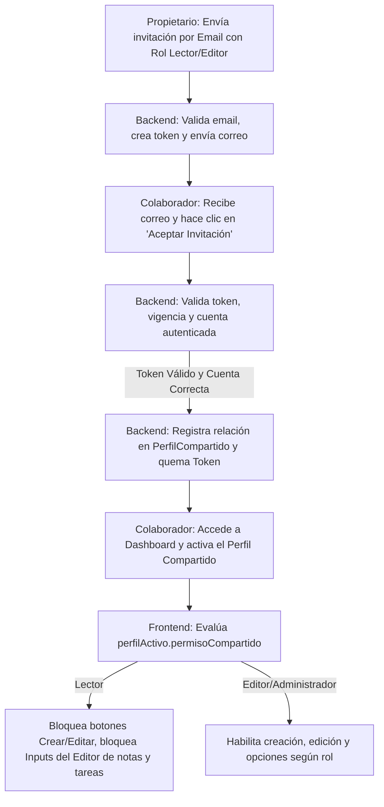

# [RF-M11 / RF-M11.1] Perfiles de Usuario Compartidos & Permisos de Perfil

## 1. Descripción y Objetivo
Este conjunto de requerimientos define la capacidad de trabajo colaborativo dentro del sistema mediante el concepto de **Perfiles Compartidos** y control de accesos por roles (**Permisos de Perfil**):
- **Perfiles Compartidos (RF-M11)**: Permite que el creador (propietario) de un perfil de trabajo lo comparta con otros usuarios enviando invitaciones mediante correo electrónico. Al aceptar la invitación, los destinatarios acceden a todo el contenido del perfil (apuntes, tareas, y temporizadores Pomodoro asociados).
- **Permisos de Perfil (RF-M11.1)**: Establece un control de acceso granular mediante roles jerárquicos estructurados. El creador del perfil puede asignar un nivel de acceso específico a cada usuario invitado:
  - **Lector**: Permite únicamente la lectura y visualización de los apuntes y tareas asociadas al perfil. No puede crear, modificar ni eliminar ningún elemento, y el editor de apuntes/tareas opera en modo de solo lectura.
  - **Editor**: Permite visualizar, crear y modificar apuntes y tareas dentro del perfil compartido.
  - **Administrador**: Además de las acciones del Editor, tiene permisos para eliminar apuntes/tareas y gestionar la asignación/modificación de permisos a otros miembros colaboradores.

---

## 2. Tecnologías, Herramientas y Librerías
- **Laravel Policies (Laravel Gate)**: Implementación de la clase `PerfilPolicy` para encapsular la jerarquía y reglas de autorización de accesos de manera centralizada.
- **Inertia.js & Vue 3**: Flujo de modals dinámicos (`CompartirPerfilModal.vue`) y enlace reactivo de variables en el frontend (`v-model`, `useForm`) para actualizar roles de forma asíncrona mediante peticiones `PUT`/`DELETE`/`POST`.
- **Laravel Notifications & SMTP (Mail)**: `InvitacionPerfilNotification` construye y envía un correo electrónico personalizado a los invitados con un enlace seguro firmado mediante un token de un solo uso de 64 caracteres.
- **MySQL / Eloquent ORM**: 
  - Tabla `PerfilCompartido`: Estructura pivote intermedia que gestiona la relación muchos a muchos entre usuarios y perfiles, almacenando el rol (`permiso`: Lector, Editor, Administrador) y metadatos de auditoría (`compartidoPor`, `fechaCompartido`).
  - Tabla `InvitacionPerfil`: Almacena el historial de invitaciones pendientes, correos, token y fecha de expiración.

---

## 3. Archivos Involucrados en el Requerimiento

### Frontend (Vue 3)
- [CompartirPerfilModal.vue](/Cronos-Note/resources/js/Components/CompartirPerfilModal.vue) - Modal de administración de colaboradores, envío de invitaciones, edición de roles y revocación de accesos.
- [GestionPerfil.vue](/Cronos-Note/resources/js/Pages/GestionPerfil.vue) - Integra el modal de compartir y gestiona la activación del perfil activo.
- [Invitacion.vue](/Cronos-Note/resources/js/Pages/PerfilCompartido/Invitacion.vue) - Vista para aceptar/rechazar invitaciones.
- [InvitacionExpirada.vue](/Cronos-Note/resources/js/Pages/PerfilCompartido/InvitacionExpirada.vue) - Vista en caso de token expirado o utilizado.
- [Index.vue (Apuntes)](/Cronos-Note/resources/js/Pages/Apuntes/Index.vue) y [Editor.vue (Apuntes)](/Cronos-Note/resources/js/Pages/Apuntes/Editor.vue) - Controlan que la interfaz oculte botones de edición/creación o bloquee el editor en modo solo lectura (`isReadOnly`) para el rol `Lector`.
- [GestionTareas.vue](/Cronos-Note/resources/js/Pages/GestionTareas.vue) - Bloquea o permite la interacción en tareas según los permisos de perfil.

### Backend & Controladores (Laravel)
- [PerfilCompartidoController.php](/Cronos-Note/app/Http/Controllers/PerfilCompartidoController.php) - Coordina el flujo de invitaciones, validaciones, confirmación, y edición de roles pivote.
- [ApunteController.php](/Cronos-Note/app/Http/Controllers/ApunteController.php) - Valida autorizaciones antes de realizar acciones en apuntes.
- [TareaController.php](/Cronos-Note/app/Http/Controllers/TareaController.php) - Valida autorizaciones antes de realizar acciones en tareas.
- [InvitacionPerfilNotification.php](/Cronos-Note/app/Notifications/InvitacionPerfilNotification.php) - Clase que formatea el email para el colaborador.

### Políticas y Modelos (Laravel Policy & ORM)
- [PerfilPolicy.php](/Cronos-Note/app/Policies/PerfilPolicy.php) - Centraliza la lógica jerárquica de permisos (`Lector` = 1, `Editor` = 2, `Administrador` = 3) y la resolución de la condición `before()`.
- [Perfil.php](/Cronos-Note/app/Models/Perfil.php) - Define la relación `usuariosCompartidos` muchos a muchos con la tabla pivote.
- [InvitacionPerfil.php](/Cronos-Note/app/Models/InvitacionPerfil.php) - Manejo y persistencia de invitaciones y tokens.
- [PerfilCompartido.php](/Cronos-Note/app/Models/PerfilCompartido.php) - Representa el registro de acceso colaborativo.

---

## 4. Flujo de Datos y Control

### Diagrama de Flujo del Requerimiento (Invitación e Ingreso)

### Detalle del Flujo de Control (Pasos)
1. **Envío de Invitación**:
   - El propietario entra a "Gestión de Perfiles" y abre "Compartir". Escribe el email del colaborador, selecciona el rol (Lector/Editor/Administrador) y presiona "Invitar".
   - El backend genera un token criptográfico único, establece la expiración en 7 días y envía el correo mediante `InvitacionPerfilNotification`.
2. **Recepción y Validación**:
   - El invitado accede al enlace seguro `/invitacion/{token}`.
   - Si no está autenticado, el sistema le solicita ingresar/registrarse. Si su correo no coincide con el destinatario de la invitación, se deniega el acceso.
   - Al hacer clic en "Aceptar", el backend crea la entrada en `PerfilCompartido` con el rol seleccionado y marca la invitación como utilizada.
3. **Control de Accesos Dinámicos**:
   - Durante la sesión activa, el controlador de Tareas y Apuntes adjunta el atributo `permisoCompartido` al perfil.
   - El middleware y la clase `PerfilPolicy.php` verifican en cada request si el rol del usuario (`Lector` = 1, `Editor` = 2, `Administrador` = 3) alcanza el nivel mínimo requerido:
     - `ver`: Requiere al menos `Lector` (1).
     - `crear` / `modificar`: Requiere al menos `Editor` (2).
     - `borrar` / `gestionarPermisos`: Requiere al menos `Administrador` (3).
     - El dueño del perfil omite las verficaciones gracias al método `before()` que siempre devuelve `true`.

---

## 5. Pruebas y Validación (QA)

1. **Precondición**: Tener dos cuentas de usuario creadas (Usuario A: Propietario, Usuario B: Colaborador).
2. **Paso 1 (Envío de Invitación)**:
   - Iniciar sesión como Usuario A. Ir a "Gestión de Perfiles".
   - Abrir el modal "Compartir" en un perfil propio. Invitar al Usuario B ingresando su correo electrónico y seleccionando el rol **Lector**.
   - **Resultado Esperado**: Se muestra la invitación en la lista como "Pendiente" y se despacha el email.
3. **Paso 2 (Aceptación de Invitación)**:
   - Iniciar sesión como Usuario B y entrar al link de invitación enviado al correo (o la URL `/invitacion/{token}` generada).
   - Hacer clic en "Aceptar Invitación".
   - **Resultado Esperado**: El sistema redirige al Dashboard con un mensaje de éxito. El perfil ahora está listado en sus perfiles disponibles.
4. **Paso 3 (Validación de Rol Lector)**:
   - Como Usuario B, activar el perfil compartido. Ir a "Mis apuntes".
   - **Resultado Esperado**: Los botones de "Nuevo apunte" y "Eliminar" no están visibles. Se muestra un indicador de "Solo lectura". Al abrir un apunte existente, el título, el contenido (`NoteEditor`) y los paneles de control de audio/formato están totalmente bloqueados y en modo lectura.
5. **Paso 4 (Modificación de Permiso)**:
   - Iniciar sesión de nuevo como Usuario A. Abrir "Compartir" en el perfil correspondiente.
   - En el menú desplegable del Usuario B, cambiar el rol de **Lector** a **Editor**.
   - Volver a la cuenta del Usuario B, recargar la página.
   - **Resultado Esperado**: Los controles de creación y edición de apuntes/tareas ahora se encuentran completamente activos para el Usuario B.
