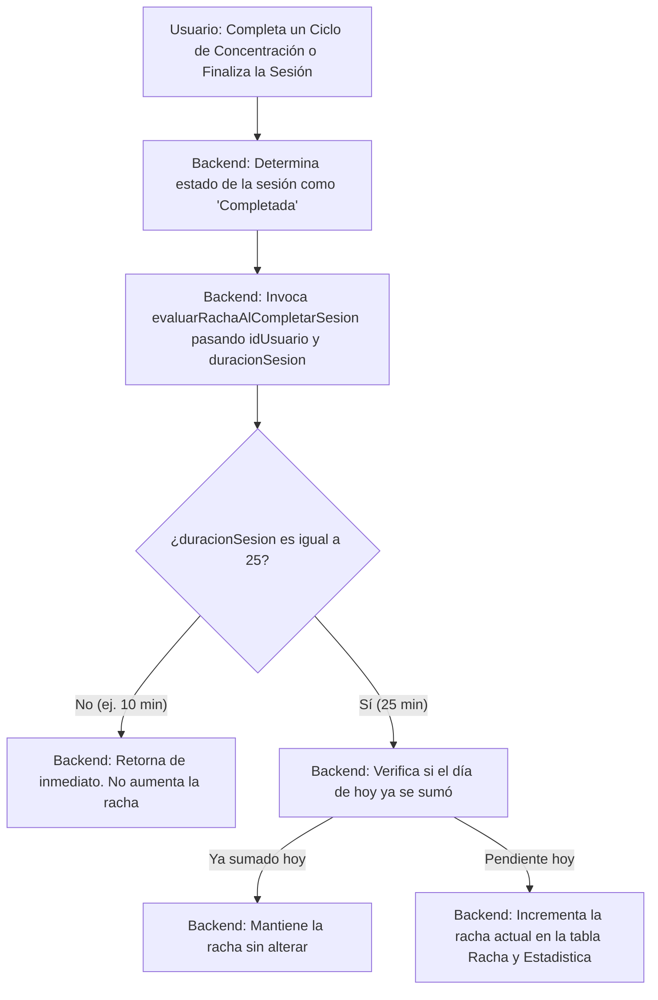

# [RF-M12] Cambios en el Sistema de Rachas

## 1. Descripción y Objetivo
Este requerimiento define una restricción en la acumulación y aumento de la racha de concentración activa del usuario:
- **Restricción de Racha**: La racha diaria de estudio/trabajo del usuario aumentará únicamente cuando complete de forma satisfactoria una sesión de concentración configurada para una duración exacta de **25 minutos** (el estándar Pomodoro).
- **Objetivo**: Asegurar el valor e integridad del sistema de gamificación (rachas). Evita que los usuarios puedan abusar del sistema o inflar artificialmente sus estadísticas completando de forma reiterada micro-sesiones rápidas de corta duración (ej. sesiones configuradas de 1 a 5 minutos).

---

## 2. Tecnologías, Herramientas y Librerías
Este requerimiento utiliza la estructura relacional de estadísticas y configuraciones de Pomodoro en Laravel:

- **MySQL / Eloquent ORM**:
  - Tabla `ConfiguracionPomodoro`: Almacena la columna `duracionSesion` (en minutos).
  - Tabla `SesionPomodoro`: Registra el historial de sesiones asociadas a una configuración.
  - Tablas `Estadistica` y `Racha`: Persisten los valores de racha activa e histórico del usuario.
- **Servicios de Negocio (Laravel Service Layer)**:
  - Clase `EstadisticaService.php`: Encapsula la lógica de evaluación e incremento de la racha, aplicando el filtro de duración.

---

## 3. Archivos Involucrados en el Requerimiento

### Frontend (Vue 3)
*No requiere modificaciones directas en el frontend, pero la racha se visualiza en:*
- [PerfilUsuario.vue](/Cronos-Note/resources/js/Pages/PerfilUsuario.vue) - Muestra al usuario su racha actual y su racha récord.
- [Dashboard.vue](/Cronos-Note/resources/js/Pages/Dashboard.vue) - Muestra el panel con resúmenes estadísticos que incluyen las rachas de productividad.

### Backend & Controladores (Laravel)
- [PomodoroController.php](/Cronos-Note/app/Http/Controllers/PomodoroController.php) - Recupera la duración configurada para la sesión activa y la envía como argumento al servicio al registrar y completar ciclos o finalizar la sesión.
- [EstadisticaService.php](/Cronos-Note/app/Services/EstadisticaService.php) - Filtra el incremento de racha en el método `evaluarRachaAlCompletarSesion`, finalizando el flujo de manera temprana si la sesión no es de exactamente 25 minutos.

### Modelos y Datos (Eloquent ORM)
- [SesionPomodoro.php](/Cronos-Note/app/Models/SesionPomodoro.php) - Representa la sesión de trabajo y provee la relación con su configuración.
- [ConfiguracionPomodoro.php](/Cronos-Note/app/Models/ConfiguracionPomodoro.php) - Almacena las preferencias de tiempo del temporizador.
- [Racha.php](/Cronos-Note/app/Models/Racha.php) y [Estadistica.php](/Cronos-Note/app/Models/Estadistica.php) - Modelos de persistencia de las rachas de concentración.

---

## 4. Flujo de Datos y Control

### Diagrama de Flujo del Requerimiento

### Detalle del Flujo de Control (Pasos)
1. **Frontend**: El temporizador llega a cero (o el usuario finaliza manualmente la sesión con éxito).
2. **Envío**: Se despacha la petición POST a `pomodoro.registrar` o `pomodoro.finalizar`.
3. **Controlador (`PomodoroController`)**:
   - Identifica que el estado final es `Completada`.
   - Recupera el modelo de sesión y extrae la duración de la sesión configurada a través de la relación `$sesion->configuracionPomodoro->duracionSesion`.
   - Invoca a `$estadisticaService->evaluarRachaAlCompletarSesion($userId, $duracionSesion)`.
4. **Servicio (`EstadisticaService`)**:
   - Evalúa si `$duracionSesion` es `25`.
   - Si no es `25`, detiene el procesamiento inmediatamente (`return;`).
   - Si es `25`, realiza las comprobaciones cronológicas estándar (si ayer hubo racha para incrementarla, o si hoy ya fue incrementada) y escribe el resultado en MySQL.

---

## 5. Pruebas y Validación (QA)

1. **Precondición**: Iniciar sesión en el sistema y verificar que la racha actual en el perfil sea de `0`.
2. **Paso 1 (Sesión no válida)**:
   - Ir a la configuración de Pomodoro y definir una duración de sesión de **10 minutos** y guardar.
   - Iniciar la sesión de Pomodoro y simular/completar el ciclo de trabajo de 10 minutos hasta finalizarla con éxito.
   - Ir a la sección "Perfil de Usuario" o ver las estadísticas del dashboard.
   - **Resultado Esperado**: La racha actual debe mantenerse en `0` (el tiempo de concentración total de 10 minutos se acumula en las horas de estudio, pero no afecta a la racha diaria).
3. **Paso 2 (Sesión válida)**:
   - Iniciar una sesión rápida (Quick Start) o configurar la duración de sesión en exactamente **25 minutos**.
   - Completar el ciclo de trabajo y finalizar la sesión de Pomodoro de forma correcta.
   - Ir a la sección de "Perfil de Usuario" o al dashboard.
   - **Resultado Esperado**: La racha actual del usuario debe haber incrementado a `1`.
