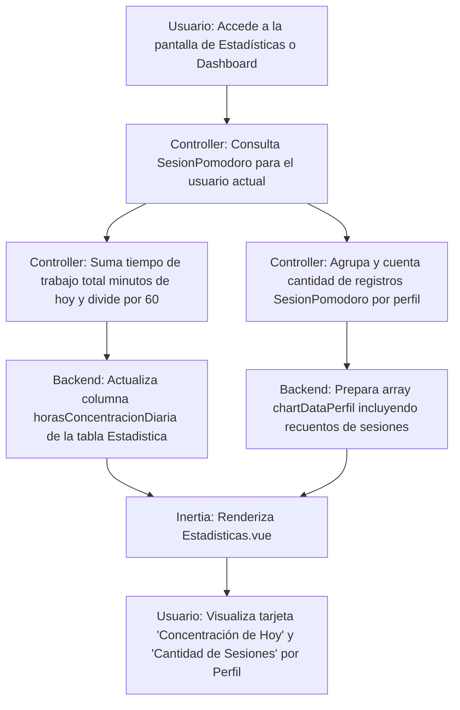

# [RF-M13] Cambios en las Estadísticas

## 1. Descripción y Objetivo
Este requerimiento introduce dos nuevas métricas y estadísticas clave para potenciar la autoevaluación y productividad del usuario en el sistema:
- **Horas de Concentración Diaria**: Muestra el total de tiempo (en horas) acumulado de enfoque/concentración del día actual (hoy).
- **Cantidad de Sesiones por Perfil**: Muestra el volumen total (cantidad) de sesiones Pomodoro registradas en cada perfil del usuario.
- **Objetivo**: Proveer un panorama detallado de en qué invierte el usuario sus recursos temporales diarios, y medir cuantitativamente su nivel de apego a cada perfil de trabajo o asignatura (ej. cuántas sesiones le dedica a cada uno).

---

## 2. Tecnologías, Herramientas y Librerías
- **MySQL / Eloquent ORM**:
  - Consulta asíncrona de suma de tiempos de la tabla `SesionPomodoro` filtrando por fecha (`Carbon::today()`).
  - Agrupación e indexado de relaciones para contabilizar cantidad de sesiones por perfil (`SesionPomodoro::whereHas('tarea')` enlazando con la tabla `Perfil`).
- **Inertia.js & Vue 3**:
  - Renderizado dinámico de tarjetas informativas en la fila superior con Bootstrap Icons.
  - Actualización reactiva de la leyenda del gráfico de dona con el formato `Perfil: Xh (Y sesiones)`.

---

## 3. Archivos Involucrados en el Requerimiento

### Frontend (Vue 3)
- [Estadisticas.vue](file:///C:/Users/forna/OneDrive/Escritorio/Facultad/4to%20año%20Primer%20Cuatrimestre/Programación%20en%20ambientes%20web/Cronos-Note/resources/js/Pages/Estadisticas.vue) - Muestra las tarjetas con la hora diaria de hoy con íconos vectoriales modernos y la cantidad de sesiones por perfil en la leyenda del gráfico de dona.

### Backend & Controladores (Laravel)
- [EstadisticaController.php](file:///C:/Users/forna/OneDrive/Escritorio/Facultad/4to%20año%20Primer%20Cuatrimestre/Programación%20en%20ambientes%20web/Cronos-Note/app/Http/Controllers/EstadisticaController.php) - Recalcula dinámicamente las horas de hoy e introduce el recuento de sesiones (`sesionesCount`) en el arreglo del gráfico de dona.
- [DashboardController.php](file:///C:/Users/forna/OneDrive/Escritorio/Facultad/4to%20año%20Primer%20Cuatrimestre/Programación%20en%20ambientes%20web/Cronos-Note/app/Http/Controllers/DashboardController.php) - Sincroniza dinámicamente el valor en la carga del dashboard del usuario.
- [EstadisticaService.php](file:///C:/Users/forna/OneDrive/Escritorio/Facultad/4to%20año%20Primer%20Cuatrimestre/Programación%20en%20ambientes%20web/Cronos-Note/app/Services/EstadisticaService.php) - Recalcula y guarda el valor en base de datos al registrar nuevos minutos de trabajo.

### Modelos y Datos (Eloquent ORM)
- [Estadistica.php](file:///C:/Users/forna/OneDrive/Escritorio/Facultad/4to%20año%20Primer%20Cuatrimestre/Programación%20en%20ambientes%20web/Cronos-Note/app/Models/Estadistica.php) - Modela la tabla que almacena `horasConcentracionDiaria`.
- [SesionPomodoro.php](file:///C:/Users/forna/OneDrive/Escritorio/Facultad/4to%20año%20Primer%20Cuatrimestre/Programación%20en%20ambientes%20web/Cronos-Note/app/Models/SesionPomodoro.php) - Utilizado para sumar el tiempo acumulado de concentración por fecha y perfil.

---

## 4. Flujo de Datos y Control

### Diagrama de Flujo del Requerimiento

### Detalle del Flujo de Control (Pasos)
1. **Petición**: El usuario solicita la carga del dashboard o la pestaña de estadísticas.
2. **Cómputo en Backend**:
   - Para las horas diarias: Se suma la columna `tiempoTrabajoTotalMinutos` de todos los registros `SesionPomodoro` del usuario donde la fecha (`fechaCreacionSesion`) sea igual a `Carbon::today()`, y se divide el resultado por 60 para convertirlo a horas (con precisión decimal).
   - Para las sesiones por perfil: Para cada perfil, se cuenta el número de registros `SesionPomodoro` vinculados mediante sus tareas correspondientes (`SesionPomodoro::whereHas('tarea')` enlazada a la tabla `Perfil`).
3. **Persistencia**: Se actualiza la base de datos para que la columna `horasConcentracionDiaria` refleje el cálculo preciso de hoy.
4. **Presentación**: Inertia devuelve las variables calculadas al frontend, el cual dibuja la tarjeta de estadísticas de concentración diaria con un ícono de reloj de arena y añade las sesiones asociadas junto al nombre de cada perfil en la leyenda del gráfico de dona.

---

## 5. Pruebas y Validación (QA)

1. **Precondición**: Iniciar sesión en el sistema y tener al menos un perfil creado.
2. **Paso 1 (Verificación del estado inicial)**:
   - Ir a la pestaña "Estadísticas".
   - **Resultado Esperado**: La tarjeta "Concentración de Hoy" debe reflejar `0 hrs` (o un valor decimal bajo si ya se ha trabajado hoy). El gráfico circular de dona de "Horas de pomodoro por perfil" no debe listar sesiones activas en la leyenda del perfil a menos que ya existieran de forma previa.
3. **Paso 2 (Registro de Enfoque)**:
   - Iniciar una sesión de Pomodoro rápida de 25 minutos asociada a una tarea del perfil seleccionado y completarla.
   - Ir a la sección "Estadísticas".
   - **Resultado Esperado**:
     - La tarjeta "Concentración de Hoy" debe reflejar un aumento de `0.42 hrs` (representando 25/60 minutos).
     - La leyenda del gráfico circular de dona para el perfil activo debe reflejar: `NombrePerfil: 0.42h (1 sesiones)` demostrando que el contador de sesiones incrementó en `1`.
