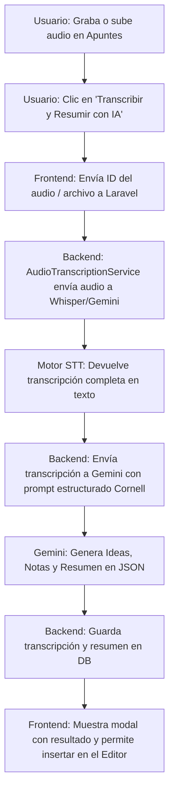

# [RF-M14] Transcripción Automática y Resumen Inteligente de Audios

## 1. Descripción y Objetivo
Este requerimiento expande las capacidades del módulo de toma de apuntes y grabaciones de audio mediante la incorporación de procesamiento de lenguaje natural y modelos de voz a texto (Speech-to-Text):
- **Transcripción Automática (Speech-to-Text)**: Convierte automáticamente grabaciones de clases, notas de voz o audios subidos en texto editable con puntuación y segmentación de oraciones.
- **Resumen Inteligente y Extracción de Conceptos**: Utiliza la API de Gemini para analizar la transcripción completa, sintetizar los puntos esenciales, estructurar ideas clave y generar un resumen conciso que se integra directamente en la plantilla del **Método Cornell** (población automática de las secciones *Notas*, *Ideas/Palabras Clave* y *Resumen*).
- **Objetivo**: Reducir drásticamente el tiempo que los estudiantes invierten en desgravar manualmente clases grabadas, optimizando el proceso de repaso mediante síntesis estructuradas e interactivas.

---

## 2. Tecnologías, Herramientas y Librerías

- **OpenAI Whisper API / Gemini 2.0 Multimodal Audio**: Motores de transcripción y comprensión auditiva de alta precisión en español para convertir audio a texto y procesar contextos extensos.
- **Google Gemini API (`gemini-2.0-flash`)**: Para la generación de resúmenes jerárquicos, extracción de conceptos clave y estructuración en formato Cornell.
- **Laravel Storage & HTTP Client**: Gestión segura de archivos temporales de audio y despacho de peticiones multipart hacia los endpoints de transcripción e inferencia.
- **Inertia.js & Vue 3 (Composition API)**: Componente modal de transcripción con barra de progreso, visor de texto generado y selector de inserción en el editor.
- **MySQL / Eloquent ORM**: Campos `transcripcion` (LONGTEXT) y `resumen_ia` (LONGTEXT) en la tabla `apunte_audios` o `apunte`.

---

## 3. Archivos Involucrados en el Requerimiento

### Frontend (Vue 3)
- [Editor.vue](/resources/js/Pages/apunte/Editor.vue) - Vista del editor donde se inserta el contenido transcrito y sintetizado.
- [AudioPanel.vue](/resources/js/Pages/apunte/components/AudioPanel.vue) - Panel de grabación que añade el botón "Transcribir y Resumir con IA".
- [TranscriptionModal.vue](/resources/js/Pages/apunte/components/TranscriptionModal.vue) - Modal interactivo que muestra el estado del procesamiento, la transcripción completa y las opciones de aplicar al apunte.

### Backend & Controladores (Laravel)
- [AudioTranscriptionController.php](/app/Http/Controllers/AudioTranscriptionController.php) - Controlador que recibe la solicitud de transcripción, valida el audio y coordina el flujo.
- [AudioTranscriptionService.php](/app/Services/AudioTranscriptionService.php) - Servicio que interactúa con la API de Whisper/Gemini para la conversión de audio a texto y generación del resumen Cornell.

### Modelos y Datos (Eloquent ORM)
- [ApunteAudio.php](/app/Models/ApunteAudio.php) - Modelo de persistencia para almacenar el archivo, su transcripción cruda y el resumen generado.
- [Apunte.php](/app/Models/Apunte.php) - Modelo del apunte enriquecido.

---

## 4. Flujo de Datos y Control

### Diagrama de Flujo del Requerimiento

### Detalle del Flujo de Control (Pasos)
1. **Frontend:** El usuario graba una nota de voz o selecciona un archivo de audio existente en el apunte y presiona "Transcribir con IA".
2. **Controlador:** `AudioTranscriptionController@transcribe` valida la pertenencia del archivo y despacha el trabajo a `AudioTranscriptionService`.
3. **Transcripción (STT):** El servicio envía el archivo binario a la API de Whisper o Gemini Multimodal, obteniendo el texto completo transcrito.
4. **Resumen Estructurado (Gemini):** El backend ejecuta un segundo prompt a Gemini solicitando:
   - *Sección Notas:* Desarrollo de los puntos explicados.
   - *Sección Ideas/Claves:* Palabras clave y preguntas de repaso.
   - *Sección Resumen:* Síntesis final de 3 a 5 oraciones.
5. **Persistencia:** Se guardan los resultados en la base de datos vinculados al registro de `ApunteAudio`.
6. **Frontend:** El modal `TranscriptionModal.vue` recibe el resultado. El usuario puede seleccionar "Aplicar al método Cornell", reemplazando o anexando los bloques directamente en el editor.

---

## 5. Pruebas y Validación (QA)

1. **Precondición:** Iniciar sesión, ingresar a "Mis Apuntes" y abrir o crear un apunte con plantilla Cornell.
2. **Paso 1:** Grabar una nota de voz de al menos 15 segundos explicando un concepto (o subir un archivo `.mp3`/`.webm`).
3. **Paso 2:** Hacer clic en el botón con ícono de varita mágica "Transcribir y Resumir con IA".
4. **Resultado Esperado 1:** Debe abrirse un modal indicando el estado del proceso (*"Transcribiendo audio..."* y *"Generando resumen inteligente..."*).
5. **Resultado Esperado 2:** Una vez finalizado, el modal muestra la transcripción textual exacta y una previsualización de las columnas Cornell generadas.
6. **Paso 3:** Pulsar "Insertar en mi apunte".
7. **Resultado Esperado 3:** Las columnas de Ideas, Notas Principales y Resumen del editor se completan automáticamente con la información generada, sin pérdida de formato.
