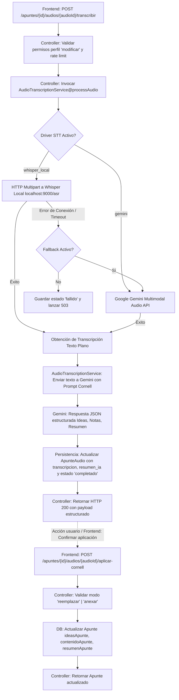

# [RF-M14] Transcripción Automática y Resumen Inteligente de Audios

## 1. Descripción y Objetivo

Este requerimiento expande las capacidades del módulo de toma de apuntes y grabaciones de audio mediante la incorporación de procesamiento de voz a texto (Speech-to-Text) e Inteligencia Artificial generativa:

- **Transcripción Automática (Speech-to-Text)**: Convierte automáticamente grabaciones de clases, notas de voz o audios subidos en texto editable con puntuación y segmentación de oraciones. Soporta un esquema híbrido desacoplado mediante **Whisper Local** (para desarrollo/pruebas locales ilimitadas sin costo) y **Google Gemini 2.0 Multimodal** (para portabilidad inmediata en la nube con fallback configurable).
- **Resumen Inteligente y Extracción de Conceptos (Método Cornell)**: Procesa la transcripción mediante **Google Gemini 2.0 Flash**, sintetizando los puntos esenciales, estructurando ideas clave y generando un resumen conciso que se integra directamente en los cuadrantes del **Método Cornell** (*Ideas Clave*, *Notas* y *Resumen*).
- **Objetivo**: Reducir drásticamente el tiempo que los estudiantes invierten en desgravar manualmente clases grabadas, optimizando el proceso de repaso mediante síntesis estructuradas e interactivas.

---

## 2. Tecnologías, Herramientas y Librerías (Backend)

- **PHP 8.2+ & Laravel 11 Framework**: Núcleo del backend, controladores, servicios y validación.
- **Whisper Local (Microservicio STT / Docker)**: Servidor local de Whisper (vía FastAPI / `whisper-asr-webservice` en `http://localhost:9000/asr`) para transcribir audios en local de forma ilimitada sin consumo de cuotas de APIs externas.
- **Google Gemini API (`gemini-2.0-flash`)**: Motor generativo para estructurar el texto transcrito bajo el esquema JSON estricto del Método Cornell, y driver alternativo de STT multimodal.
- **Laravel HTTP Client (`Illuminate\Support\Facades\Http`)**: Para enviar peticiones multipart de audio al servidor Whisper local y peticiones JSON a la API de Google Gemini.
- **MySQL & Eloquent ORM**:
  - Tabla `ApunteAudio`: Ampliada con `transcripcion` (LONGTEXT, nullable), `resumen_ia` (JSON, nullable), `estado` (VARCHAR(30), default 'pendiente') y `error_mensaje` (TEXT, nullable).
  - Tabla `Apunte`: Entidad principal que recibe la inserción/fusión de los bloques Cornell generados.

---

## 3. Archivos Involucrados en el Requerimiento (Foco Backend)

### Backend & Controladores (Laravel)

- [AudioTranscriptionController.php](/app/Http/Controllers/AudioTranscriptionController.php) - Controlador REST con endpoints:
  - `POST /apuntes/{id}/audios/{audioId}/transcribir`: Procesa la transcripción y el resumen.
  - `POST /apuntes/{id}/audios/{audioId}/aplicar-cornell`: Aplica atómicamente el resumen al apunte en modo 'reemplazar' o 'anexar'.
- [AudioTranscriptionService.php](/app/Services/AudioTranscriptionService.php) - Servicio con métodos de alta cohesión:
  - `transcribe(string $relativeAudioPath): string`: Invoca el driver STT configurado (Whisper Local / Gemini).
  - `summarizeCornell(string $transcriptionText): array`: Genera el esquema Cornell mediante Gemini Flash.
  - `processAudio(ApunteAudio $audio): array`: Orquesta el flujo completo y actualiza estados en DB.
- [config/services.php](/config/services.php) - Configuración de endpoints y credenciales (`gemini.key`, `whisper.url`, `whisper.fallback_to_gemini`).

### Modelos y Datos (Eloquent ORM & Migraciones)

- [ApunteAudio.php](/app/Models/ApunteAudio.php) - Modelo de persistencia que almacena la ruta del audio, su transcripción, el resumen Cornell en JSON, el estado del procesamiento y eventuales errores.
- [Apunte.php](/app/Models/Apunte.php) - Modelo del apunte contenedor.
- `database/migrations/2026_09_14_000001_add_transcription_fields_to_apunte_audios_table.php` - Migración para agregar `transcripcion`, `resumen_ia`, `estado` y `error_mensaje`.

### Pruebas Backend (PHPUnit / Pest)

- `tests/Feature/AudioTranscriptionTest.php` - Pruebas de integración de endpoints, validaciones de permisos, fallback y simulación de respuestas (fakes/mocks) de Whisper y Gemini.

---

## 4. Flujo de Datos y Control

### Diagrama de Flujo del Backend



### Contrato de Respuesta JSON (Transcripción y Resumen)

```json
{
  "idApunteAudio": 12,
  "idApunte": 5,
  "estado": "completado",
  "transcripcion": "Texto completo desgrabado...",
  "resumen_cornell": {
    "titulo_sugerido": "Conceptos Básicos de Redes Neuronales",
    "ideas_clave": [
      "Definición de Perceptrón",
      "Función de activación Sigmoide vs ReLU"
    ],
    "notas": "Desarrollo ordenado del contenido de la clase en formato Markdown...",
    "resumen": "Síntesis final del tema en 3 a 5 oraciones estructuradas."
  },
  "motor_stt": "whisper_local"
}
```

### Contrato de Solicitud y Respuesta (Aplicar Cornell al Apunte)

- **Endpoint**: `POST /apuntes/{id}/audios/{audioId}/aplicar-cornell`
- **Request Payload**:
  
  ```json
  {
    "modo": "reemplazar",
    "formato": "cornell"
  }
  ```
  
  - `modo`: `"reemplazar"` o `"anexar"` (requerido).
  - `formato`: `"cornell"` (distribuye en 3 columnas separadas) o `"normal"` (estructura secuencial: `### 💡 Preguntas Clave`, `### 📝 Notas`, `### 📌 Resumen` en lienzo único). Opcional, por defecto adopta el formato actual del apunte.
- **Response**: `200 OK` con el modelo `Apunte` actualizado.

---

## 5. Pruebas y Validación (QA Backend)

1. **Prueba de Autenticación y Autorización**:
   - Usuario sin autenticar recibe `401 Unauthorized`.
   - Usuario con rol `Lector` en perfil compartido recibe `403 Forbidden`.
   - Usuario con rol `Editor` o `Administrador` (propietario) procesa exitosamente.
2. **Prueba de Driver Whisper Local**:
   - Con el microservicio local activo en el puerto 9000, un audio enviado genera transcripción y resumen en DB.
3. **Prueba de Resiliencia y Fallback**:
   - Con Whisper apagado y `WHISPER_FALLBACK_TO_GEMINI=true`, el servicio realiza fallback transparente a Gemini y completa el procesamiento.
   - Con Whisper apagado y fallback deshabilitado, se retorna `503 Service Unavailable` y se persiste `estado = 'fallido'` con mensaje de error en `error_mensaje`.
4. **Prueba de Aplicación Cornell (`aplicar-cornell`)**:
   - En modo `reemplazar`: Los campos de `Apunte` se sustituyen por los del audio.
   - En modo `anexar`: El contenido previo del `Apunte` se preserva y se concatenan los nuevos bloques con saltos de línea ordenados.
