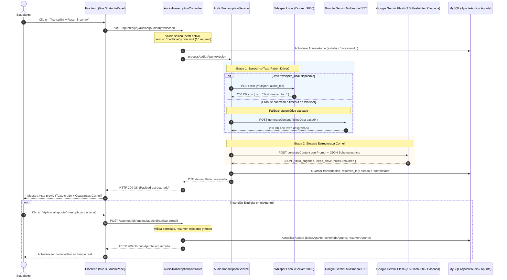

# [RF-M14] Transcripción Automática y Resumen Inteligente de Audios

## 1. Descripción y Objetivo

Este requerimiento amplía las capacidades del módulo de apuntes y grabaciones de audio mediante la integración de procesamiento de voz a texto (Speech-to-Text - STT) e Inteligencia Artificial generativa para síntesis pedagógica:

- **Elicitación y Problemática**: En las instancias de relevamiento con estudiantes universitarios (documentadas en la propuesta de *Cronos Notes Season 2*), se detectó una marcada sobrecarga cognitiva al momento de repasar: los alumnos invierten horas en escuchar y desgrabar manualmente audios de clases teóricas. Además, cuando se cuenta con transcripciones en texto plano continuo, estas carecen de jerarquía visual y síntesis pedagógica, dificultando la retención de conceptos.
- **Transcripción Automática (Speech-to-Text - STT)**: Convierte grabaciones de audio de clases o notas de voz subidas al sistema en texto plano editable, con segmentación natural de oraciones y puntuación ortográfica. La arquitectura desacoplada implementa un **patrón Driver** que prioriza un microservicio local de **Whisper AI** (procesamiento privado, sin costo y sin límites de cuota para el entorno de desarrollo), respaldado por un mecanismo de conmutación por fallback automático hacia **Google Gemini Multimodal Audio (priorizando `gemini-3.5-flash-lite`)** en la nube en caso de indisponibilidad.
- **Síntesis Estructurada Cornell**: Procesa analíticamente el texto transcrito mediante **Google Gemini Flash** (utilizando prioritariamente `gemini-3.5-flash-lite` con degradación elegante a `gemini-3.5-flash`, `gemini-2.5-flash` y `gemini-flash-latest`) bajo un esquema forzado de salida JSON estricto, organizando la información en los cuadrantes de estudio del **Método Cornell**:
  1. *Ideas Clave / Preguntas de Repaso*: Conceptos principales, términos técnicos y preguntas guía.
  2. *Notas de Clase*: Desarrollo temático ordenado y jerarquizado en Markdown.
  3. *Resumen Integrador*: Síntesis conceptual de cierre de entre 3 y 5 oraciones.
  4. *Título Sugerido*: Título temático y contextual sugerido para la nota.
- **Persistencia No Destructiva e Inserción Flexible**: Protege el trabajo previo del estudiante almacenando la transcripción cruda y el resumen estructurado en la entidad del audio. El estudiante puede previsualizar los resultados en la interfaz y decidir explícitamente si desea **anexar** el contenido a sus notas preexistentes o **reemplazar** el apunte actual.
- **Objetivo**: Reducir sustancialmente el tiempo de desgrabado de clases, eliminando la fricción del estudio pasivo y transformando audios en apuntes estructurados listos para el repaso y la preparación de exámenes.

---

## 2. Tecnologías, Herramientas y Librerías

- **PHP 8.2+ & Laravel 11 Framework**: Núcleo backend de la aplicación. Proporciona enrutamiento web seguro, inyección de dependencias, políticas de autorización de perfiles ([`AuthorizesRequests`](file:///C:/Users/della/cronos-notes/app/Http/Controllers/AudioTranscriptionController.php#L15)), validación de datos en request y middleware de limitación de tasa ([`throttle:10,60`](file:///C:/Users/della/cronos-notes/routes/web.php#L149)).
- **Whisper Local (Microservicio STT vía Docker / FastAPI)**:
  - *Despliegue con Docker*: Contenedor oficial `onerahmet/openai-whisper-asr-webservice:latest` expuesto en el puerto 9000 (`http://localhost:9000/asr`), ejecutando el modelo preentrenado `base` de OpenAI (~140 MB) optimizado para CPU y comprensión en idioma español.
  - *Alternativa Nativa en Python*: Servidor ligero con `fastapi`, `uvicorn` y `faster-whisper` cuantizado en `int8` con soporte de decodificación multimedia mediante `FFmpeg`.
  - *Justificación*: Permite transcribir audios de forma ilimitada, privada y 100% gratuita durante el desarrollo y evaluación local, evitando depender exclusivamente de APIs de pago.
- **Google Gemini API (`gemini-3.5-flash-lite`, `gemini-3.5-flash`, `gemini-2.5-flash`, `gemini-flash-latest`)**:
  - *Migración y Justificación de Modelos*: Se sustituyó el modelo original `gemini-2.0-flash` debido a límites de cuota en el nivel gratuito y depreciación de versiones tempranas. Se configuró como modelo preferente `gemini-3.5-flash-lite` por su alta velocidad de respuesta, excelente relación costo/eficiencia de tokens y robusto soporte multimodal tanto para audio como para generación JSON forzada.
  - *Síntesis Cornell*: Motor generativo de lenguaje que procesa el texto transcrito con directivas de sistema (`systemInstruction`), garantizando un esquema estricto (`responseMimeType: application/json` con `responseSchema`).
  - *Fallback Multimodal Audio*: Receptor alternativo de audio en la nube mediante `inlineData` codificado en base64 para contingencia ante caídas del servidor local.
- **Laravel HTTP Client ([`Illuminate\Support\Facades\Http`](file:///C:/Users/della/cronos-notes/app/Services/AudioTranscriptionService.php#L6))**:
  - Envío de paquetes `multipart/form-data` con adjuntos binarios (`attach`) hacia Whisper Local con timeout extendido (180 segundos).
  - Políticas de reintento automático con backoff exponencial (`Http::retry(2, 500)`) y aislamiento determinista en pruebas automatizadas (`Http::fake()`).
- **MySQL & Eloquent ORM**:
  - Tabla `apunte_audios` ([`ApunteAudio`](file:///C:/Users/della/cronos-notes/app/Models/ApunteAudio.php)): Almacena el estado de procesamiento (`pendiente`, `procesando`, `completado`, `fallido`), la transcripción cruda (`transcripcion` en `LONGTEXT`), el resumen estructurado (`resumen_ia` casteado a array JSON nativo) y mensajes de diagnóstico (`error_mensaje`).
  - Tabla `apunte` ([`Apunte`](file:///C:/Users/della/cronos-notes/app/Models/Apunte.php)): Entidad principal donde se aplican o anexan las columnas `ideasApunte`, `contenidoApunte`, `resumenApunte`, `tituloApunte` y `tipoApunte`.
- **Inertia.js & Vue 3**:
  - Grabación directa desde el navegador mediante la `MediaRecorder API` nativa de JavaScript.
  - Panel flotante y lateral reactivo para gestión de grabaciones, subida de archivos de audio (máximo 25 MB y hasta 5 grabaciones por apunte), reproducción y modal de confirmación.

---

## 3. Archivos Involucrados en el Requerimiento

### Frontend (Vue 3 / Inertia)

- [Editor.vue](file:///C:/Users/della/cronos-notes/resources/js/Pages/apunte/Editor.vue) - Vista principal del editor de apuntes. Administra la alternancia entre Modo Normal y Método Cornell, integra el panel de audios, gestiona el estado de carga y renderiza los modales de confirmación.
- [AudioPanel.vue](file:///C:/Users/della/cronos-notes/resources/js/Pages/apunte/components/AudioPanel.vue) - Componente lateral de audio. Maneja el micrófono nativo, la carga de archivos de audio externos (límite de 25 MB), la reproducción en línea, el listado de hasta 5 grabaciones por apunte y el disparador de transcripción/resumen.
- [Index.vue](file:///C:/Users/della/cronos-notes/resources/js/Pages/apunte/Index.vue) - Listado general de apuntes. Presenta insignias visuales del formato del apunte (*Cornell* / *Normal*) y contador de audios asociados.

### Backend & Controladores (Laravel)

- [AudioTranscriptionController.php](file:///C:/Users/della/cronos-notes/app/Http/Controllers/AudioTranscriptionController.php) - Controlador REST que expone los endpoints:
  - `POST /apuntes/{id}/audios/{audioId}/transcribir`: Coordina la autorización por perfil, delega el procesamiento al servicio de dominio y retorna el resultado unificado.
  - `POST /apuntes/{id}/audios/{audioId}/aplicar-cornell`: Aplica atómicamente el resumen al apunte en modos `reemplazar` o `anexar`, adaptando el formato a `cornell` o `normal`.
- [AudioTranscriptionService.php](file:///C:/Users/della/cronos-notes/app/Services/AudioTranscriptionService.php) - Servicio de dominio de alta cohesión:
  - [`transcribeWithWhisper()`](file:///C:/Users/della/cronos-notes/app/Services/AudioTranscriptionService.php#L20-L49): Comunicación HTTP multipart hacia el microservicio local de Whisper.
  - [`transcribeWithGemini()`](file:///C:/Users/della/cronos-notes/app/Services/AudioTranscriptionService.php#L58-L134): Transcripción de contingencia en la nube vía Gemini Multimodal Audio.
  - [`transcribe()`](file:///C:/Users/della/cronos-notes/app/Services/AudioTranscriptionService.php#L142-L194): Orquestación del patrón Driver y conmutación resiliente por fallback.
  - [`summarizeCornell()`](file:///C:/Users/della/cronos-notes/app/Services/AudioTranscriptionService.php#L203-L302): Estructuración del apunte Cornell mediante Gemini Flash con esquema JSON forzado.
  - [`processAudio()`](file:///C:/Users/della/cronos-notes/app/Services/AudioTranscriptionService.php#L310-L349): Gestión integral del ciclo de vida del audio y actualización de estados en base de datos.
- [web.php](file:///C:/Users/della/cronos-notes/routes/web.php#L150-L154) - Definición de rutas protegidas bajo middleware de autenticación y autorización.
- [services.php](file:///C:/Users/della/cronos-notes/config/services.php) - Parámetros de configuración para el microservicio Whisper y credenciales de Google Gemini.

### Modelos y Datos (Eloquent ORM & Migraciones)

- [ApunteAudio.php](file:///C:/Users/della/cronos-notes/app/Models/ApunteAudio.php) - Modelo Eloquent con atributos `$fillable` y casteo automático de `resumen_ia` a array/JSON.
- [Apunte.php](file:///C:/Users/della/cronos-notes/app/Models/Apunte.php) - Modelo de apunte principal con atributos de contenido, ideas, resumen, título y formato.
- `database/migrations/2026_09_14_000001_add_transcription_fields_to_apunte_audios_table.php` - Migración DDL que añade `transcripcion`, `resumen_ia`, `estado` y `error_mensaje` a la tabla `apunte_audios`.

### Pruebas Automatizadas (PHPUnit / Pest)

- [AudioTranscriptionTest.php](file:///C:/Users/della/cronos-notes/tests/Feature/AudioTranscriptionTest.php) - Suite de 14 pruebas de integración que valida el pipeline completo, simulación con `Http::fake()`, conmutación por fallback, restricciones de roles (`Lector` vs `Editor`), respuestas HTTP y persistencia en base de datos.

### Documentos de Arquitectura y Guías de Referencia

- [0001-hybrid-stt-and-gemini-transcription.md](file:///C:/Users/della/cronos-notes/docs/adr/0001-hybrid-stt-and-gemini-transcription.md) - Registro de decisión arquitectónica (ADR) sobre el patrón Driver híbrido.
- [Explicacion_Tecnica_RF_M14_Backend.md](file:///C:/Users/della/cronos-notes/contexto/Explicacion_Tecnica_RF_M14_Backend.md) - Documento de diseño técnico y secuencia de implementación.
- [Guia_Servidor_Whisper_Local_Cronos_Notes.md](file:///C:/Users/della/cronos-notes/contexto/Guia_Servidor_Whisper_Local_Cronos_Notes.md) - Manual de despliegue de Whisper Local vía Docker Desktop o script nativo en Python.
- [spec.md](file:///C:/Users/della/cronos-notes/.scratch/rf-m14-audio-transcription/spec.md) - Especificación del requerimiento con historias de usuario y matriz de alcance.

---

## 4. Flujo de Datos y Control

### 4.1. Diagrama de Secuencia del Requerimiento



---

### 4.2. Flujo de Uso del Sistema (Detalle Paso a Paso)

1. **Captura o Carga del Archivo de Audio**:
   - El estudiante ingresa al editor de un apunte guardado (`Editor.vue`) y abre el panel lateral de audios (`AudioPanel.vue`).
   - El estudiante puede grabar directamente su clase utilizando el micrófono del dispositivo (mediante la `MediaRecorder API`) o subir un archivo de audio existente (formatos `.mp3`, `.wav`, `.m4a`, `.ogg`, `.webm`, `.flac`, con tamaño máximo de 25 MB y hasta un límite de 5 grabaciones por apunte).
2. **Disparo de la Solicitud de Procesamiento**:
   - Cada grabación cuenta con una tarjeta en el panel de audio. El estudiante presiona el botón **"Transcribir y Resumir con IA"**.
   - El frontend deshabilita el botón, activa un indicador de carga (*spinner*) y dispara una petición asíncrona a `POST /apuntes/{id}/audios/{audioId}/transcribir`.
3. **Verificación de Seguridad y Autorización en Backend**:
   - El controlador [`AudioTranscriptionController`](file:///C:/Users/della/cronos-notes/app/Http/Controllers/AudioTranscriptionController.php) intercepta la petición y aplica las políticas de seguridad:
     - Verifica que la sesión del usuario esté autenticada.
     - Valida que exista un perfil activo en sesión y que el usuario cuente con autorización de modificación (`'modificar'`).
     - Aplica el middleware de limitación de tasa (`throttle:10,60`) para evitar disparos accidentales duplicados.
4. **Inicialización y Transición de Estado**:
   - Se recupera el modelo [`ApunteAudio`](file:///C:/Users/della/cronos-notes/app/Models/ApunteAudio.php). Se actualiza su columna `estado` al valor `'procesando'` y se limpia cualquier mensaje de error anterior (`error_mensaje = null`).
5. **Etapa 1: Speech-to-Text (STT Fonético)**:
   - El servicio [`AudioTranscriptionService`](file:///C:/Users/della/cronos-notes/app/Services/AudioTranscriptionService.php) recupera el binario del audio almacenado en el disco público.
   - De acuerdo a la configuración activa (`TRANSCRIPTION_DRIVER`), envía el archivo por HTTP `multipart/form-data` al microservicio local de Whisper (`http://localhost:9000/asr`).
   - Si el microservicio local responde satisfactoriamente, se extrae el texto plano. Si se produce un fallo o timeout y la directiva `WHISPER_FALLBACK_TO_GEMINI` está habilitada, el servicio conmuta en caliente enviando el binario a Google Gemini Multimodal Audio.
6. **Etapa 2: Síntesis y Razonamiento Cornell**:
   - Obtenido el texto plano, el servicio invoca el método `summarizeCornell()`, enviando la transcripción a **Google Gemini Flash** (utilizando como prioritario `gemini-3.5-flash-lite`, y en cascada `gemini-3.5-flash` o `gemini-2.5-flash`).
   - Se aplica una instrucción de sistema pedagógica y un esquema JSON estricto (`responseSchema`) para estructurar las ideas clave, notas de clase, resumen y título sugerido.
7. **Persistencia No Destructiva**:
   - Se guardan en la base de datos la transcripción en texto crudo y el objeto JSON del resumen en el registro de [`ApunteAudio`](file:///C:/Users/della/cronos-notes/app/Models/ApunteAudio.php), pasando el estado a `'completado'`.
   - **Regla de integridad**: El apunte principal ([`Apunte`](file:///C:/Users/della/cronos-notes/app/Models/Apunte.php)) **no sufre modificaciones automáticas** en esta etapa, preservando cualquier anotación que el estudiante haya realizado a mano en el editor.
8. **Visualización y Previsualización en el Frontend**:
   - El controlador retorna una respuesta `200 OK` con el payload estructurado.
   - La interfaz muestra una vista previa interactiva con dos pestañas o secciones: la transcripción completa para lectura o búsqueda, y las tarjetas del Método Cornell organizadas en cuadrantes.
9. **Decisión e Inserción Explícita en el Apunte**:
   - Si el estudiante desea incorporar el resumen generado a su apunte de estudio, selecciona una de las dos modalidades disponibles mediante el endpoint `POST /apuntes/{id}/audios/{audioId}/aplicar-cornell`:
     - **Reemplazar**: Sobrescribe los cuadrantes del apunte con el contenido del audio.
     - **Anexar**: Concatena ordenadamente las nuevas ideas y notas al final de lo ya escrito.
10. **Refresco Inmediato sin Recarga de Página**:
    - El backend actualiza los campos del modelo `Apunte` y retorna la entidad actualizada.
    - Gracias a la reactividad de Vue 3 / Inertia, el lienzo del editor se actualiza de manera inmediata.

---

### 4.3. Condicionales y Bifurcaciones del Sistema

El flujo del requerimiento implementa múltiples puntos de control, validaciones de seguridad y bifurcaciones condicionales:

#### 1. Condicionales de Seguridad y Control de Acceso

| Condición Evaluada | Rama Verdadera (Éxito) | Rama Falsa (Bifurcación / Error) |
| :--- | :--- | :--- |
| **¿El usuario cuenta con sesión activa autenticada?** | Continúa al flujo de verificación de perfil. | Redirección inmediata a la ruta de inicio de sesión (`302 Redirect` a `/login` o `401 Unauthorized`). |
| **¿Existe un perfil activo seleccionado en la sesión?** | Continúa con la verificación de permisos de acceso. | Se interrumpe la ejecución arrojando una excepción HTTP `403 Forbidden` con el mensaje *"Selecciona un perfil primero"*. |
| **¿El usuario tiene permiso de 'modificar' en el perfil?** | Usuario propietario o colaborador con rol `Editor` o `Administrador`: La solicitud es autorizada. | Usuario colaborador con rol `Lector`: Se bloquea la ejecución arrojando HTTP `403 Forbidden`, evitando consumos no autorizados de cómputo IA. |
| **¿La tasa de solicitudes está dentro del límite permitido?** | Menos de 10 peticiones en la ventana de 60 segundos: Procesa normalmente. | Supera el umbral: Middleware `throttle:10,60` retorna HTTP `429 Too Many Requests`. |

#### 2. Condicionales de Almacenamiento y Existencia de Recursos

| Condición Evaluada | Rama Verdadera (Éxito) | Rama Falsa (Bifurcación / Error) |
| :--- | :--- | :--- |
| **¿El archivo físico de audio existe en el disco de almacenamiento?** | `Storage::disk('public')->exists($ruta)` es verdadero: Se procede a leer el binario. | No se encuentra el archivo: Se lanza `RuntimeException`, se registra `estado = 'fallido'` y se responde HTTP `503`. |
| **¿El audio posee un resumen Cornell procesado (`aplicar-cornell`)?** | El campo `resumen_ia` no es nulo y es un array válido: Procede a la aplicación. | `resumen_ia` está vacío: Retorna HTTP `422 Unprocessable Content` informando que el audio aún no fue sintetizado. |

#### 3. Condicionales del Motor de Transcripción (Driver STT y Tolerancia a Fallos)

```
                              ┌───────────────────────────────────┐
                              │ TRANSCRIPTION_DRIVER == 'gemini'? │
                              └─────────────────┬─────────────────┘
                                       │                 │
                                      SÍ                 NO (whisper_local)
                                       ▼                 ▼
                         ┌───────────────────┐  ┌──────────────────────────────────┐
                         │ Gemini Multimodal │  │ Intenta llamada a Whisper Local  │
                         └───────────────────┘  │      (http://localhost:9000/asr) │
                                                └────────────────┬─────────────────┘
                                                         │                 │
                                                       ÉXITO             FALLO / TIMEOUT
                                                         ▼                 ▼
                                                ┌────────────────┐  ┌──────────────────────────────┐
                                                │ Transcripción  │  │ WHISPER_FALLBACK_TO_GEMINI?  │
                                                │ Whisper Local  │  └──────────────┬───────────────┘
                                                └────────────────┘         │               │
                                                                          SÍ               NO
                                                                           ▼               ▼
                                                                  ┌────────────────┐  ┌─────────────────────┐
                                                                  │ Conmuta a      │  │ Guarda 'fallido'    │
                                                                  │ Gemini STT     │  │ Retorna HTTP 503    │
                                                                  └───────┬────────┘  └─────────────────────┘
                                                                          │        │
                                                                        ÉXITO    FALLO
                                                                          ▼        ▼
                                                                ┌────────────┐  ┌─────────────────────┐
                                                                │ Texto STT  │  │ Guarda 'fallido'    │
                                                                │ de Gemini  │  │ Retorna HTTP 503    │
                                                                └────────────┘  └─────────────────────┘
```

- **Si `TRANSCRIPTION_DRIVER === 'gemini'`**: Omite el microservicio local y canaliza directamente el audio hacia Google Gemini Multimodal Audio (`motor_stt: 'gemini_multimodal'`).
- **Si `TRANSCRIPTION_DRIVER === 'whisper_local'` (por defecto)**:
  - Se ejecuta la petición HTTP multipart al microservicio local.
  - **Si Whisper responde exitosamente (200 OK)**: Se utiliza el texto transcripto crudo (`motor_stt: 'whisper_local'`).
  - **Si Whisper falla (puerto no disponible, error interno o timeout)**:
    - Se evalúa la variable de entorno `WHISPER_FALLBACK_TO_GEMINI`.
    - **Si el fallback está activo (`true`)**: Registra una advertencia en el log del sistema e inicia la conmutación transparente a Gemini Multimodal Audio. Si Gemini responde con éxito, el flujo continúa sin interrupción (`motor_stt: 'gemini_multimodal'`).
    - **Si el fallback está inactivo (`false`)**: Interrumpe la operación, actualiza el registro en base de datos a `estado = 'fallido'`, almacena el mensaje de error técnico y retorna HTTP `503 Service Unavailable`.
    - **Si tanto Whisper como el fallback a Gemini fallan**: Se captura la doble falla, se persiste `estado = 'fallido'` con el diagnóstico de ambos proveedores y se retorna HTTP `503`.

#### 4. Condicionales de Síntesis y Razonamiento Cornell

- **Cascada de Modelos de Gemini**: El servicio itera en orden secuencial sobre los modelos disponibles (`gemini-3.5-flash-lite`, `gemini-3.5-flash`, `gemini-2.5-flash`, `gemini-flash-latest`) aplicando reintentos automáticos (`Http::retry(2, 500)`). Si un modelo particular se encuentra congestionado (error 429 o 503), conmuta al siguiente en la lista.
- **Validación Estricta del Esquema JSON**: Se decodifica la respuesta de la IA. Si la estructura no contiene simultáneamente las 4 claves requeridas (`titulo_sugerido`, `ideas_clave`, `notas`, `resumen`), se rechaza el resultado lanzando una excepción y registrando el estado como `'fallido'`.

#### 5. Condicionales del Modo de Aplicación al Apunte (`reemplazar` vs `anexar`)

- **Bifurcación por Modo de Inserción**:
  - **Modo `'reemplazar'`**:
    - Sobrescribe por completo las columnas del apunte con los datos derivados de la IA.
    - *Condicional de Título*: Si el apunte actual tiene un título vacío o el valor por defecto `'Sin título'`, adopta automáticamente el `titulo_sugerido` por la IA (truncado a 100 caracteres). Si el estudiante ya le había asignado un título personalizado, **se preserva el título preexistente**.
  - **Modo `'anexar'`**:
    - Si el apunte ya contenía notas previas redactadas por el estudiante, las nuevas ideas y notas de la IA se concatenan al final separadas por saltos de línea y divisores limpios (`\n\n---\n\n`), garantizando que ninguna palabra del usuario sea eliminada.
    - El título preexistente del apunte **nunca se sobrescribe** en este modo.

#### 6. Condicionales del Formato de Representación (`cornell` vs `normal`)

- **Si `formato === 'cornell'`**:
  - `ideasApunte`: Se formatean los elementos del array `ideas_clave` con viñetas (`- `).
  - `contenidoApunte`: Recibe el contenido de `notas`.
  - `resumenApunte`: Recibe el texto de `resumen`.
  - Se establece `tipoApunte = 'cornell'`.
- **Si `formato === 'normal'`**:
  - Integra secuencialmente las tres secciones en el lienzo único de `contenidoApunte` mediante encabezados estructurados Markdown:
    ```markdown
    ### 💡 Preguntas Clave
    - Idea clave 1...
    - Idea clave 2...

    ---

    ### 📝 Notas
    Desarrollo conceptual ordenado...

    ---

    ### 📌 Resumen
    Síntesis integradora de cierre...
    ```
  - Mantiene sincronizadas las columnas `ideasApunte` y `resumenApunte` en segundo plano para que, si el usuario decide conmutar al Método Cornell en el editor, los datos se distribuyan automáticamente en las tres columnas sin pérdida.
  - Se establece `tipoApunte = 'normal'`.

---

### 4.4. Contratos de Intercambio de Datos (Payloads JSON)

#### Endpoint 1: Procesar Transcripción y Resumen
- **Ruta**: `POST /apuntes/{id}/audios/{audioId}/transcribir`
- **Headers**: `Accept: application/json`, `X-CSRF-TOKEN: <token>`
- **Respuesta Exitosa (`200 OK`)**:
  ```json
  {
    "idApunteAudio": 12,
    "idApunte": 5,
    "estado": "completado",
    "transcripcion": "En la clase de hoy vamos a ver redes neuronales artificiales y funciones de activación...",
    "resumen_cornell": {
      "titulo_sugerido": "Introducción a Redes Neuronales Artificiales",
      "ideas_clave": [
        "¿Qué es un perceptrón?",
        "Función de activación Sigmoide vs ReLU"
      ],
      "notas": "### Conceptos Principales\n- Un perceptrón modela una neurona biológica.\n- Las funciones de activación introducen no-linealidad.",
      "resumen": "La clase profundizó en los fundamentos de las redes neuronales artificiales, abarcando el perceptrón simple y las funciones de activación requeridas para el aprendizaje profundo."
    },
    "motor_stt": "whisper_local"
  }
  ```
- **Respuesta de Error del Servicio (`503 Service Unavailable`)**:
  ```json
  {
    "error": "Error al procesar la transcripción del audio.",
    "detalle": "Error crítico de transcripción: Whisper Local falló (...) y el fallback a Gemini Multimodal también falló (...).",
    "estado": "fallido"
  }
  ```

#### Endpoint 2: Aplicar Resumen Cornell al Apunte
- **Ruta**: `POST /apuntes/{id}/audios/{audioId}/aplicar-cornell`
- **Request Body**:
  ```json
  {
    "modo": "reemplazar",
    "formato": "cornell"
  }
  ```
  *(Parámetros: `modo` requerido entre `reemplazar` o `anexar`; `formato` opcional entre `cornell` o `normal`)*.
- **Respuesta Exitosa (`200 OK`)**:
  Retorna la entidad `Apunte` actualizada en formato JSON con sus nuevas propiedades reflejadas.

---

## 5. Pruebas y Validación (QA)

A continuación se detallan los escenarios específicos que debe ejecutar un tester o evaluador para verificar el correcto funcionamiento del requerimiento:

### Escenario 1: Flujo Nominal Completo (Whisper Local + Gemini Flash + Modo Cornell)
1. **Precondición**: Iniciar sesión con un usuario que posea un perfil propio. Tener el contenedor Docker de Whisper activo (`docker start whisper-local` en puerto 9000). Crear un nuevo apunte con título "Sin título" y guardar los cambios.
2. **Paso 1**: Abrir el panel de audio lateral y subir una grabación de audio de prueba (o grabar 10 segundos con el micrófono).
3. **Paso 2**: Presionar el botón "Transcribir y Resumir con IA".
4. **Resultado Esperado 1**: Se visualiza el spinner de carga. Tras el procesamiento, se muestra el estado "completado", el texto transcripto completo y los tres bloques del Método Cornell con el motor STT `whisper_local`.
5. **Paso 3**: Seleccionar "Aplicar al apunte" con modo `reemplazar` y formato `cornell`.
6. **Resultado Esperado 2**: El título del apunte cambia automáticamente al sugerido por la IA. Las tres columnas del Método Cornell (*Ideas*, *Notas*, *Resumen*) se pueblan con la información estructurada sin recarga forzada de página.

### Escenario 2: Resiliencia y Fallback Automático a Gemini ante Caída de Whisper
1. **Precondición**: Detener el contenedor de Whisper local (`docker stop whisper-local`). Verificar que en el archivo `.env` esté configurado `WHISPER_FALLBACK_TO_GEMINI=true`.
2. **Paso 1**: Dentro de un apunte con una grabación cargada, presionar "Transcribir y Resumir con IA".
3. **Resultado Esperado**: El backend detecta la indisponibilidad del puerto 9000 y conmuta transparentemente a Gemini Multimodal Audio. El proceso finaliza con éxito, retornando `motor_stt: "gemini_multimodal"` y el apunte enriquecido con su resumen Cornell correspondiente.

### Escenario 3: Fallo Catastrófico con Fallback Deshabilitado
1. **Precondición**: Servidor Whisper detenido y variable `WHISPER_FALLBACK_TO_GEMINI=false`.
2. **Paso 1**: Disparar la transcripción del audio.
3. **Resultado Esperado**: El sistema responde con código HTTP `503 Service Unavailable`. En la base de datos, el registro de `apunte_audios` pasa a `estado = 'fallido'` y el campo `error_mensaje` describe la imposibilidad de conectar con Whisper. La interfaz notifica al usuario del error de servicio sin romper el estado del editor.

### Escenario 4: Aplicación No Destructiva en Modo Anexar
1. **Precondición**: Tener un apunte con un título personalizado ("Mi Clase Magistral") y texto manual redactado en las notas ("Notas previas del alumno tomadas durante la clase").
2. **Paso 1**: Transcribir y resumir un audio.
3. **Paso 2**: Presionar "Aplicar al apunte" seleccionando `modo = 'anexar'`.
4. **Resultado Esperado**: El título "Mi Clase Magistral" no se modifica. En el campo de notas, el texto original se mantiene intacto y el nuevo contenido generado por la IA se concatena debajo, separado por `---`.

### Escenario 5: Aplicación en Modo Normal (Jerarquía Lineal)
1. **Precondición**: Tener un apunte configurado en modo estándar (`tipoApunte = 'normal'`).
2. **Paso 1**: Presionar "Aplicar al apunte" enviando `formato = 'normal'`.
3. **Resultado Esperado**: El lienzo único del apunte organiza el contenido de forma ordenada en tres secciones consecutivas: `### 💡 Preguntas Clave`, `### 📝 Notas` y `### 📌 Resumen`. Los campos `ideasApunte` y `resumenApunte` quedan sincronizados en segundo plano.

### Escenario 6: Seguridad y Matriz de Roles (Perfil Compartido)
1. **Precondición**: Usuario A comparte un perfil con Usuario B asignándole el permiso `Lector`.
2. **Paso 1**: Usuario B inicia sesión, selecciona el perfil compartido e intenta ejecutar una petición a `/apuntes/{id}/audios/{audioId}/transcribir` o `/aplicar-cornell`.
3. **Resultado Esperado**: El sistema bloquea ambas peticiones con código HTTP `403 Forbidden`, impidiendo que usuarios sin permiso de modificación alteren apuntes o generen consumo de cómputo IA.

---

### 4.5. Verificación Automatizada de la Suite de Pruebas

La totalidad de los flujos, condicionales y contratos especificados se encuentran respaldados por la suite de pruebas automatizadas en [`AudioTranscriptionTest.php`](file:///C:/Users/della/cronos-notes/tests/Feature/AudioTranscriptionTest.php), ejecutables mediante el comando:

```powershell
php artisan test --filter=AudioTranscriptionTest
```

**Resultado de ejecución:**
```
PASS  Tests\Feature\AudioTranscriptionTest
✓ usuario no autenticado no puede transcribir
✓ usuario con rol lector recibe 403 al transcribir
✓ propietario puede transcribir y generar resumen cornell exitosamente
✓ fallback automatico a gemini multimodal cuando whisper falla
✓ falla con 503 si whisper falla y fallback esta deshabilitado
✓ falla con 503 si whisper y gemini ambos fallan
✓ transcripcion maneja error si archivo no existe
✓ transcripcion maneja error si gemini retorna esquema invalido
✓ aplicar cornell requiere autenticacion
✓ aplicar cornell bloquea a usuario con rol lector
✓ aplicar cornell valida existencia de resumen
✓ aplicar cornell en modo reemplazar sobrescribe columnas correctamente
✓ aplicar cornell en modo anexar concatena sin perder contenido previo
✓ aplicar cornell en modo normal estructura preguntas notas resumen

Tests:    14 passed (58 assertions)
Duration: ~3.25s
```
