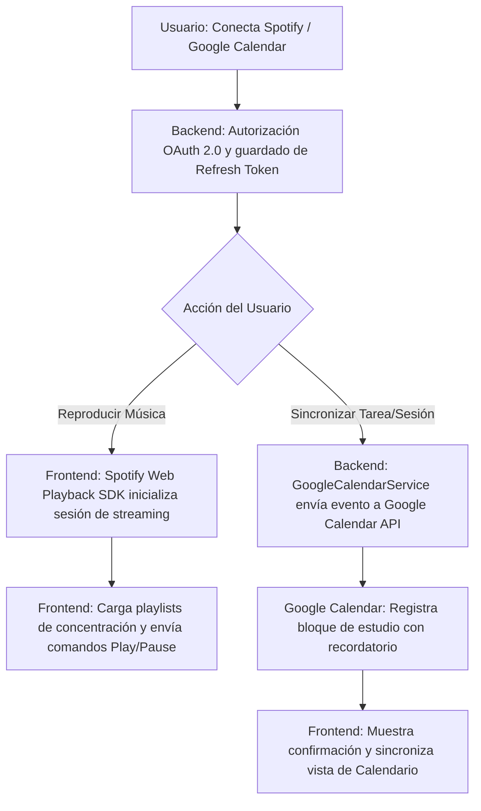

# [RF-M15] Sincronización Completa con Google Calendar y Spotify

## 1. Descripción y Objetivo
Este requerimiento profundiza y completa las capacidades de integración externa iniciadas en versiones previas, permitiendo una experiencia de productividad unificada dentro de Cronos Notes:
- **Sincronización Bidireccional con Google Calendar**: Permite exportar automáticamente las sesiones Pomodoro planificadas y tareas con fecha límite hacia el calendario de Google del usuario, así como importar eventos de estudio existentes para visualizarlos en el calendario de Cronos Notes y prevenir superposiciones horarias.
- **Reproductor Integrado de Spotify (Web Playback SDK & Web API)**: Permite a los usuarios con cuenta de Spotify conectar su biblioteca musical, explorar listas de reproducción sugeridas para estudio y concentración (Lofi Beats, Chillhop, Deep Focus, Ruido Marrón) y controlar la reproducción (Play, Pausa, Siguiente, Anterior, Volumen) directamente desde el widget multimedia del Modo Zen sin abandonar la aplicación.
- **Objetivo**: Evitar el cambio constante de pestañas o aplicaciones entre el temporizador, el calendario personal y el reproductor musical, centralizando todo el entorno de trabajo en una sola plataforma.

---

## 2. Tecnologías, Herramientas y Librerías

- **Laravel Socialite & Google API Client**: Flujo OAuth 2.0 con alcance `https://www.googleapis.com/auth/calendar.events` para creación, edición y consulta de eventos.
- **Spotify Web API & Spotify Web Playback SDK**: Protocolo OAuth 2.0 (`user-read-playback-state`, `user-modify-playback-state`, `streaming`) y librería JavaScript SDK para reproducción de audio directa en el navegador.
- **Inertia.js & Vue 3**: Componentes de reproducción musical en Sesión Zen y sincronización rápida en Calendario.
- **Tabla `IntegracionExterna`**: Almacenamiento seguro y refresco automático de `access_token` y `refresh_token` para Google y Spotify.

---

## 3. Archivos Involucrados en el Requerimiento

### Frontend (Vue 3)
- [SpotifyPlayer.vue](/resources/js/Pages/pomodoro/components/SpotifyPlayer.vue) - Componente del reproductor embebido de Spotify con carátula de álbum, barra de reproducción y controles interactivos.
- [SesionZen.vue](/resources/js/Pages/pomodoro/SesionZen.vue) - Integra el reproductor de Spotify junto al mezclador de sonidos ambientales.
- [Calendario.vue](/resources/js/Pages/Calendario.vue) - Vista del calendario con botón "Sincronizar con Google Calendar" e indicadores de eventos externos.
- [PerfilUsuario.vue](/resources/js/Pages/PerfilUsuario.vue) - Panel de configuración de cuentas vinculadas (Google y Spotify).

### Backend & Controladores (Laravel)
- [GoogleCalendarController.php](/app/Http/Controllers/GoogleCalendarController.php) - Controlador para sincronizar tareas y eventos con Google Calendar.
- [SpotifyController.php](/app/Http/Controllers/SpotifyController.php) - Controlador para gestionar autenticación OAuth de Spotify, refresco de tokens y peticiones a la API de Spotify.
- [GoogleCalendarService.php](/app/Services/GoogleCalendarService.php) - Servicio para crear y listar eventos de Google Calendar.
- [SpotifyService.php](/app/Services/SpotifyService.php) - Servicio para interactuar con la Web API de Spotify (playlists recomendadas, estado de reproducción).

### Modelos y Datos (Eloquent ORM)
- [IntegracionExterna.php](/app/Models/IntegracionExterna.php) - Persistencia de credenciales, tokens y expiraciones de cada servicio conectado.
- [Tarea.php](/app/Models/Tarea.php) - Atributo `google_event_id` para vincular tareas con eventos del calendario.

---

## 4. Flujo de Datos y Control

### Diagrama de Flujo del Requerimiento

### Detalle del Flujo de Control (Pasos)
1. **Vinculación de Cuentas:** El usuario ingresa a Ajustes de Perfil o presiona el botón "Conectar Spotify" / "Sincronizar Google Calendar". Se ejecuta el handshake OAuth 2.0 y se persisten los tokens en `IntegracionExterna`.
2. **Uso de Spotify:**
   - En el Modo Zen, el componente `SpotifyPlayer.vue` consulta playlists predeterminadas de concentración a través de `SpotifyController@getPlaylists`.
   - Al seleccionar una pista, se envía la instrucción de reproducción al SDK del navegador o a través de endpoints REST (`/v1/me/player/play`).
   - El estado de la pista actual (título, artista, progreso, carátula) se sincroniza reactivamente en Vue.
3. **Uso de Google Calendar:**
   - Al crear una tarea con fecha y hora límite o al programar una sesión de estudio, se ofrece la opción *"Añadir a Google Calendar"*.
   - El backend invoca a `GoogleCalendarService@crearEvento`, enviando título, descripción y tiempo estimado en bloques Pomodoro.
   - El ID del evento retornado se almacena en la tarea para permitir futuras actualizaciones o eliminaciones sincronizadas.

---

## 5. Pruebas y Validación (QA)

### Caso de Prueba 1: Reproducción con Spotify
1. **Precondición:** Iniciar sesión y tener una cuenta activa de Spotify vinculada.
2. **Paso 1:** Entrar a la Sesión Zen (`/pomodoro`) y abrir el panel de Spotify.
3. **Paso 2:** Seleccionar la playlist recomendada *"Lofi Focus Beats"* y presionar "Play".
4. **Resultado Esperado:** La pista comienza a sonar, se actualiza el nombre de la canción, artista y portada en el reproductor. Los controles de volumen y pausa responden de inmediato.

### Caso de Prueba 2: Sincronización con Google Calendar
1. **Precondición:** Tener vinculada la cuenta de Google Calendar.
2. **Paso 1:** Ir a "Mis Tareas", crear una nueva tarea titulada *"Estudio de Redes"* con fecha límite mañana a las 18:00 y marcar la casilla *"Sincronizar con Google Calendar"*.
3. **Paso 2:** Guardar la tarea.
4. **Resultado Esperado:** La tarea se crea en Cronos Notes con la insignia de Google Calendar. Al abrir Google Calendar en el navegador, el evento *"Estudio de Redes"* aparece agendado con la duración estimada en Pomodoros y descripción correspondiente.
