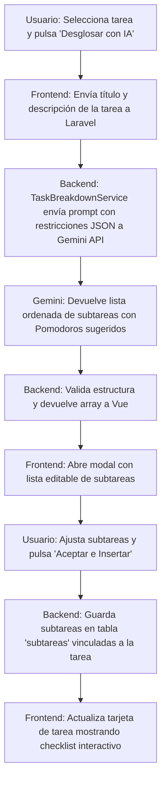

# [RF-M16] Desglose Automático de Tareas con IA (Subtareas Inteligentes)

## 1. Descripción y Objetivo
Este requerimiento introduce un asistente impulsado por Inteligencia Artificial para combatir la parálisis por sobrecarga y la procrastinación en proyectos complejos:
- **Descomposición Jerárquica de Tareas**: Permite al usuario ingresar una tarea amplia o desafiante (ej. *"Desarrollar módulo de autenticación"* o *"Escribir monografía de historia"*) y presionar el botón de desglose inteligente.
- **Generación de Subtareas Estructuradas**: El modelo de lenguaje (Gemini API) analiza el alcance y desglosa la actividad principal en una secuencia lógica de subtareas claras, accionables y con una estimación de esfuerzo recomendada en Pomodoros (bloques de 25 minutos) para cada una.
- **Personalización y Aprobación**: El usuario puede revisar la propuesta, modificar textos, ajustar estimaciones, añadir nuevos pasos o eliminar sugerencias antes de insertarlas en su gestor de tareas.
- **Objetivo**: Guiar al usuario a través de un camino paso a paso claro (*roadmap personal*), transformando metas intimidantes en pequeños objetivos diarios alcanzables.

---

## 2. Tecnologías, Herramientas y Librerías

- **Google Gemini API (`gemini-2.0-flash`)**: Para el procesamiento de lenguaje natural y la generación estructurada de subtareas en formato JSON estricto.
- **Laravel Services & HTTP Client**: Servicio backend `TaskBreakdownService` que construye el prompt especializado, administra la llamada a la API y valida el esquema de respuesta.
- **Inertia.js & Vue 3 (Composition API)**: Componente modal interactivo con listas reordenables, inputs editables y checkboxes para seleccionar qué subtareas adoptar.
- **MySQL / Eloquent ORM**: Tabla `subtareas` (o relación jerárquica `tarea_padre_id` en la tabla `Tarea`) con atributos `titulo`, `completada`, `estimacionEsfuerzo` y `orden`.

---

## 3. Archivos Involucrados en el Requerimiento

### Frontend (Vue 3)
- [SubtaskBreakdownModal.vue](/resources/js/Components/SubtaskBreakdownModal.vue) - Modal con interfaz interactiva para ver, editar y confirmar el desglose propuesto por la IA.
- [GestionTareas.vue](/resources/js/Pages/GestionTareas.vue) - Vista principal de tareas con el botón de desglose en la tarjeta de cada tarea o en el formulario de creación.
- [VerTareaModal.vue](/resources/js/Components/VerTareaModal.vue) - Muestra el checklist de subtareas y el progreso de completado.

### Backend & Controladores (Laravel)
- [TareaController.php](/app/Http/Controllers/TareaController.php) - Endpoint `desglosarTareaConIA(Request $request, Tarea $tarea)` y persistencia del lote de subtareas.
- [TaskBreakdownService.php](/app/Services/TaskBreakdownService.php) - Servicio que encapsula la lógica de comunicación con Gemini para generar el desglose estructurado.

### Modelos y Datos (Eloquent ORM)
- [Subtarea.php](/app/Models/Subtarea.php) - Modelo Eloquent para representar subtareas hijas vinculadas a una tarea padre.
- [Tarea.php](/app/Models/Tarea.php) - Relación `hasMany(Subtarea::class)` y cálculo dinámico del porcentaje de avance en base a subtareas.

---

## 4. Flujo de Datos y Control

### Diagrama de Flujo del Requerimiento

### Detalle del Flujo de Control (Pasos)
1. **Frontend:** El usuario selecciona una tarea existente o escribe una nueva y hace clic en el botón con ícono de descomposición "Desglosar con IA".
2. **Backend (Prompt Engineering):** `TaskBreakdownService` estructura el prompt contextualizando el rol de tutor de productividad:
   - Requiere un arreglo de entre 3 a 7 subtareas secuenciales.
   - Solicita títulos claros que inicien con verbo en infinitivo.
   - Pide una estimación realista de Pomodoros (entre 1 y 4 por subtarea).
   - Exige formato JSON estricto: `[{"titulo": "...", "estimacionPomodoros": 2}, ...]`.
3. **Inferencia de IA:** Se ejecuta la petición HTTP a Gemini API. Al recibir la respuesta, el backend valida la integridad del JSON.
4. **Interacción en Frontend:** El modal `SubtaskBreakdownModal.vue` presenta la lista al usuario en formato editable. El usuario puede desmarcar las subtareas que no considere necesarias o editar sus nombres.
5. **Guardado en Base de Datos:** Al confirmar, se envían las subtareas seleccionadas y se crean en la base de datos vinculadas a la tarea principal (`tarea_id`).
6. **Visualización:** La tarjeta de la tarea en `GestionTareas.vue` ahora muestra una barra de progreso (ej. `0/4 subtareas completadas`) y permite marcar subtareas completadas individualmente.

---

## 5. Pruebas y Validación (QA)

1. **Precondición:** Iniciar sesión y tener una tarea creada llamada *"Preparar informe final de pasantías"*.
2. **Paso 1:** Abrir los detalles de la tarea y presionar el botón "Desglosar con IA".
3. **Resultado Esperado 1:** Debe desplegarse el modal con animación de carga mientras la IA procesa la solicitud.
4. **Resultado Esperado 2:** En menos de 4 segundos, se presenta una lista con 4 a 6 subtareas lógicas (ej. *"1. Recopilar métricas de desempeño"*, *"2. Redactar introducción y objetivos"*, *"3. Estructurar conclusiones"*), cada una con su estimación en Pomodoros.
5. **Paso 2:** Modificar el texto de la subtarea 2, eliminar la última subtarea y presionar "Guardar Subtareas".
6. **Resultado Esperado 3:** La tarea principal actualiza su visualización mostrando la lista de subtareas con sus respectivas casillas de verificación. Al marcar una subtarea como completada, la barra de progreso general de la tarea se incrementa proporcionalmente.
