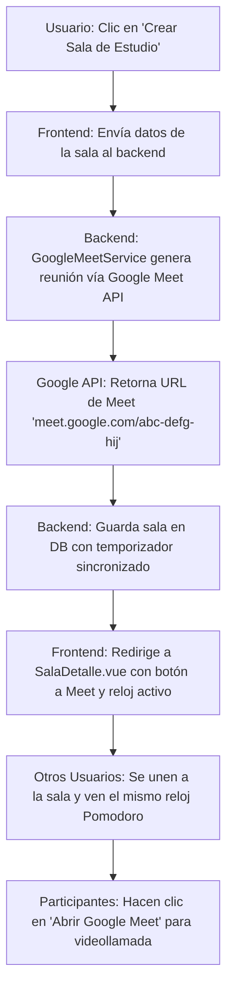

# [RF-M17] Salas de Estudio Virtuales en Tiempo Real con Google Meet

## 1. Descripción y Objetivo
Este requerimiento introduce un espacio de colaboración sincrónica y concentración compartida ("Body Doubling") dentro de Cronos Notes:
- **Creación y Unión a Salas de Estudio Virtuales**: Los usuarios pueden crear salas temáticas (ej. *"Estudio para Final de Álgebra"*, *"Sesión de Código Silenciosa"*) asociadas a un perfil compartido o públicas para la comunidad.
- **Integración con Google Meet API**: El sistema genera dinámicamente un enlace de videoconferencia seguro de Google Meet utilizando las credenciales de Google Workspace/OAuth de los usuarios, permitiendo la comunicación audiovisual en tiempo real.
- **Temporizador Pomodoro Sincronizado**: Todos los participantes de la sala de estudio comparten el mismo reloj Pomodoro centralizado, permitiendo que el grupo inicie los ciclos de enfoque y los descansos al unísono.
- **Objetivo**: Combatir el aislamiento durante el estudio a distancia, fomentar la responsabilidad mutua (*accountability*) y potenciar el trabajo en equipo sin fricción.

---

## 2. Tecnologías, Herramientas y Librerías

- **Google Meet REST API / Google Calendar API (Conference Data)**: Para la generación programática de reuniones de Google Meet con enlaces de acceso válidos (`meet.google.com/xxx-xxxx-xxx`).
- **Laravel Events & WebSockets / Polling reactivo**: Para la sincronización del estado del temporizador y la lista de participantes activos en la sala.
- **Inertia.js & Vue 3 (Composition API)**: Vista de la sala de estudio con panel de temporizador grupal, botón de acceso rápido a Meet y lista de participantes.
- **MySQL / Eloquent ORM**: Tablas `salas_estudio` y `miembros_sala` para persistir las salas creadas, su creador, enlace de Google Meet, temporizador activo y participantes.

---

## 3. Archivos Involucrados en el Requerimiento

### Frontend (Vue 3)
- [SalasEstudio.vue](/resources/js/Pages/sala-estudio/Index.vue) - Vista principal con el listado de salas activas y botón "Crear Sala".
- [SalaDetalle.vue](/resources/js/Pages/sala-estudio/Detalle.vue) - Interfaz de la sala activa con temporizador grupal sincronizado, botón flotante de Google Meet y lista de compañeros conectados.
- [CrearSalaModal.vue](/resources/js/Pages/sala-estudio/components/CrearSalaModal.vue) - Modal de configuración de la nueva sala (título, descripción, perfil asociado, tipo de sesión Pomodoro).

### Backend & Controladores (Laravel)
- [SalaEstudioController.php](/app/Http/Controllers/SalaEstudioController.php) - Controlador para listar, crear, unirse y abandonar salas de estudio.
- [GoogleMeetService.php](/app/Services/GoogleMeetService.php) - Servicio encargado de autenticarse con la API de Google y generar la reunión con datos de conferencia de Meet.

### Modelos y Datos (Eloquent ORM)
- [SalaEstudio.php](/app/Models/SalaEstudio.php) - Modelo de la sala con relación al usuario anfitrión, perfil y enlace de Meet.
- [MiembroSala.php](/app/Models/MiembroSala.php) - Registro de usuarios unidos a la sesión activa.

---

## 4. Flujo de Datos y Control

### Diagrama de Flujo del Requerimiento

### Detalle del Flujo de Control (Pasos)
1. **Creación de Sala:** El anfitrión hace clic en "Crear Sala", define el título, selecciona la duración del Pomodoro y confirma la acción.
2. **Generación del Enlace de Meet:** `GoogleMeetService` realiza una llamada a la API de Google utilizando las credenciales OAuth del usuario y crea un evento de calendario con `conferenceData` habilitado, obteniendo el `hangoutLink` de Meet.
3. **Persistencia:** Se inserta el registro en la tabla `salas_estudio` con el estado del temporizador en `Inactiva` o `Iniciada`, y se registra al creador como miembro anfitrión.
4. **Unión de Participantes:** Otros usuarios que naveguen a la sección "Salas de Estudio" ven la sala disponible y pulsan "Unirse". Se actualiza la tabla `miembros_sala`.
5. **Sincronización en Vivo:** Cuando el anfitrión inicia el Pomodoro, el cambio de estado se transmite a todos los participantes de la sala, iniciando la cuenta regresiva en sus navegadores.
6. **Videollamada:** Los participantes pueden hacer clic en el botón destacado "Unirse a Google Meet" para abrir la videollamada en una ventana adyacente o integrada.

---

## 5. Pruebas y Validación (QA)

1. **Precondición:** Iniciar sesión con un usuario que tenga vinculada su cuenta de Google.
2. **Paso 1:** Ir a la sección "Salas de Estudio" (`/salas-estudio`) y hacer clic en "Crear Sala".
3. **Paso 2:** Ingresar el título *"Estudio de Programación Web"* y presionar "Crear Sala".
4. **Resultado Esperado 1:** El sistema genera la sala y redirige a la vista de la sala activa. Se visualiza el enlace oficial de Google Meet generado y la lista de participantes mostrando al anfitrión.
5. **Paso 3:** En otra ventana/navegador con una segunda cuenta de usuario, ingresar a `/salas-estudio` y presionar "Unirse" en la sala creada.
6. **Resultado Esperado 2:** La lista de participantes de ambas ventanas se actualiza reflejando a los dos usuarios.
7. **Paso 4:** El anfitrión pulsa "Iniciar Pomodoro Grupal".
8. **Resultado Esperado 3:** El temporizador comienza a correr simultáneamente en ambas pantallas con los mismos minutos y segundos restantes.
