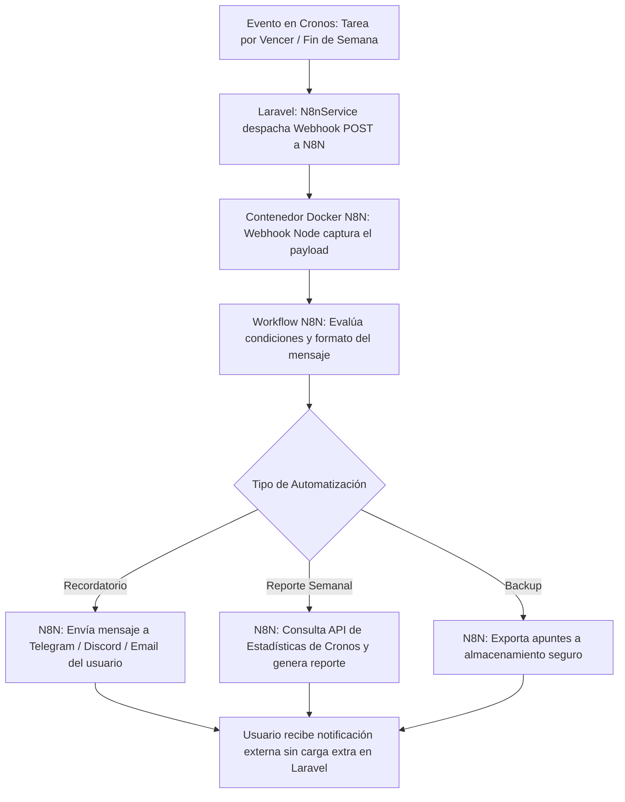

# [RF-M18] Automatización y Orquestación de Flujos con N8N (Docker)

## 1. Descripción y Objetivo
Este requerimiento introduce una capa de automatización e interoperabilidad externa desacoplada mediante la integración de **N8N** (plataforma de automatización de workflows de código abierto) ejecutada como servicio contenerizado:
- **Contenedor N8N en Docker**: Despliegue de una instancia local/remota de N8N mediante Docker Compose, interconectada en la misma red que Cronos Notes.
- **Flujos Automatizados de Productividad**:
  - *Recordatorios Inteligentes:* Envío automatizado de avisos por correo, Telegram o Discord cuando una tarea del usuario esté próxima a su fecha límite.
  - *Reporte Semanal de Productividad:* Generación y envío programado (todos los domingos) de un resumen en PDF/Email con las métricas de estudio, pomodoros completados y rachas logradas en la semana.
  - *Copia de Seguridad de Apuntes:* Rutina automatizada que exporta periódicamente los apuntes creados por el usuario a un almacenamiento secundario o carpeta drive.
- **Webhooks Bidireccionales**: Endpoints protegidos en Laravel para emitir eventos hacia N8N (*outbound webhooks*) y recibir desencadenadores desde N8N (*inbound webhooks*).
- **Objetivo**: Delegar procesos pesados, tareas programadas e integraciones con terceros a un motor de flujos especializado sin comprometer el rendimiento del servidor web principal.

---

## 2. Tecnologías, Herramientas y Librerías

- **N8N (Node-based Workflow Automation)**: Motor visual de orquestación de workflows y procesamiento de triggers HTTP.
- **Docker & Docker Compose**: Para el empaquetado, despliegue aislado y persistencia del contenedor de N8N (`n8nio/n8n:latest`).
- **Laravel HTTP Client & Events**: Para despachar payloads JSON hacia los webhooks de N8N ante eventos del dominio (ej. `TareaCreada`, `SesionFinalizada`, `ApunteGuardado`).
- **Middleware de Seguridad de Webhooks**: Verificación de firmas criptográficas HMAC / Tokens de autenticación en cabeceras HTTP (`X-N8N-Webhook-Secret`).

---

## 3. Archivos Involucrados en el Requerimiento

### Infraestructura y Docker
- [docker-compose.yml](/docker-compose.yml) - Configuración del servicio `n8n` junto a los servicios de Laravel y MySQL.
- [docker/n8n/workflows/](/docker/n8n/workflows/) - Directorio con las definiciones JSON de los flujos preconfigurados (recordatorios, reportes semanales).

### Backend & Controladores (Laravel)
- [N8nWebhookController.php](/app/Http/Controllers/Api/N8nWebhookController.php) - Recibe las notificaciones y solicitudes de ejecución desde N8N.
- [N8nService.php](/app/Services/N8nService.php) - Servicio para emitir eventos hacia los webhooks configurados en N8N.
- [routes/api.php](/routes/api.php) - Declaración de rutas de webhook protegidas (`/api/webhooks/n8n/...`).

### Frontend (Vue 3)
- [PerfilUsuario.vue](/resources/js/Pages/PerfilUsuario.vue) - Pestaña de "Automatizaciones y Notificaciones" donde el usuario puede activar recordatorios por Telegram/Email.

---

## 4. Flujo de Datos y Control

### Diagrama de Flujo del Requerimiento


### Detalle del Flujo de Control (Pasos)
1. **Configuración Inicial:** El archivo `docker-compose.yml` inicia el contenedor de N8N en el puerto 5678 con volumen de datos persistente.
2. **Disparo de Evento:** Al crearse una tarea crítica con fecha límite próxima o al ejecutarse el cron programado de Laravel (`schedule:run`), el servicio `N8nService` envía un payload JSON firmado al webhook correspondiente de N8N:
   ```json
   {
     "evento": "tarea.recordatorio",
     "usuario_email": "usuario@ejemplo.com",
     "tarea_titulo": "Examen Final de Redes",
     "fecha_limite": "2026-08-25 10:00:00",
     "prioridad": "Alta"
   }
   ```
3. **Procesamiento en N8N:** El workflow recibe el evento, procesa las plantillas de mensaje y ejecuta los nodos de integración (ej. nodo de Telegram Bot o SMTP Mailer).
4. **Respuesta:** N8N retorna un código `200 OK` confirmando la entrega exitosa del mensaje.

---

## 5. Pruebas y Validación (QA)

1. **Precondición:** Tener levantado el contenedor de N8N mediante `docker compose up -d n8n`.
2. **Paso 1:** Configurar en el perfil de usuario la recepción de recordatorios por Telegram o correo electrónico.
3. **Paso 2:** Crear una tarea con fecha de vencimiento configurada para dentro de 1 hora.
4. **Paso 3:** Ejecutar la rutina de verificación de recordatorios (`php artisan cronos:check-reminders` o esperar la ejecución automática del cron).
5. **Resultado Esperado 1:** En los logs de Laravel se confirma el despacho del webhook hacia N8N con status `200 OK`.
6. **Resultado Esperado 2:** En la interfaz de N8N (`http://localhost:5678`), el workflow se muestra como ejecutado exitosamente.
7. **Resultado Esperado 3:** El usuario recibe el mensaje de alerta formateado en su canal configurado con el título de la tarea, urgencia y enlace directo a Cronos Notes.
