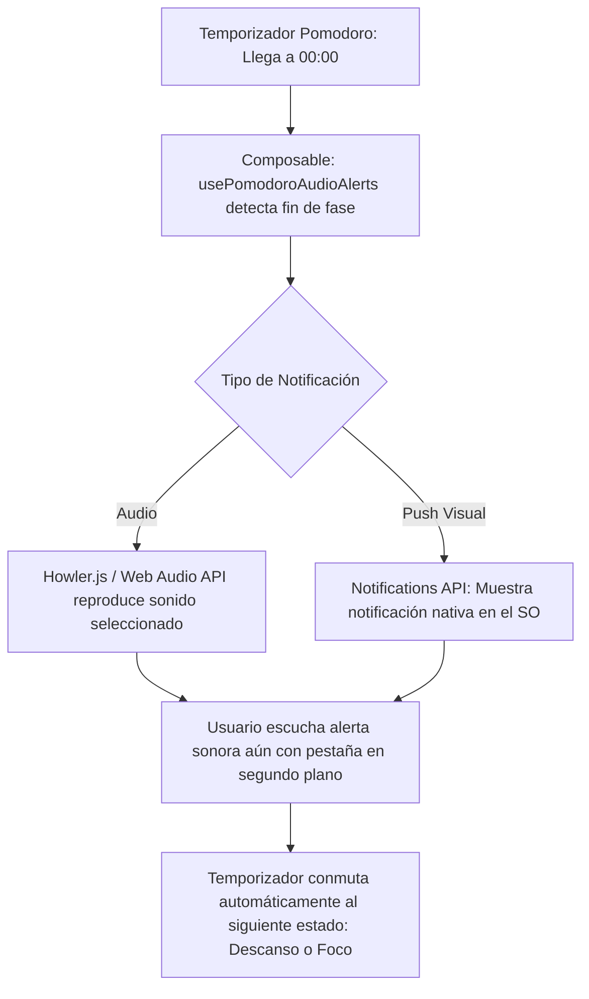

# [RF-M20] Sistema de Notificaciones Auditivas y Alertas de Ciclo Pomodoro

## 1. Descripción y Objetivo
Este requerimiento introduce un sistema integral de alertas sonoras y notificaciones de ciclo para acompañar las transiciones del temporizador Pomodoro:
- **Alertas Auditivas de Transición**: Reproducción automática de sonidos distintivos y no intrusivos al finalizar cada fase del ciclo:
  - *Campana de Inicio:* Señal suave que indica el comienzo del tiempo de enfoque.
  - *Alerta de Descanso Corto:* Sonido relajante para avisar que es momento de una pausa de 5 minutos.
  - *Alerta de Descanso Largo:* Notificación especial al completar los 4 ciclos Pomodoro tradicionales.
  - *Reanudación de Foco:* Aviso auditivo para regresar al trabajo al terminar la pausa.
- **Biblioteca de Sonidos Personalizable**: Selector de diferentes timbres y estilos auditivos (Cuenco Tibetano Zen, Campana Clásica de Reloj, Tono Digital Minimalista, Arpa Suave) con opción de preescucha y control de volumen independiente.
- **Notificaciones Nativas en Segundo Plano**: Integración con la API nativa de notificaciones del sistema operativo (`Notification API`), asegurando que el usuario reciba el aviso sonoro y visual incluso si el navegador se encuentra minimizado.
- **Objetivo**: Garantizar que el usuario se desconecte de la pantalla durante sus descansos y retome sus tareas puntualmente sin necesidad de vigilar visualmente el reloj.

---

## 2. Tecnologías, Herramientas y Librerías

- **Web Audio API & Howler.js**: Para la carga asíncrona, sintetización y reproducción precisa de archivos de sonido (`.mp3` y `.ogg`) con baja latencia y volumen ajustable.
- **HTML5 Notifications API**: Notificaciones emergentes nativas del sistema operativo sincronizadas con el disparo del sonido.
- **Vue 3 Composable (`usePomodoroAudioAlerts.js`)**: Hook reactivo que escucha los cambios de estado del temporizador Pomodoro y despacha la alerta sonora correspondiente.
- **LocalStorage / MySQL**: Persistencia de las preferencias de sonido y volumen elegidas por el usuario.

---

## 3. Archivos Involucrados en el Requerimiento

### Frontend (Vue 3)
- [usePomodoroAudioAlerts.js](/resources/js/Composables/usePomodoroAudioAlerts.js) - Composable reactivo que gestiona los audios de alerta, eventos de ciclo y notificaciones push del navegador.
- [ConfiguracionAudioModal.vue](/resources/js/Pages/pomodoro/components/ConfiguracionAudioModal.vue) - Modal de ajustes de sonidos con selector de campanas, botón de prueba (preescucha) y slider de volumen.
- [SesionZen.vue](/resources/js/Pages/pomodoro/SesionZen.vue) - Vincula los eventos del temporizador con el despachador de alertas sonoras.

### Recursos Estáticos (Audios de Alerta)
- `public/sounds/alerts/zen-bowl.mp3` - Cuenco tibetano para transiciones de concentración.
- `public/sounds/alerts/bell-classic.mp3` - Campana tradicional de estudio.
- `public/sounds/alerts/digital-chime.mp3` - Chime electrónico moderno.
- `public/sounds/alerts/harp-break.mp3` - Melodía suave para el descanso.

### Backend & Modelos (Laravel)
- [ConfiguracionPomodoro.php](/app/Models/ConfiguracionPomodoro.php) - Columnas `tipo_sonido_alerta`, `volumen_alerta` y `notificaciones_activas`.

---

## 4. Flujo de Datos y Control

### Diagrama de Flujo del Requerimiento

### Detalle del Flujo de Control (Pasos)
1. **Configuración de Preferencias:** El usuario ingresa a los ajustes del temporizador, selecciona el tono de campana de su agrado (ej. "Cuenco Tibetano"), prueba el sonido con el botón de preescucha y ajusta el volumen. Las preferencias se guardan reactivamente.
2. **Solicitud de Permiso:** Al activar las alertas por primera vez, el sistema solicita permiso para notificaciones del navegador (`Notification.requestPermission()`).
3. **Monitoreo del Temporizador:** El composable `usePomodoroAudioAlerts` observa el estado del ciclo `tiempoRestante` desde `usePomodoroTimer.js`.
4. **Disparo de la Alerta:**
   - En el instante en que el contador llega a `0`, se identifica el estado que concluye (*Trabajo* o *Descanso*).
   - Se invoca la instancia de audio correspondiente con el volumen configurado (`alertSound.play()`).
   - Se despacha simultáneamente la notificación nativa del navegador con el texto: *"¡Tiempo de concentración finalizado! Tómate un descanso de 5 minutos."*
5. **Transición:** El temporizador cambia de modo y queda a la espera de la siguiente acción del usuario o inicia el descanso automático si está configurado.

---

## 5. Pruebas y Validación (QA)

1. **Precondición:** Iniciar sesión y acceder al temporizador Pomodoro (`/pomodoro`).
2. **Paso 1:** Abrir la configuración del temporizador, hacer clic en "Sonidos de Alerta" y seleccionar el tono *"Cuenco Tibetano"*.
3. **Paso 2:** Hacer clic en el botón de prueba "Preescucha".
4. **Resultado Esperado 1:** Debe reproducirse de forma nítida el sonido del cuenco tibetano al nivel de volumen indicado en el slider.
5. **Paso 3:** Configurar una sesión de prueba rápida de 1 minuto de trabajo y minimizar la ventana del navegador.
6. **Resultado Esperado 2:** Al transcurrir el minuto exacto, se escucha claramente el sonido de alerta a través de los altavoces/auriculares del sistema y aparece una notificación flotante del sistema operativo anunciando el inicio del descanso.
